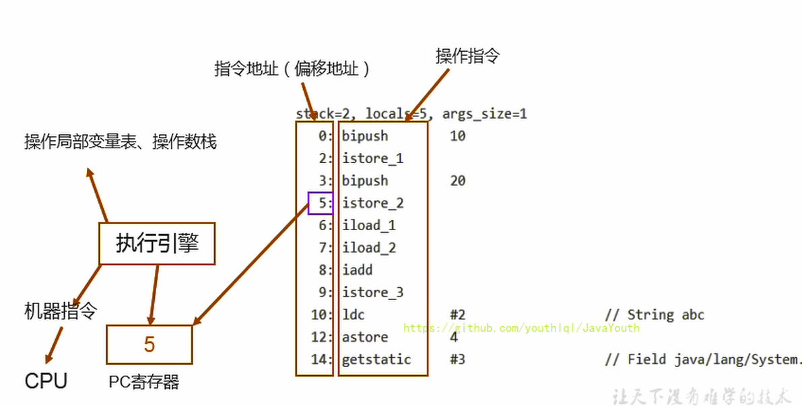
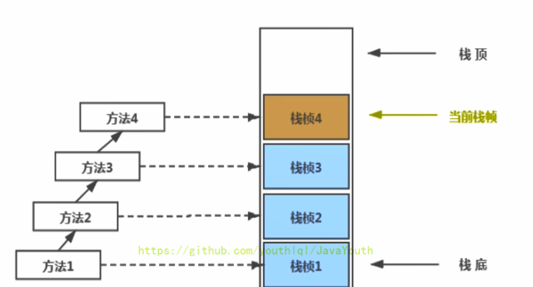

# 1. 内加载子系统
## 1.1. 类的加载过程
* 加载
  * 通过一个类的全限定名获取定义此类的二进制字节流
  * 将这个字节流所代表的静态存储结构转化为方法区的运行时数据结构
  * **在内存中生成一个代表这个类的java.lang.Class对象**，作为方法区这个类的各种数据的访问入口
* 链接
* * 验证 Verify
  - 目的在于确保class文件的字节流中包含信息符合当前虚拟机要求，保证被加载类的正确性，不会危害虚拟机自身安全
* * 准备 Prepare
  - 为类变量分配内存并且设置该类变量的默认初始值，即零值
  - 这里不包含用final修饰的static，因为final在编译的时候就会分配了，准备阶段会显式初始化
  - 这里不会为实例变量分配初始化，类变量会分配在方法区中，而实例变量是会随着对象一起分配到java堆中
* * 解析 Resolve
  - 将常量池内的符号引用转换为直接引用的过程
  - 事实上，解析操作往往会伴随着JVM在执行完初始化之后再执行
  - 符号引用就是一组符号来描述所引用的目标，符号引用的字面量形式明确定义在《Java虚拟机规范》的Class文件格式中。直接引用就是直接指向目标的指针、相对偏移量或一个间接定位到目标的句柄
  - 解析动作主要针对类或接口、字段、类方法、接口方法、方法类型等。对应常量池中的CONSTANT_Class_info、CONSTANT_Fieldref_info、CONSTANT_Methodref_info等
* 初始化
  - 初始化过程就是执行类构造器方法<clinit>()的过程
  - 此方法不需定义，是javac编译器自动收集类中的所有类变量的赋值动作和静态代码块中的语句合并而来
  - 构造器方法中指令按语句在源文件中出现的顺序执行
  - <clinit>()不同于类的构造器。（关联：构造器是虚拟机视角下的<init>())
  - 若该类具有父类，JVM会保证子类的<clinit>()执行前，父类的<clinit>()已经执行完毕
  - 虚拟机必须保证一个类的<clinit>()方法在多线程下被同步加锁：jdk8，本地内存缓存起来，虚拟机执行加载时只执行一次。当另一个线程访问该类时会被阻塞访问
#### 1.1.0.1. 总结:
Java类的加载，类的加载器分为启动类加载器和用户自定义的类加载器，其两个重要特征：层次组织结构和代理模式。Java类加载器的一个重要用途就是为相同名称的Java类创建隔离空间，在jvm中判断两个类是否相同不仅是根据二进制名称还会根据定义类的类加载器是否相同，这种机制可以为相同名称的类的不同版本共存。用户自定义加载器能够实现特定的字节码查找方式，对字节码进行加密和解密，只需继承java.lang.ClassLoader类
Java类的链接，指的是把java类的二进制代码合并到jvm的运行状态中。其包括验证、准备和解析。验证是确保类的二进制代码在结构上是否完全正确，准备是对类的静态域进行创建并赋予默认值，不会执行代码，解析是确保类引入的其他类能够被找到，解析的过程可能会导致引入的类被加载。
Java类的初始化，当一个类被使用到时会对静态代码和静态域进行初始化，当访问一个类或接口的静态时，只有真正声明这个静态域的类或接口会被初始化。
## 1.2. 类加载器的分类
引导类加载器（BootstrapClassLoader）
自定义类加载器（User-Defined ClassLoader）（包括扩展类加载器（Extension CLassLoader） 系统类/应用程序类加载器（System CLassLoader））
* 启动类加载器
  - 使用c/c++语言实现，嵌套在JVM内部
  - 用来加载java核心库，用于提供JVM自身需要的类
  - 并不继承自java.lang.ClassLoader，没有父加载器
  - 加载拓展类和应用程序类加载器，并指定为它们的父类加载器
  - 出于安全考虑，Bootstrap启动加载器只加载包名为java、javax、sun等开头的类
* 拓展类加载器
  - java语言编写
  - 派生于ClassLoader类
  - 父类加载器为启动类加载器
  - 从java.ext.dirs系统属性所指定的目录中加载类库，或从JDK安装目录的jre/lib/ext子目录（拓展目录）下加载类库。**如果用户创建的JAR放在此目录下，也会自动由拓展类加载器加载**
* 系统/应用程序类加载器
  - java语言编写，由sun.misc.Launcher$AppCLassLoader实现
  - 派生于CLassLoader类
  - 父类加载器为拓展类加载器
  - 它负责加载环境变量classpath或系统属性，java.class.path指定路径下的类库
  - **该类加载是程序中默认的类加载器**，一般来说，Java应用的类都是由它来完成加载
  - 通过ClassLoader#getSystemClassLoader()方法可以获取到该类加载器
* 用户自定义类加载器
  - 继承自ClassLoader类 
  - 隔离加载类，中间链和应用模块之间是隔离的
  - 修改类加载的方式
  - 拓展加载源
  - 防止源码泄露
## 1.3. 双亲委派机制*
Java虚拟机对class文件采用的是**按需加载**机制，即当需要该类时才会将它的class文件加载到内存生成class对象。而且加载某个类的class文件时，java虚拟机采用的是双亲委派机制，即把请求交由父类处理，它是一种任务委派模式。
工作原理：
- 如果一个类加载器收到了类加载请求，它并不会自己先去加载，而是把这个请求委托给父类的加载器去执行
- 如果父类加载器还存在其父类加载器，则进一步向上委托，依次递归，请求最终将到达顶层的启动类加载器
- 如果父类加载器可以完成类加载任务，就成功返回，倘若父类加载器无法完成加载任务，子加载器才会尝试自己去加载，这就是双亲委派模式。

接口由引导类加载器加载，而具体实现类则是由系统类加载器中的线程上下文类加载器加载

优势：
* 避免了类的重复加载
* 保护程序安全，防止核心API被随意纂改 ------>沙箱安全机制，保证对java核心源代码的保护
  - 自定义类：java.lang.String
  - 自定义类：java.lang.ShkStart
## 1.4. 其他
* 在JVM中表示两个class对象是否包含为同一个类存在的两个必要条件
  - 类的完整类名必须一致，包括包名
  - 加载这个类的ClassLoader（指ClassLoader实例对象）必须相同
* 换句话说，在JVM中，即使这两个类对象来源于用一个Class文件，被同一个虚拟机加载，但只要加载它们的CLassLoader实例对象不同，那么这两个类对象也是不相等的（如java.lang.String)
* 对加载器的引用
  - JVM必须知道一个类型是由启动加载器加载的还是由用户加载器加载的，如果一个类型是由用户类加载器加载的，那么JVM会**将这个类加载器的一个引用作为类型信息的一部分保存在方法区中**。当解析一个类型到另一个类型的引用的时候，JVM需要保证这两个类型的类加载器是相同的
* Java程序对类的使用方式分为主动使用和被动使用。
  - 主动使用共有7种，而其他使用Java类的方式都被看作是对类的被动使用，都不会**导致类的初始化**
# 2. 运行时数据区概述及线程
* **不同的JVM对于内存的划分方式和管理机制存在着部分差异。**
* JVM内存布局规定了Java在运行过程中内存申请、分配、管理的策略，保证了JVM高效稳定运行
* 运行时数据区有些随着虚拟机（进程）的启动而创建，线程间共享的有：堆（95%垃圾回收）、堆外内存（永久代或元空间（5%垃圾回收）、代码缓存）。有些随着线程开始和结束而创建和销毁，每个线程独立包括程序计数器、栈、本地栈。
* 每个JVM只有一个Runtime实例，即为运行环境，相当于内存结构中的运行时数据区（Runtime Data Area）：运行时环境
### 2.0.1. 线程
* 线程是一个程序里的运行单元，JVM允许一个应用有多个线程并行的执行
* 在Hotspot JVM中，每个线程都与操作系统的本地线程直接映射
* * 当一个Java线程准备好执行后，此时一个操作系统的本地线程也同时创建。Java线程执行终结后，本地线程也会回收。
* 操作系统负责所有线程的安排调度到任何一个可用的CPU上。一旦本地线程初始化成功，它就会调用Java线程中的run()方法。
JVM中主要有以下几个系统线程：虚拟机线程、周期任务线程、GC线程、编译线程、信号调度线程
## 2.1. 程序计数器（PC寄存器）
### 2.1.1. 程序计数器介绍
程序计数寄存器。JVM中的PC寄存器是对物理PC寄存器的抽象模拟，寄存器存储指令相关的现场信息。CPU只有把数据转载到寄存器才能运行
* 它是一块很小的内存空间，也是运行速度最快的存储区域。
* 在JVM规范中，每个线程都有它自己的程序计数器，是线程私有的，生命周期与线程的生命周期保持一致。
* 任何时间一个线程都只有一个方法在执行，也就是所谓的**当前方法**。程序计数器会存储当前线程正在执行的Java方法的JVM指令地址；或者，如果是在执行native方法，则是未指定值（undefned）。
* 它是程序控制流的指示器，分支、循环、跳转、异常处理、线程恢复等基础功能都需要依赖这个计数器来完成。
* 字节码解释器工作时就是通过改变这个计数器的值来选取下一条需+要执行的字节码指令。
* 它是唯一一个在Java虚拟机规范中没有规定任何OutofMemoryError情况的区域。

程序计数器执行步骤：

#### 常见问题（面试题）
* 使用PC寄存器存储字节码指令地址有什么用||||为什么使用PC寄存器记录当前线程的执行地址
* - 因为CPU需要不停的切换各个线程,这时候切换回来以后,就得知道接着从哪开始继续执行
* - JVM的字节码解释器需要通过改变PC寄存器的值来明确下一条应该执行什么样的字节码指令
* PC寄存器为什么会被设定为线程私有
* - 多线程在特定的时间段内只会执行其中一个线程,CPU会不停地做任务切换,这样必然导致经常中断或恢复。为了能够准确地记录各个线程正在执行的当前字节码指令地址，最好的办法就是为每个线程分配一个PC寄存器，各个线程之间便可以进行独立计算，从而不会出现相互干扰的情况。
* - 由于CPU时间片轮限制，众多线程在并发执行过程中，任何一个确定的时刻，一个处理器或者多核处理器中的一个内核，只会执行某个线程中的一条指令。CPU时间片
* - 这样必然导致经常中断或恢复,每个线程在创建后,都会产生自己的程序计数器和栈帧,程序计数器在各个线程之间互不影响.

并行:一个CPU同时执行多个任务,串行:一个CPU一次执行一个任务
并发:一个CPU快速执行每一个线程,看似并行
## 虚拟机栈
* 虚拟机栈出现的背景
* - 由于跨平台性的设计,Java的指令都是根据栈来设计的,不同平台CPU架构不同,所以不能设计为基于寄存器的.
* - 优点是跨平台,指令集小,编译器容易实现,缺点是性能下降,实现同样的功能需要更多的指令.
* 栈是运行时的单位,堆是存储的单位
* Java虚拟机栈早期也叫Java栈,每个线程在创建时都会创建一个虚拟机栈,其内部保存一个个的栈帧(每个方法对应一个栈帧,最顶部的栈帧被称为当前执行栈),对应着一次次的Java方法调用.其说线程私有的
* 虚拟机栈生命周期和线程一样
* 虚拟机栈主管java程序的运行,它保存方法的局部变量（8种基本数据类型、引用类型变量地址）,部分结果,并参与方法的调用和返回.
* - 局部变量 vs 成员变量(或属性)
* - 基本数据变量（8种） vs 引用类型变量(类、数组、接口)
* 栈的优点
* - 栈是一种快速有效的分配存储方式，访问速度仅次于程序计数器
* - JVM直接对Java栈的操作只有两个：
* - - 每个方法执行，伴随着进栈（入栈、压栈）
* - - 执行结束后的出栈工作
* - 对于栈来说不存在垃圾回收问题（但可能存在OOM问题）
* - - 设置栈内存大小  -Xss size * Linux:1024KB * windows 视实际内存大小而定
#### 面试题：开发中关于栈遇到的异常及区别
* StackOverflowError异常：如果次啊用固定大小的Java虚拟机栈，如果线程请求分配的栈容量超过Java虚拟机栈允许的最大容量，Java虚拟机将会抛出一个StackOverflowError异常
* OutOfMemoryError异常：如果虚拟机栈可以动态拓展，并且在尝试拓展时无法申请到足够的内存，那Java虚拟机将会抛出一个OutOfMemoryError异常。
## 栈的存储单位
### 栈中存储什么
* 每个线程都有自己的栈，栈中的数据都是以栈帧（Stack Frame）的格式存在
* 在这个线程上正在执行的每个**方法**都各自对应一个栈帧（Stack Frame）。
* 栈帧是一个内存区块，是一个数据集，维系着方法执行过程中的各种数据信息。
### 栈运行原理
* JVM直接对Java栈的操作只有两个，就是对栈帧的压栈和出栈，遵循先进后出（后进先出）原则
* 在一条活动线程中，一个时间点上，只会有一个活动的栈帧。即只有当前正在执行的方法的栈帧（栈顶栈帧）是有效的。这个栈帧被称为当前栈帧（Current Frame），与当前栈帧相对应的方法就是当前方法（Current Method），定义这个方法的类就是当前类（Current Class）
* 执行引擎运行的所有字节码指令只针对当前栈帧进行操作。
* 如果在该方法中调用了其他方法，对应的新的栈帧会被创建出来，放在栈的顶端，成为新的当前帧。

* **不同的线程中所包含的栈帧是不允许存在相互引用的**，即不可能在一个栈顶之中引用另一个线程的栈帧
* 如果当前方法调用了其他方法，方法返回之际，当前栈帧会传回此方法的执行结果给前一个栈帧，接着，虚拟机会丢弃当前栈帧，使得前一个栈帧会重新成为当前栈帧
* Java方法有两种返回函数的方式
* * **一种是正常的函数返回，使用return指令**
* * **另一种是方法执行中出现未捕获处理的异常，以抛出异常的方式结束（可以作为另类返回return）**
* * **不管使用哪种方式，都会导致栈顶被弹出（被结束）**
### 栈帧的内部结构
每个栈帧中存储着：**局部变量表LV**、**操作数栈**、动态链接、方法返回地址、一些附加信息
#### 局部变量表（LV）
* 也被称为局部变量数组或本地变量表
* **定义为一个数学数组，主要用于存储方法参数和定义在方法体内的局部变量**，这些数据类型包括各类基本数据类型、对象引用以及returnAddress类型
* 由于局部比哪里表是建立在线程的栈上，是线程的私有数据，因此**不存在数据安全问题（没有涉及共享）**
* **局部变量表所需要的容量大小是在编译期确定下来的**，并保存在方法的Code属性的maximum local variables数据项中。**在方法运行期间是不会改变局部变量表的大小的**。
* **方法嵌套调用的次数由栈的大小决定。**一般来说，**栈越大，方法嵌套调用次数越多**。对一个函数而言，它的参数和局部变量越多，使得局部变量表膨胀，它的栈帧越大，以满足方法调用所需传递的信息增大的需求，进而函数调用就会占用更多的栈空间，导致其嵌套调用次数就会减少。
* **局部变量表中的变量只在当前方法调用中有效，**在方法执行时，虚拟机通过局部变量表完成参数值到参数变量列表的传递过程。**当方法调用结束后，随着方法栈帧的销毁，局部变量表也会随之销毁**
* 局部变量表中起始PC地址对应的是字节码文件中当前变量声明结束后的作用范围，即声明并存储该变量后的下一个字节码位置便是起始PC
* * Ljava/lang/String 前面的L表示引用类型
* * Length== 5表示局部变量剩余有效行数，main方法字节码指令总共有16行，从11行开始生效，那么剩下就是16-11 ==5。
### 关于Slot的理解
* 参数值的存放总是从局部变量数组索引0的位置开始,到数组长度-1的索引结束.
* 局部变量表,最基本的存储单元是Slot(变量槽)
* 局部变量表中存放编译期可知的各种基本数据类型(8种),引用类型(reference),returnAddress类型的变量
* 在局部变量表种,32位以内的类型只占用一个slot(包括returnAddress类型),64位的类型(long和double)占用两个slot.
* * byte、short、char在存储前被转换为int，boolean也被转换为int，0表示false，非0表示true
