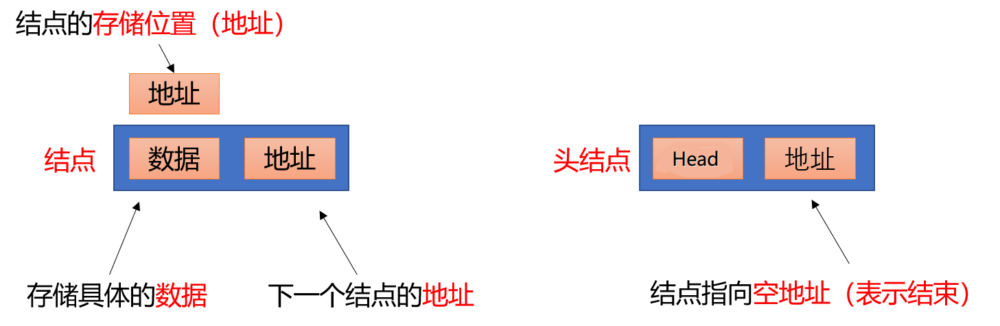

<!-- TOC -->

- [1. 前置教程](#1-前置教程)
  - [1.1. JDK的安装目录](#11-jdk的安装目录)
- [2. 基础语法](#2-基础语法)
  - [2.1. 注释](#21-注释)
  - [2.2. 关键字](#22-关键字)
  - [2.3. 常量](#23-常量)
  - [2.4. 数据类型](#24-数据类型)
  - [2.5. 变量](#25-变量)
  - [2.6. 标识符](#26-标识符)
  - [2.7. 类型转换](#27-类型转换)
    - [2.7.1. 自动类型转换](#271-自动类型转换)
    - [2.7.2. 强制类型转换](#272-强制类型转换)
- [3. 运算符](#3-运算符)
  - [3.1. 算数运算符](#31-算数运算符)
    - [3.1.1. 字符”+“操作](#311-字符操作)
    - [3.1.2. 字符串“+”操作](#312-字符串操作)
  - [3.2. 赋值运算符](#32-赋值运算符)
  - [3.3. 自增、自减运算符](#33-自增自减运算符)
  - [3.4. 关系运算符](#34-关系运算符)
  - [3.5. 逻辑运算符](#35-逻辑运算符)
  - [3.6. 短路逻辑运算符](#36-短路逻辑运算符)
  - [3.7. 三元运算符](#37-三元运算符)
  - [3.8. 案例](#38-案例)
- [4. 数据输入](#4-数据输入)
- [5. 流程控制](#5-流程控制)
  - [5.1. if-else语句](#51-if-else语句)
  - [5.2. if-elseif-else语句](#52-if-elseif-else语句)
  - [5.3. switch 语句](#53-switch-语句)
  - [5.4. for循环语句](#54-for循环语句)
    - [5.4.1. for循环语句格式](#541-for循环语句格式)
  - [5.5. while循环语句](#55-while循环语句)
  - [5.6. do...while循环语句](#56-dowhile循环语句)
  - [5.7. 跳转控制语句](#57-跳转控制语句)
  - [5.8. 循环嵌套](#58-循环嵌套)
  - [5.9. Random](#59-random)
- [6. IDEA](#6-idea)
  - [6.1. IDEA中项目结构](#61-idea中项目结构)
  - [6.2. IDEA中内容辅助键和快捷键](#62-idea中内容辅助键和快捷键)
    - [6.2.1. 快速生成语句](#621-快速生成语句)
    - [6.2.2. 内容辅助键](#622-内容辅助键)
    - [6.2.3. 注释](#623-注释)
    - [6.2.4. 格式化](#624-格式化)
  - [6.3. IDEA中新建模块|删除模块|导入模块](#63-idea中新建模块删除模块导入模块)
- [7. 数组](#7-数组)
  - [7.1. 数组定义格式](#71-数组定义格式)
  - [7.2. 数组初始化之动态初始化](#72-数组初始化之动态初始化)
    - [7.2.1. 动态初始化](#721-动态初始化)
    - [7.2.2. 静态初始化](#722-静态初始化)
  - [7.3. 数组元素访问](#73-数组元素访问)
  - [7.4. java中内存分配](#74-java中内存分配)
      - [7.4.0.1. 堆内存](#7401-堆内存)
  - [7.5. 数组中两个常见小问题](#75-数组中两个常见小问题)
  - [7.6. 数组常见操作](#76-数组常见操作)
    - [7.6.1. 遍历](#761-遍历)
    - [7.6.2. 获取最值(排序|变量存储最大值)](#762-获取最值排序变量存储最大值)
- [8. 方法](#8-方法)
  - [8.1. 概述](#81-概述)
  - [8.2. 方法定义](#82-方法定义)
  - [8.3. 方法注意事项](#83-方法注意事项)
  - [8.4. 方法重载](#84-方法重载)
  - [8.5. 方法参数传递](#85-方法参数传递)
  - [8.6. ps:print(ln)](#86-psprintln)
- [9. Debug](#9-debug)
- [10. 类和对象](#10-类和对象)
      - [10.0.0.1. 类：手机（现实生活中一类具有共同属性和行为的事物的抽象）](#10001-类手机现实生活中一类具有共同属性和行为的事物的抽象)
  - [10.1. 类的定义](#101-类的定义)
  - [10.2. 对象的使用](#102-对象的使用)
  - [10.3. private关键字](#103-private关键字)
  - [10.4. this关键字](#104-this关键字)
  - [10.5. this内存原理](#105-this内存原理)
  - [10.6. 封装](#106-封装)
  - [10.7. 构造方法](#107-构造方法)
    - [10.7.1. 注意事项](#1071-注意事项)
  - [10.8. 标准类制作](#108-标准类制作)
- [11. API](#11-api)
  - [11.1. String](#111-string)
    - [11.1.1. String构造方法](#1111-string构造方法)
    - [11.1.2. 字符串的比较](#1112-字符串的比较)
  - [11.2. StringBulider](#112-stringbulider)
    - [11.2.1. StringBulider类的创建](#1121-stringbulider类的创建)
    - [11.2.2. StringBuilder类的添加和反转](#1122-stringbuilder类的添加和反转)
  - [11.3. StringBulider和String相互转换](#113-stringbulider和string相互转换)
- [12. 集合](#12-集合)
  - [12.1. 集合基础](#121-集合基础)
    - [12.1.1. ArrayList构造方法和添加方法](#1211-arraylist构造方法和添加方法)
    - [12.1.2. ArrayList集合常用方法](#1212-arraylist集合常用方法)
  - [12.2. 小作业，设计一个学生管理系统](#122-小作业设计一个学生管理系统)
- [13. 继承](#13-继承)
  - [13.1. 继承的好处和弊端](#131-继承的好处和弊端)
      - [13.1.0.1. 什么时候使用继承](#13101-什么时候使用继承)
  - [13.2. 继承中变量的访问特点](#132-继承中变量的访问特点)
  - [13.3. super关键字](#133-super关键字)
  - [13.4. 继承中构造方法的访问特点](#134-继承中构造方法的访问特点)
  - [13.5. 继承中成员方法的访问特点](#135-继承中成员方法的访问特点)
  - [13.6. super内存图](#136-super内存图)
  - [13.7. 方法重写](#137-方法重写)
    - [13.7.1. 方法重写的注意事项](#1371-方法重写的注意事项)
  - [13.8. Java中继承的注意事项](#138-java中继承的注意事项)
- [14. 包](#14-包)
  - [14.1. 导包](#141-导包)
  - [14.2. 权限修饰符](#142-权限修饰符)
  - [14.3. 状态修饰符](#143-状态修饰符)
- [15. 多态](#15-多态)
  - [15.1. 多态中成员的访问特点](#151-多态中成员的访问特点)
  - [15.2. 多态的好处和弊端](#152-多态的好处和弊端)
  - [15.3. 多态中的转型](#153-多态中的转型)
  - [15.4. 多态转型的内存图解](#154-多态转型的内存图解)
- [16. 抽象类](#16-抽象类)
  - [16.1. 抽象类的特点](#161-抽象类的特点)
  - [16.2. 抽象类的成员特点](#162-抽象类的成员特点)
- [17. 接口](#17-接口)
  - [17.1. 接口的特点](#171-接口的特点)
  - [17.2. 接口的成员特点](#172-接口的成员特点)
  - [17.3. 猫和狗，接口版本](#173-猫和狗接口版本)
  - [17.4. 类和接口关系](#174-类和接口关系)
  - [17.5. 抽象类和接口区别](#175-抽象类和接口区别)
- [18. 形参和返回值](#18-形参和返回值)
- [19. 类名作为形参和返回值](#19-类名作为形参和返回值)
  - [抽象类名作为形参和返回值](#抽象类名作为形参和返回值)
  - [接口名作为形参和返回值](#接口名作为形参和返回值)
- [内部类](#内部类)
  - [成员内部类](#成员内部类)
  - [19.1. 局部内部类](#191-局部内部类)
  - [19.2. 匿名内部类](#192-匿名内部类)
    - [19.2.1. 匿名内部类在开发中的使用](#1921-匿名内部类在开发中的使用)
- [20. 常用api](#20-常用api)
  - [20.1. Math](#201-math)
  - [20.2. System](#202-system)
  - [20.3. Object类](#203-object类)
  - [20.4. ToString方法](#204-tostring方法)
  - [20.5. equals方法](#205-equals方法)
  - [20.6. Array](#206-array)
    - [20.6.1. 冒泡排序](#2061-冒泡排序)
    - [20.6.2. Interger](#2062-interger)
      - [20.6.2.1. 基本类型包装类](#20621-基本类型包装类)
      - [20.6.2.2. Interger类的概述和使用](#20622-interger类的概述和使用)
      - [20.6.2.3. int和String的相互转换](#20623-int和string的相互转换)
  - [20.7. 基本类型包装类](#207-基本类型包装类)
    - [20.7.1. 自动装箱和拆箱](#2071-自动装箱和拆箱)
  - [20.8. 日期类](#208-日期类)
    - [20.8.1. Data类概述和构造方法](#2081-data类概述和构造方法)
    - [20.8.2. Data类的常用方法](#2082-data类的常用方法)
    - [20.8.3. SimpleDateFormat类](#2083-simpledateformat类)
    - [20.8.4. 日期工具类](#2084-日期工具类)
      - [20.8.4.1. Calendar类描述](#20841-calendar类描述)
      - [20.8.4.2. Calendar的常用方法](#20842-calendar的常用方法)
- [21. 异常](#21-异常)
  - [21.1. 异常描述](#211-异常描述)
  - [21.2. JVM的默认处理方案](#212-jvm的默认处理方案)
  - [21.3. 异常处理](#213-异常处理)
  - [21.4. Throwabl的成员方法  e.](#214-throwabl的成员方法--e)
  - [21.5. 编译时异常和运行时异常的区别](#215-编译时异常和运行时异常的区别)
  - [21.6. 自定义异常](#216-自定义异常)
    - [21.6.1. throws和throw的区别](#2161-throws和throw的区别)
- [22. 集合进阶](#22-集合进阶)
  - [22.1. Collection](#221-collection)
    - [22.1.1. 集合类体系结构](#2211-集合类体系结构)
    - [22.1.2. Collection集合概述和使用](#2212-collection集合概述和使用)
    - [22.1.3. Collection集合常用方法](#2213-collection集合常用方法)
    - [22.1.4. Collection集合的遍历](#2214-collection集合的遍历)
    - [22.1.5. 集合的使用步骤](#2215-集合的使用步骤)
  - [22.2. List](#222-list)
    - [22.2.1. List集合概述和特点](#2221-list集合概述和特点)
    - [22.2.2. List集合特有的方法](#2222-list集合特有的方法)
    - [22.2.3. 并发修改异常](#2223-并发修改异常)
    - [22.2.4. ListIterator](#2224-listiterator)
    - [22.2.5. 增强for循环](#2225-增强for循环)
    - [22.2.6. 数据结构](#2226-数据结构)
    - [22.2.7. 常见数据结构之栈](#2227-常见数据结构之栈)
    - [22.2.8. 常见数据结构之队列](#2228-常见数据结构之队列)
    - [22.2.9. 常见数据结构之数组](#2229-常见数据结构之数组)
    - [22.2.10. 常见数据结构之链表](#22210-常见数据结构之链表)
    - [22.2.11. List集合子类特点](#22211-list集合子类特点)
    - [22.2.12. LinkedList集合特有功能](#22212-linkedlist集合特有功能)
    - [22.2.13. Set集合](#22213-set集合)
    - [22.2.14. 哈希值](#22214-哈希值)
    - [22.2.15. HashSet集合概述和特点](#22215-hashset集合概述和特点)
    - [22.2.16. HashSet集合保证元素唯一性源码分析](#22216-hashset集合保证元素唯一性源码分析)
    - [22.2.17. 常见数据结构之哈希表](#22217-常见数据结构之哈希表)
    - [22.2.18. hash表之重复学生对象](#22218-hash表之重复学生对象)
    - [22.2.19. LinkedHashSet集合概述和特点](#22219-linkedhashset集合概述和特点)
    - [22.2.20. TreeSet集合概述和特点](#22220-treeset集合概述和特点)
    - [22.2.21. 自然排序Comparable的使用](#22221-自然排序comparable的使用)
    - [22.2.22. 比较器排序Comparator的使用](#22222-比较器排序comparator的使用)
    - [22.2.23. Set集合中hashSet和TreeSet的区别](#22223-set集合中hashset和treeset的区别)
  - [22.3. 泛型](#223-泛型)
    - [22.3.1. 泛型类](#2231-泛型类)
    - [22.3.2. 泛型方法](#2232-泛型方法)
    - [22.3.3. 泛型接口](#2233-泛型接口)
    - [22.3.4. 类型通配符](#2234-类型通配符)
    - [22.3.5. 可变参数](#2235-可变参数)
    - [22.3.6. 可变参数的使用](#2236-可变参数的使用)
  - [22.4. Map](#224-map)
    - [22.4.1. Map集合概述和使用](#2241-map集合概述和使用)
    - [22.4.2. Map集合的基本功能](#2242-map集合的基本功能)
    - [22.4.3. Map集合的获取功能](#2243-map集合的获取功能)
    - [22.4.4. Map集合的遍历（方式1）](#2244-map集合的遍历方式1)
    - [22.4.5. Map集合的遍历（方式2）](#2245-map集合的遍历方式2)
    - [22.4.6. TreeMap--键值排序的哈希表](#2246-treemap--键值排序的哈希表)
      - [22.4.6.1. hashmap存储键-学生姓名。值-学生对象及两种遍历](#22461-hashmap存储键-学生姓名值-学生对象及两种遍历)
      - [22.4.6.2. hashmap存储键——学生对象。值-学生住址及防止重复方法](#22462-hashmap存储键学生对象值-学生住址及防止重复方法)
      - [22.4.6.3. ArrayList集合存储HashMap元素遍历](#22463-arraylist集合存储hashmap元素遍历)
      - [22.4.6.4. HashMap集合存储ArrayList元素并遍历](#22464-hashmap集合存储arraylist元素并遍历)
      - [22.4.6.5. 统计字符串中每个字符出现的次数（HashMap实现方式）](#22465-统计字符串中每个字符出现的次数hashmap实现方式)
  - [22.5. Collections（具体的类）](#225-collections具体的类)
      - [22.5.0.6. ArrayList存储学生对象并排序](#22506-arraylist存储学生对象并排序)
      - [22.5.0.7. 模拟斗地主](#22507-模拟斗地主)
      - [22.5.0.8. 模拟斗地主](#22508-模拟斗地主)
- [23. File](#23-file)
  - [23.1. File](#231-file)
    - [23.1.1. File类概述和构造方法](#2311-file类概述和构造方法)
    - [23.1.2. File类创建功能](#2312-file类创建功能)
    - [23.1.3. File类判断和获取功能](#2313-file类判断和获取功能)
    - [23.1.4. File类删除功能](#2314-file类删除功能)
    - [23.1.5. 递归](#2315-递归)
  - [23.2. I/O流概述和分类](#232-io流概述和分类)
  - [23.3. 字节流写数据](#233-字节流写数据)
    - [23.3.1. 字节流写数据的3种方法](#2331-字节流写数据的3种方法)
    - [23.3.2. 字节流写数据的两个小问题](#2332-字节流写数据的两个小问题)
      - [23.3.2.1. 字节流写数据如何实行换行](#23321-字节流写数据如何实行换行)
      - [23.3.2.2. 字节流写数据如何实现追加写入](#23322-字节流写数据如何实现追加写入)
    - [23.3.3. 字节流写数据加入异常处理](#2333-字节流写数据加入异常处理)
    - [23.3.4. 字节流读数据（一次读一个字节数据）](#2334-字节流读数据一次读一个字节数据)
      - [23.3.4.1. 复制文本文件](#23341-复制文本文件)
    - [23.3.5. 字节流读数据（一次读一个字节数组数据）](#2335-字节流读数据一次读一个字节数组数据)
      - [23.3.5.1. 复制图片](#23351-复制图片)
  - [23.4. 字节缓冲流（具体类）](#234-字节缓冲流具体类)
      - [23.4.0.2. 字节流复制视频（缓冲区的好处）](#23402-字节流复制视频缓冲区的好处)
  - [23.5. 字符流](#235-字符流)
    - [23.5.1. 编码表](#2351-编码表)
        - [23.5.1.0.1. 常见字符集有ASCII字符集、GBXXX字符集、Unicode字符集等](#235101-常见字符集有ascii字符集gbxxx字符集unicode字符集等)
    - [23.5.2. 字符串中的编码解码问题](#2352-字符串中的编码解码问题)
    - [23.5.3. 字符流写数据的5种方式](#2353-字符流写数据的5种方式)
    - [23.5.4. 字符流读数据的两种方式](#2354-字符流读数据的两种方式)
      - [23.5.4.1. 复制java文件](#23541-复制java文件)
      - [23.5.4.2. 复制java文件简化升级版](#23542-复制java文件简化升级版)
    - [23.5.5. 字符缓冲流](#2355-字符缓冲流)
    - [23.5.6. 字符缓冲流的特有功能](#2356-字符缓冲流的特有功能)
      - [23.5.6.1. IO流小结](#23561-io流小结)
      - [23.5.6.2. 集合到文件](#23562-集合到文件)
      - [23.5.6.3. 文件到集合](#23563-文件到集合)
      - [23.5.6.4. 字符串分割    String[]str2 =  str1.split(",");](#23564-字符串分割----stringstr2---str1split)
      - [23.5.6.5. 字符串转Integer格式  int num = Integer.parseInt(String)](#23565-字符串转integer格式--int-num--integerparseintstring)
      - [23.5.6.6. ArrayList中的对象按照指定格式存储到文件](#23566-arraylist中的对象按照指定格式存储到文件)
      - [23.5.6.7. 集合到文件（数据排序改进版）](#23567-集合到文件数据排序改进版)
    - [23.5.7. 复制文件的异常处理](#2357-复制文件的异常处理)
  - [23.6. 特殊操作流](#236-特殊操作流)
    - [23.6.1. 标准输入输出流](#2361-标准输入输出流)
    - [23.6.2. 打印流](#2362-打印流)
    - [23.6.3. 对象序列化流](#2363-对象序列化流)
    - [23.6.4. 对象序列化流（Out）](#2364-对象序列化流out)
    - [23.6.5. 对象反序列化流（In）ObjectInputStream](#2365-对象反序列化流inobjectinputstream)
    - [23.6.6. 对象序列化流几个问题](#2366-对象序列化流几个问题)
    - [23.6.7. Properties](#2367-properties)
    - [23.6.8. Properties作为集合的特有方法](#2368-properties作为集合的特有方法)
    - [23.6.9. Properties和IO流结合的方法](#2369-properties和io流结合的方法)
      - [23.6.9.1. 猜数字本地文件限制次数](#23691-猜数字本地文件限制次数)
- [24. 复制多级文件夹](#24-复制多级文件夹)
- [25. 多线程](#25-多线程)
  - [25.1. 实现多线程](#251-实现多线程)
    - [25.1.1. 进程](#2511-进程)
    - [25.1.2. 线程](#2512-线程)
    - [25.1.3. 多线程的实现方式一](#2513-多线程的实现方式一)
    - [25.1.4. 设置和获取线程名称](#2514-设置和获取线程名称)
    - [25.1.5. 线程调度](#2515-线程调度)
    - [25.1.6. 线程控制](#2516-线程控制)
    - [25.1.7. 线程生命周期](#2517-线程生命周期)
    - [25.1.8. 多线程的实现方式二](#2518-多线程的实现方式二)
  - [25.2. 线程同步](#252-线程同步)
      - [25.2.0.1. 卖票](#25201-卖票)
      - [25.2.0.2. 卖票案例中数据安全问题的解决](#25202-卖票案例中数据安全问题的解决)
    - [25.2.1. 同步代码块](#2521-同步代码块)
    - [25.2.2. 同步方法](#2522-同步方法)
    - [25.2.3. 线程安全的类](#2523-线程安全的类)
    - [25.2.4. Lock锁（接口）](#2524-lock锁接口)
  - [25.3. 生产者消费者](#253-生产者消费者)
    - [25.3.1. 生产者消费者模式概述](#2531-生产者消费者模式概述)
    - [生产者消费者模式概述](#生产者消费者模式概述)
    - [生产者和消费者案例](#生产者和消费者案例)
- [网络编程](#网络编程)
  - [网络编程入门](#网络编程入门)
    - [网络编程概述](#网络编程概述)
    - [网编程三要素](#网编程三要素)
    - [IP地址](#ip地址)
    - [InetAddress的使用](#inetaddress的使用)
    - [端口](#端口)
    - [协议](#协议)
  - [UDP通信程序](#udp通信程序)
    - [UDP通信原理](#udp通信原理)
    - [UDP发送数据](#udp发送数据)
    - [UDP接收数据](#udp接收数据)
      - [UDP通信案例](#udp通信案例)
  - [TCP通信程序](#tcp通信程序)
    - [TCP通信原理](#tcp通信原理)
    - [TCP发送数据](#tcp发送数据)
    - [TCP接收数据](#tcp接收数据)

<!-- /TOC -->
# 1. 前置教程
## 1.1. JDK的安装目录
&nbsp;&nbsp;目录名称&nbsp;&nbsp;说明
1. bin&nbsp;该路径下存放了JDK的各种工具命令。**javac**和**jav**就放在这个目录
2. conf&nbsp;该路径下存放了JDK的相关配置
3. include&nbsp;该路径下存放了一些平台特定的头文件
4. jmods&nbsp;该路径存放了JDK各种模块
5. legal&nbsp;该路径存放了JDK各种模块的授权文档
6. lib&nbsp;该路径存放了JDK工具的一些补充JAR包
# 2. 基础语法
## 2.1. 注释
```java
//单行注释
/* 多行
           注释
 */
```
## 2.2. 关键字
被java语言赋予了特别含义的单词，如public，class，void等
关键字的字母全部小写
## 2.3. 常量
1. 字符串常量：用**双引号**的内容
2. 整数常量
3. 小数常量
4. 字符常量：用**单引号**的内容
5. 布尔值和空值null
## 2.4. 数据类型
最小信息单元：位(bit)，最小存储单元：字节(Byte|B)
1. 基本数据类型
   1. 数值型
      1. 整数(byte 128,short 32768,long 2^63)
      2. 浮点数(float E38,double E308)
      3. 字符(char 65535)
   2. 非数值型
      1. 布尔(boolean)
2. 引用数据类型
   1. 类(class)
   2. 接口(interface)
   3. 数组([])
## 2.5. 变量
变量是内存中的一小块区域
强类型语言：变量名、数据类型、变量值
变量使用事项：
1. 一个方法内一个变量名最多只能定义一次
2. 定义变量时需要赋值，且在long和float赋值时要加L和F，因为整形默认值为int，浮点型默认值为double。
## 2.6. 标识符
概念
1. 由数字、字母、下划线(_)及美元符($)组成
2. 不能以数字开头
3. 不能是关键字
4. 区分大小写
约定
小驼峰命名法：方法，变量
1. 标识符是一个单词的时候，首字母小写
2. 标识符由多个单词组成时，第一个单词首字母小写，其他单词首字母大写
大驼峰命名法：类
1. 标识符是一个单词的时候，首字母大写
2. 标识符由多个单词组成的时候，每个单词首字母大写
## 2.7. 类型转换
### 2.7.1. 自动类型转换
double d = 10;

### 2.7.2. 强制类型转换
把一个表示数据范围大的数值或变量赋值给另一个表示数据范围小的变量，一般不使用
int k = (int)88.88;
# 3. 运算符
## 3.1. 算数运算符
**(+ - * /(商,准确商，小数与除数与被除数中最多小数位的数据类型一致) %(余数))**
### 3.1.1. 字符”+“操作
算术表达式中包含多个基本数据类型的时候，整个算术表达式的类型会自动进行提升。等级顺序为byte,short,char->int->long->float->double
char i,c;正确相加结果为：int j = i + c
### 3.1.2. 字符串“+”操作
"it " + "is" = "it is"
666 + "it" = "666it"
"黑马“ + 66 + 4 = “黑马664”
66 + 4 + ”黑马“ = ”70黑马“
字符串中含有数字时，显示和运算从左到右进行，可用括号提升优先级
## 3.2. 赋值运算符
“+=”等运算符隐含了强制类型转换
"-="、"*="、"/="、"%="
```java
int i = 10;
i += 10;//+=的操作包含了强制类型转换
short s = 10;
s = short(s + 10);//需要变换成short类型
```
## 3.3. 自增、自减运算符
i++/++i等价于i = i + 1;    i--
参与操作使用：
int j = i++;
++放在变量后面，则首先赋值，再执行++，反之则先执行++再赋值
## 3.4. 关系运算符
==,!=,>,<,<=,>=
int和float可以进行比较
## 3.5. 逻辑运算符
与   &   
或  |  
异或    ^  
非   ！
## 3.6. 短路逻辑运算符
&&   ||
区别：
```java
int i = 10;
int j = 20;
(i++ > 100) && (j++ > 100);
//此时因为i++>100为假，当使用短路逻辑与运算符时便不再继续运行，i和j最终值为11，20，及j++不再执行
```
短路逻辑运算遵从从左到右运算，当达到终结条件时右边的关系式不再进一步运算
## 3.7. 三元运算符
格式：关系表达式？表达式1：表达式2
a>b?x:y;
计算关系表达式的值，如果为真，则表达式1就是运算结果，否则表达式2为运算结果
## 3.8. 案例
三个数最大值
```java
int a = 150;
int b = 210;
int c = 165;
int max = (a>b?a:b)>c?(a>b?a:b):c;;
```
# 4. 数据输入
```java
import java.util.Scanner
Scanner sc = new Scanner(System.in);
int x = sc.nextInt();
int y = sc.nextInt();
System.out.println("x:" + x);
```
# 5. 流程控制
顺序语句、分支语句、循环语句
## 5.1. if-else语句
```java
if(关系表达式){
    语句体1;
}else{
    语句体2;
}
```
## 5.2. if-elseif-else语句
```java
if(关系表达式1){
    yuju1;
}else if{
    yuju2;
}else{
    yuju3'
}
```
## 5.3. switch 语句
注意switch中每个case都要求有个break;否则会出现case穿透，导致顺序运行case直到遇到break时停止
```java
switch(表达式){
    case 值1:
        yujuti1;
        break;
    case 值2:
        yujti2;
        break;
    case 值3:
        yujuti3;
        break;
    default:
        yujuti4;//因为default在最后，可以不要break
}
//简化版
swicth(表达式){
    case 1:case 2:case 3:
        yujuti1;
        break;
    case 4:case
}
```
## 5.4. for循环语句
### 5.4.1. for循环语句格式
for循环中的变量i,j,k这些只能在循环内部使用
```java
for (初始化条件;条件判断句;条件控制句){
    循环体语句;
}
for循环死循环格式：
for(;;){
    循环体语句
}//ctrl+c结束死循环
```
## 5.5. while循环语句
while语句的变量因为定义在循环体外部，所以能在循环结束后再循环外部使用
```java
基本格式：
while(条件判断){
    循环体语句;
}  

完整格式：
初始化语句;
while(条件判断语句){
    循环体语句;
    条件控制语句;
}

死循环格式：
while(true){
    循环体语句
}//ctrl+c结束死循环
```
## 5.6. do...while循环语句
至少会执行一次循环体
```java
基本格式
do {
    循环体语句;
}while(条件判断语句);  

完整格式
初始化语句；
do{
    循环体语句;
    条件控制语句;
}while(条件判断句);
```
## 5.7. 跳转控制语句
跳过某次循环体内容：continue  
结束循环体运行：break
## 5.8. 循环嵌套
不同|相同循环嵌套
## 5.9. Random
```java
导包:import java.util.Random;  
创建对象:Random r = new Random();  
获取随机数:int number = r.nextInt(10);//获取的数据范围[0,10)，包括0不包括10
```
# 6. IDEA
## 6.1. IDEA中项目结构
项目以下很多模块，模块中有很多包，包下有很多java文件
## 6.2. IDEA中内容辅助键和快捷键
### 6.2.1. 快速生成语句
快速生成main()方法：psvm，回车  
快速生成输出语句：sout，回车
### 6.2.2. 内容辅助键
Ctrl+Alt+space(内容补全、内容提示等)
### 6.2.3. 注释
单行注释：Ctrl+/
多行注释：Ctrl+Shift+/
### 6.2.4. 格式化
格式化的是将代码格式成标准格式
Ctrl+Alt+L
## 6.3. IDEA中新建模块|删除模块|导入模块
# 7. 数组
用于存储多个相同数据类型的数据
## 7.1. 数组定义格式
```java
格式1：（推荐）
int[] arr
定义了一个int类型的数组，数组名是arr  
格式2：
int arr[]
定义了一个int型的变量，变量名是arr数组
```
## 7.2. 数组初始化之动态初始化
### 7.2.1. 动态初始化
初始化时只指定数组长度，由系统为数组分配初始值
```java
int[] arr = new int[3];//生成的数组元素都为0
左边：
    int:说明数组中的元素类型是int
    []:说明是一个数组
    arr:数组名称
右边：
    new:为数组申请内存空间
    int:说明数组中的元素类型是int
    []:说明这是一个数组
    3:数组长度
```
### 7.2.2. 静态初始化
int[] arr={1,2,3};
## 7.3. 数组元素访问
数组名[索引]，从0开始的编号  
arr:数组名，空间地址  
arr[0],arr[1],arr[2]  
## 7.4. java中内存分配
int[] arr = new int[3];  
首先new int[3]申请一个长度为3的数组，地址名为mmm1，这个内存称为堆内存  
#### 7.4.0.1. 堆内存
存储new出来的内容，数组在初始化时，会为存储空间添加默认值，每一个new出来的东西都有一个地址值是，使用完毕后被回收

然后将int[]类型的arr变量指向该内存地址，故直接打印arr输出为mmm1，变量arr成为栈内存，定义在方法中的变量，使用完毕，立即消失
而arr[0]即指向内存后的第一个元素值，即数据
```java
int[] arr2 = arr;//赋值的为地址，结果为两个数组堆内存地址相同
```
## 7.5. 数组中两个常见小问题
* 防止索引不存在造成索引越界
* 防止将栈内存指向null空值
## 7.6. 数组常见操作
### 7.6.1. 遍历
用循环进行遍历，获取元素个数：arr.length，注意元素个数遍历时应减1。
```java
for (int i=0;i<arr.length;i++){

}
```
### 7.6.2. 获取最值(排序|变量存储最大值)
# 8. 方法
## 8.1. 概述
方法是将具有独立功能的代码块组织成一个整体，使其具有特殊功能的代码集
* 方法必须先创建才可以使用，该过程成为方法定义
* 方法创建后并不是直接运行的，需要手动使用后才能执行，该过程成为方法调用

## 8.2. 方法定义
```java
public static 数据类型(一般void) 方法名(){
    //方法体
}
```
## 8.3. 方法注意事项
* 方法不能嵌套，方法之间是独立的
* void表示无返回值，可以省略return ，也可以单独的书写return，后面不加数据

## 8.4. 方法重载
指同一个类中定义的多个方法之间的关系，满足以下条件的多个方法相互构成重载
* 多个方法在同一个类中
* 多个方法方法名相同
* 多个方法参数不相同，类型不同或数量不同  
特点：  
* 重载仅对应方法的定义，与方法的调用无关，调用方式参考标准格式
* 重载仅针对同一个类中方法的名称与参数进行识别，与**返回值**无关，即不能通过返回值来判定两个方法是否相互重载

## 8.5. 方法参数传递 
方法中参数不影响方法外参数
数组传入方法时因为传递的是地址，所以在方法中改变数组数据时方法外也会改变
## 8.6. ps:print(ln)
* System.out.println();//输出内容并换行，单独使用可起到换行作用
* System.out.print();//输出内容不换行
# 9. Debug
idea有自动导包，不需要手动导包
# 10. 类和对象
new对象  
类：对现实生活中一类具有共同属性和行为的事物的抽象
特点
* 类时对象的数据类型
* 类是具有相同属性和行为的一组对象的集合  

属性：对象具有的各种特征，每个对象的每个属性都拥有特定的值  
行为：对象能够执行的操作  
#### 10.0.0.1. 类：手机（现实生活中一类具有共同属性和行为的事物的抽象）
属性：品牌、价格
行为：打电话，发短信
## 10.1. 类的定义
类是Java程序的基本组成单位  
**类**=**属性（成员变量）**+**行为（成员方法，去点static关键字）**  
## 10.2. 对象的使用
成员变量：类中方法外的变量，在堆内存，随着对象的存在而存在，对象消失则消失，**有默认的初始化值**
局部变量：方法中的变量，在栈内存，方法使用后即消失，**没有默认初始值，必须先定义赋值**
```java
Phone p = new Phone();
//使用成员变量
p.brand
//使用成员方法
p.call()
```
## 10.3. private关键字
private关键字：权限修饰符，可以修饰成员，保护成员不被别的成员使用，被**private**修饰的成员只能在本类中才能访问  
针对private修饰的成员变量，如果需要被其他类使用，提供相应的操作：
* 提供“get变量名()”方法，用于获取成员变量的值，方法用public修饰
* 提供“set变量名(参数)”方法，用于设置成员变量的值，方法用public修饰
## 10.4. this关键字
* 用来指代变量名称  ，解决局部变量隐藏成员变量
* 方法被哪个对象调用，this就代表哪个对象，如调用对象s1中的方法，此时this等价于s1。其指向类本身
* 用 this.name 修饰name时，this.name 指的是**成员变量**，而name指的是局部变量  
* 当方法的形参没有与成员变量同名，不带this修饰的变量指的是成员变量
## 10.5. this内存原理
与数组、类-成员原理相似
## 10.6. 封装
**面向对象三大特征：封装、继承、多态**
封装时面向对象编程语言对客观世界的模拟，客观世界里成员变量都是隐藏在对象内部的，外界是无法直接操作的
封装原则：将类的某些信息隐藏在类内部，不允许外部程序直接访问，而是通过该类提供的方法来实现对隐藏信息的操作和访问成员变量private，提供对应的fetXxx()/setXxx()方法
## 10.7. 构造方法
构造方法是一种特殊方法，作用是**创建对象**，**完成对象数据的初始化**  
对于工具类，一般将无参构造方法设为private即私有类
```java
public Student(){}//无参构造方法
public Student(String name){
        this.name = name;
        System.out.println("name");
    }
public Student(int age){
        this.age = age;
        System.out.println("age");
    }

Student s1 = new Student();
Student s2 = new Student("林青霞");
Student s3 = new Student(12)
```
### 10.7.1. 注意事项
* 当一个类中没有构造方法时，系统会给出一个默认的无参构造方法
* 如果自定义了带参构造方法，还要使用无参数构造方法，就必须再写一个无参数构造方法
* **推荐无论是否使用构造方法，都手写无参数构造方法**
## 10.8. 标准类制作
# 11. API
* 调用方法时，如果方法有明确的返回值，我们用变量接收可以手动完成，也可以使用快捷键的方式完成Ctrl+Alt+V
sc.nextLine();==>String line = sc.next.Line();
## 11.1. String
字符串不变，它们的值在创建后是无法更改的，但可以被共享。
字符串效果上相当于字符串组(char[ ])，但是底层原理是字节数组(byte[ ])  
### 11.1.1. String构造方法
|方法名|说明|
|:--|:--|
|public String()|创建一个空白字符串对象，不含有任何内容|
|public String(char[] chs)|根据字符数组的内容来创建字符串对象|
|public String(byte[] bys)|根据字节数组的内容，来创建字符串对象|
|String s = "abc";|直接赋值的方式创建字符串对象，内容就是abc|  

"abc"这种常量池的地址相同，而通过new String("abc")创建的两个字符串对象指向的是String对象的地址，此时两者地址不同
### 11.1.2. 字符串的比较
|符号|作用|
|:--|:--|
|==|基本类型：比较的是数据值是否相同<br>引用类型：比较的是地址值是否相同</br>|
|equals()|s1.equals(s2);比较字符串内容|

* 数组长度：数组名.length
* 字符串长度：字符串对象.length()
* 字符串获取某个位置的字符：字符串.charAt(int index)
* 判断字符串是大小写、数字、符号等只需要对ch限定范围即可，如ch>='A' && ch<='Z'

## 11.2. StringBulider
```java
String s = "hello";
s += "world";
```
此时"hello","world","helloworld"都会占用空间，造成浪费，而StringBulider类就能解决改问题。  
该类为可变的字符串
### 11.2.1. StringBulider类的创建
```java
StringBuilder sb2 = new StringBuilder("hello");
```
### 11.2.2. StringBuilder类的添加和反转
```java
sb2.append("world").append("   ").append("hahha");//链式调用
sb2.reverse();//反转
```
## 11.3. StringBulider和String相互转换
```java
StringBuilder sb2 = new StringBuilder("hello");
String s2 = sb2.toString();
StringBuilder s3 = new StringBuilder(s2);
```
# 12. 集合
提供一种存储空间可变的数据类型  
ArrayList，可调整大小的数组实现  
它是一种特殊的数据类型，泛型

## 12.1. 集合基础
### 12.1.1. ArrayList构造方法和添加方法
```java
ArrayList<String> array = new ArrayList<>();
array.add("world");//返回值为boolean类型，表示添加是否成功
array.add(2,"javase");//指定位置处添加，注意不要超过最大索引位置+1
```
### 12.1.2. ArrayList集合常用方法
修改是array.set(index,类);
```java
ArrayList<String> array = new ArrayList<>();
    array.add("n1");//添加
    array.add("n2");
    array.add("n3");
    array.add("n4");
    System.out.println(array);
    array.remove(2);//根据索引删除，当没有该元素时返回false
    System.out.println(array);
    array.remove("n1");//根据元素删除
    System.out.println(array);
    System.out.println(set(1,"javase"));//【**修改**】指定位置的元素
    System.out.println(array.get(0));//得到索引处元素数据
    System.out.println(array.size());//得到array元素个数
```
## 12.2. 小作业，设计一个学生管理系统
* 快捷键Alt+Insert能够自动生成构造函数及get/set方法，根据自己需要进行选择
* System.exit(0);//退出程序
* \t是tab键的意思，作用是进行缩进

```java
switch (line){
  case "1":
    bulabula;
    break;
  case "2":
    bulabula;
    break;
  default:
    bulabula;
}
```
# 13. 继承
面向对象三大特征之一，可以使得子类具有父类的属性和方法，还可以在子类中重新定义，追加属性和方法。
子类不仅有自己的方法，还能有父类方法
```java
public class Zi extends Fu{}
//父类成为基类，超类
//子类被称为派生类
```

## 13.1. 继承的好处和弊端
好处：
* 提高了代码的**复用性**（多个类相同的成员可以放到同一个类中）
* 提高了代码的**维护性**（如果方法的代码需要修改，修改一处即可）
弊端：
* 继承让类与类之间产生了关系，类的耦合性增强了，当父类发生关系时子类实现也不得不跟着变化，消弱了子类的独立性
#### 13.1.0.1. 什么时候使用继承
继承体现的关系：is a
假设法：有两个类A和B，如果他们满足A是B的一种，或者B是A的一种，就说明它们存在继承关系，这个时候就可以考虑使用继承来体现，否则就不能滥用继承
举例：苹果和水果√，猫和动物√，猫和狗×
## 13.2. 继承中变量的访问特点
子类在查找变量首先在方法内部查找成员变量，再在子类中查找，最后在父类中查找，如果没有则报错
## 13.3. super关键字
访问本类的成员变量：this.name
访问父类的成员变量：super.name
访问本类成员方法：this.成员方法()
访问父类成员方法：super.成员方法()
访问本类构造方法：构造方法第一行 为this()
访问父类构造方法：构造方法第一句为super()
## 13.4. 继承中构造方法的访问特点
子类中所有的构造方法默认都会访问父类中无参的构造方法
* 子类会继承父类中的数据，可能还会使用父类中的数据，所以子类初始化前，一点先完成父类数据的初始化
* 每个子类构造方法的第一条语句默认都是super()，等价于Fu()，即super==Fu类(调用的父类无参构造方法，此时注意要创建一个空的无参构造方法，即```public Fu(){}```)
* 可以通过添加super(age,name);的方式将父类访问有参构造方法

## 13.5. 继承中成员方法的访问特点
成员方法首先在子类中找，再在父类中找，再找不到就报错
## 13.6. super内存图
子类在堆内存中创建地址后，除了加载本身的成员百变量，还会拓展出一个super空间用来存储父类的成员变量
## 13.7. 方法重写
重写描述：子类中出现了和父类一摸一样的方法声明
方法重写的引用：
* 当子类需要父类的功能，而功能你如果主体子类有自己特有内容时，可以重写父类中的方法，这样，即沿袭了父类的功能，又定义了子类特有的内容
在子类中重写父类方法，并使用super.方法()继承父类方法，在重写时使用```@Override```注解进行检查重写方法声明的正确性
### 13.7.1. 方法重写的注意事项
* 父类中public权限的方法能被子类调用重写，而private权限的方法不能被子类调用重写
* 访问权限为：  
private<默认<protected<public
## 13.8. Java中继承的注意事项
* Java中类只支持单继承，不支持多继承
* Java中类支持多层继承
* super只能在子类中使用，
# 14. 包
包就是文件夹，作用是对类进行分类管理
编译时自动创建包
javac -d. helloworld.java
java 包的路径.helloworld

## 14.1. 导包
import com.company.Teacher;
## 14.2. 权限修饰符
|修饰符|同一个类|同一个类中子类无关类|不同包的子类|不同包的无关类|
|:---|:---|:---|:---|:---|
|private|√||||
|默认|√|√|||
|protected|√|√|√||
|public|√|√|√|√|

## 14.3. 状态修饰符
final：最终态。可以修饰成员方法，成员变量、类
fianl修饰的方法不能被重写
final修饰的值是常量，不能再次被赋值
final修饰的类是最终类，不能被继承

final修饰局部变量时：
* 变量是引用类型，final修饰指的是基本类型的数据值不能改变
* 变量是引用类型，final修饰指的是基本类型的地址值不能改变

static：是静态。可以修饰成员方法和成员变量  
静态修饰的成员可以通过类名来访问 **（建议）** ，如Student2.university ="北京大学"  
也可以通过对象名来访问，如
s1.university = "北京大学";
特点：被static修饰的所有对象共享，例：给所有人提供饮水机，但每个人都有不同的水杯  

非静态成员方法
* 可以访问所有静态和非静态的成员变量和成员方法；
静态成员方法
* 只可以访问静态的成员变量和方法

# 15. 多态
同一个对象，在不同时刻表现出来的不同形态  
举例：猫  
可以说猫是猫，即猫 cat = new 猫()  
也可以说猫是动物，即动物 animal  = new 猫()  
多态的前提和体现
* 有继承/实现关系
* 有方法重写
* 有父类引用指向子类对象

## 15.1. 多态中成员的访问特点
成员变量：编译看左边，执行看左边  
成员方法：编译看左边，执行看右边  
因为成员方法有重写，而成员变量没有重写
## 15.2. 多态的好处和弊端

好处：提高了程序的扩展性，定义方法的时候，使用父类作为参考，将来在使用的时候，使用具体的子类型参与操作  
继承父类，所以能够使用父类的方法
弊端：不能使用子类的特有功能  

## 15.3. 多态中的转型
* 向上转型   
  从子到父
  父类引用指向子类对象
* 向下转型
  从父到子
  父类引用转为子类对象  
向下转型：
```java
Animal a = new Cat;
Cat c = (Cat) a;
```
通过强制类型转化弥补多态弊端，达到访问子类特有功能的目的。强制类型转换能够进行的原因，是因为a指向的堆内存中的数据块就是Cat类型的，所以能够强制转换。
## 15.4. 多态转型的内存图解

# 16. 抽象类
抽象类描述
在Java中，一个没有方法体的方法应该定义为抽象方法，而类中如果有抽象方法，该类必须定义为抽象类  
定义抽象类的方法：  
将类和方法加上前缀：abstract
## 16.1. 抽象类的特点
* 抽象类和抽象方法都要用abstract修饰
* 抽象类可以没有抽象方法，但抽象方法一定在抽象类里面
* 抽象子类如果继承重写，必须要继承重写抽象父类中的所有抽象方法
* 抽象类的子类不想重写，则继承Animal中的抽象方法，所以该子类也应该是抽象类
## 16.2. 抽象类的成员特点
* 成员变量可以是变量，也可以是常量
* 有构造方法，但是不能实例化
* 构造方法的作用是用于子类访问父类数据的初始化
* 成员方法可以有抽象方法，限定子类必须完成某些动作；也可以有非抽象方法，提高代码复用性  
# 17. 接口
接口是一种公共的规范标准，只要符合规范，大家都可以通用
Java中的接口更多的体现在对行为的抽象
## 17.1. 接口的特点
* 接口用关键字interface修饰，即```public interface 接口名{}```
* 类实现接口用implements表示，```public class 类名 implements 接口名{}```
* 接口不能实例化，但可以参照多态的方式，通过实现类对象实例化，即接口多态  
  多态的形式：具体类多态，抽象类多态，接口多态
  多态的前提：有继承或者实现关系；有方法重写；有父（类/接口）引用指向（子/实现）类对象
* 接口的实现类
  要么重写接口所有的抽象类
  要么是抽象类，但其子类仍需要重写所有对象类

## 17.2. 接口的成员特点
* 成员变量只能是常量，即默认被 public static final修饰
* 接口没有构造方法，因为接口主要是对行为进行抽象的，是没有具体存在  
  一个类如果没有父类，默认继承自Object类
* 成员方法只能是抽象方法，默认修饰符是Public abstract  
  关于接口中的方法，JDK8和JDK9中有一些新特性  

## 17.3. 猫和狗，接口版本
* 接口只能调用接口方法，抽象类只能调用抽象类方法
* 在使用时使用具体的子类，因为它具有最多的方法，即接口方法和抽象父类方法  
## 17.4. 类和接口关系
* 类和类的关系
  继承关系，只能单继承，也可以多层继承
* 类和接口关系
  实现关系，可以单实现，也可以在继承一个类的同时实现多个接口  
* 接口和接口的关系
  继承关系，可以单继承，也可以多继承  
## 17.5. 抽象类和接口区别
* 成员区别
  抽象类：变量，常量；有构造方法，有抽象方法，也有非抽象方法
  接口：常量，抽象方法
* 关系区别
  类与类：继承，单继承
  类与接口：实现，可以单实现，也可以多实现
  接口与接口：继承，单继承，多继承
* 设计理念区别
  抽象类：对类抽象，包括属性，行为
  接口：对行为抽象，主要是行为
比如门的开open，关close动作，和新加入的报警alarm动作，所有的门都有开和关，只有一部分有报警功能  
做法是将门的开和关作为一个抽象类，alarm作为一个接口，设计一个新的子类:alarmdoor,它继承自抽象类并导入了接口alarm
# 18. 形参和返回值
# 19. 类名作为形参和返回值
方法的形参是类名，其实需要的是该类的对象  ```useCat(Cat c)```  
方法的返回值是类名，其实返回的是该类的对象
 ```java
Cat c = new Cat();
        return c;
```  
##   抽象类名作为形参和返回值
```java
AnimalOperator ao = new AnimalOperator();
        Animal a = new Cat();
        ao.useAnimal(a);
```
* 方法的形参是抽象类名，其实需要的是该抽象类的子类对象
* 方法的返回值是抽象类名，其实返回的是该抽象类的子类对象  
## 接口名作为形参和返回值

* 方法的形参是接口名，其实需要的是该接口的实现类对象  
* 方法的返回值是接口名，其实返回值是该接口的实现类对象
# 内部类
记：类没有{}  
目的：将内部类隐藏起来，不被外面看到，所以修饰符一般用private。   
内部类就是在一个类中定义一个类，即在一个类A的内部定义一个类B，则类B就称为内部类  
* 内部类可以访问外部类的成员，包括私有
* 外部类要访问内部类的成员，必须创建对象
```java
public class Ceshi {
    （修饰符） public class Ceshi2{
        
    }
}
```
* 内部类
* * 在类的成员位置：成员内部类
* * 在类的局部位置：局部内部类
## 成员内部类

```Outer.Inner oi = new Outer().new Inner();```  
或者在成员内部类外进行调用，利用外部类创建方法进行隐式调用  
## 19.1. 局部内部类
定义：在类内的方法中定义一个类，这个类不能直接被访问，需要在该方法中创建该局部内部类的对象，进而访问局部内部类对象。  
特点：局部内部类能够访问在它之上的所有变量，包括成员变量和局部变量。  
## 19.2. 匿名内部类
前提：存在一个类或者接口，这里的类可以是具体类也可以是抽象类  
本质：一个继承了该类或者实现了该接口的子类匿名对象，既然是对象，就可以调用方法，也可以赋值给该类或者实现了的接口。  
 
### 19.2.1. 匿名内部类在开发中的使用
记：编译看左边，执行看右边

使用匿名内部类，其本质是继承了该类，或者是实现了该接口的子类的匿名对象，省去了新建类继承父类或者实现接口的子类java文件。  
# 20. 常用api
## 20.1. Math
* 方法重载
* 包含数字运算方法，不需要创建Math对象  
* 没有构造方法，如果类的成员是静态的，可以直接通过类名来调用
* 常用方法：
  
|方法名|说明|
|:---|:---|
|public static int abs(int a)|返回参数的绝对值|
|public static double ceil(double a)|返回大于或等于参数的最小double值，等于一个整数|
|public static double floor(double a)|返回小于或等于参数的最大double值，等于一个整数|
|int round(float a)|按照四舍五入返回最接近参数的int|
|int max(int a,int b)|返回两个int值的较大值|
|int min(int a,int b)|返回两个int值的较小值|
|double pow(double a,double b)|返回a的b次幂|
|double random()|返回值为double的正值随机数，[0.0,1.0)|  

## 20.2. System

|方法名|说明|
|:---|:---|
|System.currentTimeMillis()|返回当前时间，毫秒为单位|
|System.exit(int status)|终止当前运行的虚拟机，非0表示异常，0表示正常|
## 20.3. Object类
子类的构造方法默认访问的都是父类的无参构造方法。因为它们的顶级父类只有无参构造方法。  
## 20.4. ToString方法
sout默认输出s.ToString()
建议所有子类重写该方法，自动生成
## 20.5. equals方法
默认比较地址。重写方法可比较内容，自动生成
## 20.6. Array
### 20.6.1. 冒泡排序
### 20.6.2. Interger
Interger.MIN_VALUE;int范围最小值
Interger.MAX_VALUE;int范围最大值

Interger是最终类，还提供了几种将String和int相互转换的方法，以及其他常量和方法在处理int时非常有用
#### 20.6.2.1. 基本类型包装类
**所有基础类型在存储时使用的都是包装类型！！！！**
|基本数据类型|包装类|
|:---|:---|
|byte|Byte|
|short|Short|
|int|Interger|
|long|Long|
|float|Float|
|double|Double|
|char|Character|
|boolean|Boolean|

#### 20.6.2.2. Interger类的概述和使用
获得指定int值的Interger实例，使用：
```java
Interger i1 = Interger.valueOf(100);
Interger i2 = Interger.valueOf("100");
```
#### 20.6.2.3. int和String的相互转换
//int转String
String s1 = ""+number;

String s2 = String.valueOf(number);
//String转int
Integer i = Integer.valueOf(s)
int x = i.intValue();//返回Integer的值作为int

int y = Integer.parseInt(s);//静态方法的方式 

* ValueOf返回的是integer的包装类型（对象），底层使用的也是parseInt
* parseInt返回的是int基本类型
## 20.7. 基本类型包装类
### 20.7.1. 自动装箱和拆箱
装箱：把基本数据类型转换为对应的包装类类型
拆箱：把包装类类型转换为对应的基本数据类型
```java
Integer i = Integer.valueOf(100);//手动装箱
Integer ii = 100;//自动装箱

ii = ii.intValue()+200;//ii.intValue这个动作是手动拆箱，然后自动装箱
ii += 200;//自动拆、装箱
// ii +=200;
```
在开发中，如果是引用类型的变量，首先应判断是否是null，然后在进行计算操作。  
只要是对象，在操作前都要进行不为null判断。  
## 20.8. 日期类
### 20.8.1. Data类概述和构造方法
Data代表了一个特定的时间，精确到毫秒  
|方法名|说明|
|:---|:---|
|Data()|分配一个Data对象，并初始化，以便它代表它被分配的时间，精确到毫秒|
|Data(long Data)|分配一个Data对象，并将其初始化为表示从标准基准时间起指定的毫秒数|

### 20.8.2. Data类的常用方法
|方法名|说明|
|:---|:---|
|long getTime()|获取的是日期对象从1970年1月1日00:00:00到现在的毫秒值|
|void setTime(long time)|设置时间，给的是毫秒值|

### 20.8.3. SimpleDateFormat类
SimpleDateFormat是一个具体的类，用于以区域设置敏感的方式格式化和解析日期。  
日期和时间格式由日期和时间模式字符串指定，在日期和时间模式字符串中，从'A'到'Z'，以及从'a'到'z'引导的字母被解释为表示日期或时间字符串的组件的模式字母。  
常用的为：
* y  年
* M  月
* d  日
* H  时
* m  分
* s  秒

格式化和解析日期：

```java
final format(Date data);//格式化，从Date到String，将日期格式化成日期/时间字符串
Date d4 = new Date();
SimpleDateFormat sdf = new SimpleDateFormat("yyyy年MM月dd日 HH:mm:ss");
String s = sdf.format(d4);

Date parse(String source);//从给定字符串的开始解析文本以生成日期 
String ss = "2022-02-11 11:11:11";
SimpleDateFormat sdf2 = new SimpleDateFormat("yyyy-MM-dd HH:mm:ss");
Date dd = sdf2.parse(ss);
```

### 20.8.4. 日期工具类
* 工具类：构造方法私有，成员方法静态
#### 20.8.4.1. Calendar类描述
Calendar为某一时刻和一组日历字段之间的转换提供了一些方法，并为操作日历字段提供了一些方法。  
Calendar提供了一个类方法getInstance用于获取Calendar对象，其日历字段已使用当前日期和时间初始化’
Calendar c = Calendar.getInstance();  
c.get(Calendar.YEAR)  
c.get(Calendar.MONTH)+1
c.get(Calendar.DATE)  
**注意，获得的月份从0开始！**
#### 20.8.4.2. Calendar的常用方法

|方法名|说明|
|:---|:---|
|get(int field)|返回给定日历字段的值|
|abstract void add(int field,int amount)|根据日历规则，将指定的时间量增加或减少给定的日历字段|
|final void set(int year,int month,int date)|设置当前日历的年月日|

# 21. 异常
## 21.1. 异常描述
Trowbale是所有异常的超类，下面有Error和Exception两个子类
* Error问题一般是严重问题，无法用程序解决，如内存溢出
* Exception类包括非RuntimeException类和RuntimeException，表示程序本身可以处理的问题
* * RuntimeException类时在Java虚拟机的正常操作期间可以抛出的异常的超类。**称为运行时异常**
* * 非RuntimeException：编译时就必须处理的，否则程序编译不通过，更不能正常运行
## 21.2. JVM的默认处理方案
* 把异常名称，异常原因和异常出现的位置等信息输出在了控制台
* 程序停止执行
## 21.3. 异常处理
两种方案：
  * 异常处理之try...catch
```java
    try {
            int[] arr = {1, 2, 3};
            System.out.println(arr[4]);//ArrayIndexOutOfBoundsException
        }catch (ArrayIndexOutOfBoundsException e){
//            System.out.println("超出索引"+e);
        e.printStackTrace();
```
  * 异常处理之throws
    格式：throws 异常类名
    该格式是跟在方法括号后面的
* 对于运行时异常，throws抛出异常仍是会停止工作，还是要使用try...catch异常进行异常处理
* 对于编译时异常，如Date dd = sdf2.parse(ss);，此时不需要额外写try...catch，只需要使用throws即可

## 21.4. Throwabl的成员方法  e.
|方法名|说明|
|:---|:---|
|String getMessage()|返回此throwable的详细消息字符串，即异常原因|
|String toString()|返回此可抛出的简短描述,包含message内容|
|void printStackTrace()|把异常的错误信息输出在控制台，输出的信息是最全的|
## 21.5. 编译时异常和运行时异常的区别
也被称为受检异常和非受检异常  
* 编译时异常：必须显示处理，否则程序就会发生错误，无法通过编译，也被称为受检异常
* 运行时异常：无需显示处理，也可以和编译时异常一样处理，被称为非受检异常
## 21.6. 自定义异常
* 第一步，自定义异常类
  ```java
  public class No1Exception extends Exception{
          public No1Exception() {
          }
          public No1Exception(String message) {
              super(message);//message可以最终通过Throwable方法抛出自定义消息异常
          }
      }
  ```
* 第二步，定义具体类，在达不到条件时抛出异常，注意throw和throws的区别
```java
public class Teacher {
    public void checkScore(int score) throws ScoreException{
        if (score<0||score>100){
            throw new ScoreException("分数有误");
        }else {
            System.out.println("分数正常");
        }
    }
}
```
* 第三步，具体使用，使用时用try...catch捕捉异常
```java
try {
    t.checkScore(score);
} catch (ScoreException e) {
    e.printStackTrace();
}
```
### 21.6.1. throws和throw的区别
|throws|throw|
|:---|:---|
|用在方法声明后面，跟的是异常类名|用在方法体内，跟的是异常对象名|
|表示抛出异常，由该方法的调用者来处理|表示抛出异常，由方法体内的语句来处理|
|表示出现异常的一种可能性，并不一定会发生这种异常|作为一个类用来生成具体错误对象，从而输出运行错误时的语句|
# 22. 集合进阶
## 22.1. Collection
### 22.1.1. 集合类体系结构

其中，Collection，Map，List，Set表示接口，其他则为实现类，接口是不能被实例化的  

### 22.1.2. Collection集合概述和使用
Collection集合概述
* 是单例集合的顶层接口，它表示一组对象，这对象也称为Collection的元素
* JDK不提供此接口的任何直接实现，它提供更具体的子接口，如Set，List实现
创建Collection集合的对象
* 多态的方式
* 具体的实现类ArrayList  
基本使用:
```java
Collection<String> c = new ArrayList<>();
        //添加元素；boolean add(E,e)
        c.add("HeWllo");
        c.add("world");
        c.add("java");
        System.out.println(c);
```
### 22.1.3. Collection集合常用方法
|方法名|说明|
|:---|:---|
|boolean add(E e)|添加元素|
|boolean remove(Object o)|从集合中移除指定的元素|
|void clear()|清空集合中的元素|
|boolean contains(Object o)|判断集合中是否存在指定的元素|
|Boolean isEmpty()|判断集合是否为空|
|int size()|集合的长度，也就是集合中元素的个数|

* 在add时能够创建重复字符串，且能正常显示
* 类后带<E>说明是泛型
### 22.1.4. Collection集合的遍历
Iterator：迭代器，集合的专用遍历方式  
* Iterator<E> iterator():返回此集合中元素的迭代器，通过集合的iterator()方法得到
* 迭代器是通过集合的iterator()方法得到的，所以我们说它是依赖于集合而存在的  
Iterator中的常用方法
* E next():返回迭代器中的下一个元素
* boolean hasNext():如果迭代器具有更多的元素，则返回true

Collection<String> c = new ArrayList<>();  
Iterator<String> it = c.iterator();//通过多态的方式来实现  
### 22.1.5. 集合的使用步骤
第1步：创建集合对象
第2步：添加元素
第2.1步：创建元素
第2.2步：添加元素到集合
第3步：遍历集合
第3.1步：通过集合对象获取迭代器对象，直接 c.iterator()，然后快捷键Ctrl+Alt+V
第3.2步：通过迭代器对象的hasNext()方法判断是否还有元素
第3.3步：通过迭代器对象的next()方法获取下一个元素

## 22.2. List
### 22.2.1. List集合概述和特点
List集合概述
* 有序集合（也称为序列），用户可以精确控制列表中每个元素的插入值，用户可以通过整数索引访问元素，并搜索列表中的元素
* 与Set集合不同，列表通常允许重复的元素
List集合特点
* 有序：存储和去除的元素顺序一致
* 可重复：存储的元素可重复
```java
List<String> list = new ArrayList<>();
        list.add("hello");

        Iterator<String> it = list.iterator();
        while (it.hasNext()){
            String s = (String) it.next();
            System.out.println(s);
        }
```
### 22.2.2. List集合特有的方法
|方法名|说明|
|:---|:---|
|void add(int index,E element)|在此集合中的指定位置插入指定的元素|
|E remove(int index)|删除只当索引的元素，返回被删除的元素|
|E set(int index,E element)|修改指定索引处的元素，返回被修改的元素|
|E get(int index)|返回指定索引处的元素|
* 添加、删除、替换、get时不要超过List索引
### 22.2.3. 并发修改异常
本节详细给出迭代器对象的next方法使用与集合对象的add方法冲突的分析
```java
第一步，给出出现错误的代码
List<String> list = new ArrayList<>();
        list.add("hello");
        list.add("java");
        list.add("world");

        Iterator<String> it = list.iterator();
        while (it.hasNext()){
            String s = it.next();
            if (s.equals("java")){
                list.add("nihao");
            }
        }
at java.base/java.util.ArrayList$Itr.checkForComodification(ArrayList.java:1043)
at java.base/java.util.ArrayList$Itr.next(ArrayList.java:997)
at com.company.Collection类.Wrong.main(Wrong.java:16)
分析出问题的部分，代码中是next行出错，以及ArrayList接口中checkForComodification和next两个方法出现问题
首先把List内容拿出来。在这个接口里面有迭代器方法和add方法。依次点击视图——>工具窗口——>结构，把这两个方法复制下来。
最终new的是ArrayList的对象，所以对这个对象分析一下，进入后找到最上面。ArrayList实现了List接口，就要重写上述两个方法，复制下来。
最终next中出问题的就是第一行语句：checkForComodification();，该方法中有一个判断，如果modCount 和 expectedModCount不相等，就抛出异常
首先要知道这两个值是什么，其中midcount是实际修改集合的次数，exceptmodcount是预期修改集合的次数。在调用Iterator时两个值赋为相等，为实际修改集合次数。
为了知道modCount的起始位置，浏览ArrayList的父类abstractList，找到有 protected transient int modCount = 0;，即初始化时实际修改集合次数为0。在add时modCount++;而expectedModCount不变，此时在经过next时两个数就会不一样，故会抛出并发修改异常。
public interface List<E> extends Collection<E> {
  boolean add(E e);
  Iterator<E> iterator();
}

public class ArrayList<E> extends abstractList<E> implements List<E>{
   public boolean add(E e) {
        modCount++;
        add(e, elementData, size);
        return true;
    }
    public Iterator<E> iterator() {
      return new Itr();
  }
  private class Itr implements Iterator<E> {
      int expectedModCount = modCount;
      @SuppressWarnings("unchecked")
      public E next() {
          checkForComodification();
          int i = cursor;
          if (i >= size)
              throw new NoSuchElementException();
          Object[] elementData = ArrayList.this.elementData;
          if (i >= elementData.length)
              throw new ConcurrentModificationException();
          cursor = i + 1;
          return (E) elementData[lastRet = i];
      }
      
    final void checkForComodification() {
        if (modCount != expectedModCount)
            throw new ConcurrentModificationException();
    }
  }
}
```
如何解决并发修改异常：
使用循环得到数据时不使用next，而是使用get方法，该方法只会调用得到String而不会改变上述两个变量的值。
### 22.2.4. ListIterator
列表迭代器
* 通过List集合的listIterator()方法得到，所以说它是List集合特有的迭代器
* 用于允许程序员任一方向遍历列表的列表迭代器，在迭代期间修改列表，并获取列表中迭代器的当前位置。
**Lostiterator中的常用方法：**
* E next():返回迭代器的下一个元素
* boolean hasNext():如果迭代器具有更多元素，则返回true
* E previous():返回列表中的上一个元素
* boolean hasPrevious():如果此列表迭代器在相反方向遍历列表时具有更多元素，则返回true
* void add(E e):将指定的元素插入列表
* * 列表迭代器add方法可以实现玩迭代器中添加元素，它不会引发并发修改异常，因为底层会把实际修改值赋值给预期修改值

### 22.2.5. 增强for循环
目的：简化数组和collection集合的遍历
* 实现了Iterable接口的类允许其对象成为增强型for语句的目标
* 它是JDK5之后出现的，其内部原理是一个Iterator迭代器
* 当使用增强for时List集合不能使用add语句，因为其内部同样是一个Iterator迭代器，使用时仍会抛出异常
格式：
for(**元素数据类型** 变量名:数组或者collection集合){
  //在此处使用变量名即可，该变量就是元素
}
范例：
Int[] arr = {1,2,3,4,5};
for (int i:arr){
  sout(i)
}
### 22.2.6. 数据结构
数据结构是计算机存储、组织数据的方式，是指相互之间存在一种或多种特定关系的数据元素的集合。通常情况下，精心选择的数据结构可以带来更高的运行或者存储效率。
### 22.2.7. 常见数据结构之栈
数据进入栈的过程：压/进栈，进栈是从栈顶进入
数据离开栈的过程：弹/出栈，首先出的是栈顶元素
**先进后出**
### 22.2.8. 常见数据结构之队列
数据从后端进入队列的过程：入队列
数据从前端离开队列的过程：出队列
**先进先出**
### 22.2.9. 常见数据结构之数组
**数组是一种查询效块，增删慢的模型**
查询数据通过索引定位，查询任意数据耗时相同，查询效率高
删除数据时，要将原始数据删除，同时后面每个数据前移，删除效率低
添加数据时。添加位置后的每个元素后移，再添加元素，添加效率低
### 22.2.10. 常见数据结构之链表

对于数组来说
* 链表是一种增删块的模型
* 链表是一种查询慢的模型（查询数据是否存在，必须从头开始查询）
* 链表节省空间
### 22.2.11. List集合子类特点
ArrayList的底层数据结构是数组，查询快，增删慢（常用）
LinkedList是双链表实现的，查询慢，增删块
```java
增加：List:19  Link:3
查询：List:68  Link:51
```
### 22.2.12. LinkedList集合特有功能
|方法名|说明|
|:---|:---|
|void addFirst(E e)|在该列表开头插入指定的元素|
|void addLast(E e)|将指定的元素追加到此列表的末尾|
|E getFirst()|返回此列表中的第一个元素|
|E getLast()|返回此列表中的最后一个元素|
|E removeFirst()|从此列表中删除并删除第一个元素|
|E removeLast()|从此列表中删除并返回最后一个元素|
### 22.2.13. Set集合
* 不包含重复元素的集合
* 没有带索引的方法，所以不能使用普通for循环遍历
使用哈希表的方法时，对集合内元素的顺序不予保证
### 22.2.14. 哈希值
哈希值：是JDK根据对象的**地址**或者**字符串**或者**数字**算出来的int类型的**数值**
Object类中有一个方法可以获取**对象的哈希值**
* int hashCode()：返回对象的哈希码值
* * 不同情况下，不同对象的哈希值是不相同的，通过方法重写，可以实现不同对象的哈希值是相同的
* * 字符串重写了hashCode方法，不同字符串返回的哈希值可能是相同的
### 22.2.15. HashSet集合概述和特点
* 底层数据结构是哈希表
* 对集合的迭代顺序不作任何保证，也就是说不保证存储和取出的元素顺序一致
* 没有带索引的方法，所以不能使用普通for循环遍历
* 由于Set是集合，所以是不包含重复元素的集合
### 22.2.16. HashSet集合保证元素唯一性源码分析
```java
HashSet<String> ss = new HashSet<>();
ss.add("nihao");
ss.add("jaja");
ss.add("java");
System.out.println(ss.add("jaja"));

public boolean add(E e) {
    return map.put(e, PRESENT)==null;
}
static final int hash(Object key) {
    int h;
    return (key == null) ? 0 : (h = key.hashCode()) ^ (h >>> 16);
}
public V put(K key, V value) {
    return putVal(hash(key), key, value, false, true);
}
//hash值是根据元素的hashcode方法得到的
final V putVal(int hash, K key, V value, boolean onlyIfAbsent,
               boolean evict) {
    Node<K,V>[] tab; Node<K,V> p; int n, i;
    //如果哈希表未初始化，就进行初始化
    if ((tab = table) == null || (n = tab.length) == 0)
        n = (tab = resize()).length;
    //根据对象的哈希值计算对象的存储位置，如果该位置没有元素，就存储元素
    if ((p = tab[i = (n - 1) & hash]) == null)
        tab[i] = newNode(hash, key, value, null);
    else {
        Node<K,V> e; K k;
        //如果该位置有元素，首先将存入的元素和以前的元素比较哈希值。如果哈希值不同，会继续向下执行，new一个新的结点，将新元素添加到集合
        //如果哈希值相同，会调用对象的equals方法，如果返回true，说明元素重复，不存储

        if (p.hash == hash &&
            ((k = p.key) == key || (key != null && key.equals(k))))
            e = p;
        else if (p instanceof TreeNode)
            e = ((TreeNode<K,V>)p).putTreeVal(this, tab, hash, key, value);
        else {
            for (int binCount = 0; ; ++binCount) {
                if ((e = p.next) == null) {
                    p.next = newNode(hash, key, value, null);
                    if (binCount >= TREEIFY_THRESHOLD - 1) // -1 for 1st
                        treeifyBin(tab, hash);
                    break;
                }
                if (e.hash == hash &&
                    ((k = e.key) == key || (key != null && key.equals(k))))
                    break;
                p = e;
            }
        }
        if (e != null) { // existing mapping for key
            V oldValue = e.value;
            if (!onlyIfAbsent || oldValue == null)
                e.value = value;
            afterNodeAccess(e);
            return oldValue;
        }
    }
    ++modCount;
    if (++size > threshold)
        resize();
    afterNodeInsertion(evict);
    return null;
}
```
### 22.2.17. 常见数据结构之哈希表
* JDK8之前，底层采用**数值+链表**实现，可以说是一个元素为链表的数组
* JDK8之后，在长度比较长的时候，底层实现了优化
### 22.2.18. hash表之重复学生对象
对于自建类，本身在new对象时，不论内容是否相同，哈希值都不同，可以通过重写hashCode和equals方法使得当类中内容相同时返回哈希值相同。
### 22.2.19. LinkedHashSet集合概述和特点
* 使用哈希表和链表实现的Set接口，具有可预测的迭代次序
* 由链表保证元素有序，也就是说元素的存储和取出顺序是一致的
* 由哈希表保证元素唯一，也就说没有重复的元素
### 22.2.20. TreeSet集合概述和特点
* **元素有序**，这里的顺序不是指存储和取出的顺序，而是按照一定的规则进行排序，具体排序方式取决于构造方法
  TreeSet():根据其元素的自然排序进行排序
  TreeSet(Comparator comparator):根据指定的比较器进行排序
* 没有带索引的方法，所以**不能使用普通for循环遍历**
* 由于是Set集合，所以**不包含重复元素的集合**
* **所有基本类型，在存储时使用的是包装类型**
```java
TreeSet<Integer> ts = new TreeSet<>();
```
### 22.2.21. 自然排序Comparable的使用
```java
//子类：
public class Student implements Comparable<Student>
//重写CompareTo：
public int compareTo(Student s) {
    int num = this.age-s.age;
    num=num==0?this.name.compareTo(s.name):num;
    return num;
}

```
* 存储学生对象并遍历，创建TreeSet集合使用无参构造方法
* 要求：按照年龄从小到大排序，年龄相同，按照姓名的字母顺序排序
结论
* 用TreeSet集合存储自定义对象，无参构造方法使用的时**自然排序**对元素进行排序的
* 自然排序，就是**让元素所属的类实现Comparable接口**，重写compareTo(To)方法
* 重写方法时，一定要注意排序规则必须按照要求的主要条件和次要条件来写
### 22.2.22. 比较器排序Comparator的使用
* 存储学生对象并遍历。创建TreeSet集合使用带参构造方法
* 要求：按照年龄从小到大排序，年龄相同，按照姓名的字母顺序排序
结论
* 用TreeSet集合存储自定义对象，带参构造方法使用的是**比较器排序**对元素进行的排序
* 比较器排序，就是**让集合构造方法接收Comparator的实现类对象**，重写compare(T o1,T o2)方法
* 重写方法时，一定要注意排序规则必须按照要求的主要条件和次要条件来写
```java
TreeSet<Student> ts = new TreeSet<>(new Comparator<Student>() {
    @Override
    public int compare(Student o1, Student o2) {
        int num = o1.getAge()-o2.getAge();
        num = num==0?o1.getName().compareTo(o2.getName()):num;
        return num;
    }
});
```
### 22.2.23. Set集合中hashSet和TreeSet的区别
大体上区别不大，只是TreeSet内部会对元素进行排序
## 22.3. 泛型
泛型是JDK5中引入的特性，它提供了编译时类型安全检测机制，该机制允许在编译时检测到非法的类型
它的本质是**参数化类型**，也就是说操作的数据类型被指定为一个参数
一提到参数，最熟悉的就是定义方法时有形参，然后调用此方法时传递实参。那么参数化类型怎么理解呢？
顾名思义，就是就是**将类型由原来的具体的类型参数化，然后再使用/调用时传入具体的类型**
这种参数类型可以用在类、方法和接口中，分别成为泛型类、泛型方法、泛型接口

泛型定义格式：
* <类型>：指定一种类型的格式。这里的类型可以看成是形参
* <类型1,类型2...>：指定多种类型的格式，多种类型之间用逗号隔开。这里的类型可以看成是形参
* 将来具体调用时候给定的类型可以看成是实参，并且实参的类型只能是引用数据类型

泛型好处：
* 把运行时期的问题提前到了编译期间
* 避免了强制类型转换
```java
Collection c = new ArrayList();//再添加c.add(100)时不会报错，但使用迭代器调用时会出问题
Collection<String> c = new ArrayList();//使用泛型指定了Collection类存储元素的数据格式，好处如上
```
### 22.3.1. 泛型类
目的：在子类中的一个方法中接收多种数据类型
使用方法即定义格式
格式：修饰符 class 类名<类型>{}
范例：public class Generic<T>{}
```Java
// 子类
public class Teacher<T>{
  private T name;
//执行类
Teacher<String> t = new Teacher<String>();
  t.setName("你好");
```
### 22.3.2. 泛型方法
泛型方法的定义格式：
* 格式：修饰符 <类型> 返回值类型 方法名 (类型 变量名){}
* 范例：public <T> void show(T t){}
```java
//子类
public class Teacher2 {
    public <T> void show(T t){
        System.out.println(t);
    }
}
//父类
Teacher2 t = new Teacher2();
```
### 22.3.3. 泛型接口
使接口中方法的输入数据格式自定义，此时注意接口实现方法的输入数据格式也是泛类，即<T>。定义格式：
* 格式：修饰符 interface 接口名<类型>{}
* 范例：public interface Generic<T>{}
```java
//接口步骤
public interface Generic<T> {
    void show(T t);
}
//接口实现类步骤
public class Genericimpl<T> implements Generic<T> {
    @Override
    public void show(T t) {
        System.out.println(t);
    }
}
//主方法步骤
Genericimpl<String> gl = new Genericimpl();
```
### 22.3.4. 类型通配符
为了表示各种泛型List的父类，可以使用类型的通配符
* 类型通配符：<?>
* List<?>:表示元素类型未知的List，它的元素可以匹配**任何的类型**
* 这种带通配的List仅表示它是各种泛型List的父类，并**不能把元素添加到其中**

如果说我们不希望List<?>是任何泛型List的父类，只希望它代表某一类泛型List的父类，可以使用类型通配符的上限
* 类型通配符上限：<?extends 类型>
* List<?extends Number>:它代表的类型是**Number或者其子类型**
除了可以指定类型通配符的上限，我们也可以指定类型通配符的下限
* 类型通配符下限：<?super 类型>
* List<?super Number>:它表示的类型是**Number或者父类型**
```java
List<?> list1 = new ArrayList<Object>();
List<?> list2 = new ArrayList<Number>();
List<?> list3 = new ArrayList<Integer>();
System.out.println("-------------------");

//        List<? extends Number> list4 = new ArrayList<Object>();
List<? extends Number> list5 = new ArrayList<Number>();
List<? extends Number> list6 = new ArrayList<Integer>();

List<? super Number> list7 = new ArrayList<Object>();
List<? super Number> list8 = new ArrayList<Number>();
//        List<? super Number> list9 = new ArrayList<Integer>();
```
### 22.3.5. 可变参数
可变参数又称为参数个数可变，用作方法的形参出现，那么方法参数个数就是可变的了。
目标：当输入参数很多时，实现一个方法对多种可变参数的输入进行计算
* 格式：修饰符 返回值类型 方法名(数据类型... 变量名){}
* 范例：public static int sum(int... a){}
* 可变参数对应的对象实际上是一个数组
* 如果方法中包含多个参数，且包含可变参数，则需要把可变参数放在后面，如下面代码示例，第一个参数传给参数b
```java
public static void main(String[] args) {
    System.out.println(sum(1,2,3,4,5));
}
public static int sum(int b,int... a){//对象a是一个数组
    int sum = 0;
    for(int i:a){
        sum += i;
    }
    sum += b;
    return sum;
}
```
### 22.3.6. 可变参数的使用
Arrays工具类中有一个静态方法：
* public static<T> List<T> asList(T... a):返回由指定数组支持的固定大小的列表
* 返回的集合不能做增删操作，可以做修改操作
List接口中有一个静态方法：
* public static <E> List<E> of (E... elemnents):返回包含任意数量元素的不可变列表
* 返回的集合不能做增删改操作
Set接口中有一个静态方法：
* public static <E> Set <E> of (E... elements):返回一个包含任意数量元素的不可变集合
* 返回的集合不能做增删改操作，没有修改的方法
```java
List<String> list = Arrays.asList("hello","world","java");

/*      // public static <T> List<T> asList (T... a);返回由指定数组支持的固定大小的列表
//        list.add("java1");//UnsupportedOperationException
//        list.remove("hello");//UnsupportedOperationException
list.set(1,"javaaa");
*/
// public static <T> List<T> of (T... a);返回包含任意数量元素的不可变列表
List<String> list1 = List.of("Hello","world","java","java");
//        list1.add("haha");//UnsupportedOperationException
//        list1.remove(3);//UnsupportedOperationException
//        list1.set(2,"haha");//UnsupportedOperationException
//        System.out.println(list1);

//public static <T> Set<T> of (T... a);返回一个包含任意数量元素的不可变集合
Set<String> set = Set.of("hello","world","java");//set集合不允许有重复元素，当输入元素存在重复时会抛出异常
//        set.add("haha");//UnsupportedOperationException
//        set.remove("hello");//UnsupportedOperationException
//        set集合是没有序号的
System.out.println(set);
```
## 22.4. Map
### 22.4.1. Map集合概述和使用
* Interface Map<K,V>  K:键的类型，V:值的类型
* 将键映射到值的对象，不能包含重复的键，每个键可以映射到最多一个值
* 举例：学生的姓名和学号
  itheima001   林青霞
  itheima002   张曼玉
  itheima003   王祖贤
创建Map集合的对象
* 多态的方式
* 具体的实现类HashMap
```java
Map<String,String> map = new HashMap<>();
```
### 22.4.2. Map集合的基本功能
|方法名|说明|
|:---|:---|
|put(K ket,V value)|添加元素|
|remove(Pbject Key)|根据键删除键值对元素|
|void clear()|移除所有的键值对元素|
|boolean containsKey(Object key)|判断集合是否包含指定的键|
|boolean containsValue(Object value)|判断集合是否包含指定的键|
|boolean isEmpty()|判断集合是否为空|
|int size()|集合的长度，也就是集合中键值对的个数|

### 22.4.3. Map集合的获取功能
|方法名|说明|
|:---|:---|
|get(Object key)|根据键获取值|
|Set<K> keySet()|获取所有键的集合|
|Collection<V> values()|获取所有值的集合|
|Set<Map.Entry<K,V>> entrySet()|获取所有键值对对象的集合|
```java
Map<String,String> map = new HashMap<>();

map.put("itheima001","林青霞");
map.put("itheima002","张曼玉");
map.put("hahaha","jajaja");

System.out.println(map.get("hahaha"));
System.out.println(map.get("hahaha1"));//None

Set<String> keyset = map.keySet();
for (String s:keyset){
    System.out.println(s);
}

Collection<String> values = map.values();
for (String s:values){
    System.out.println(s);
}
```
### 22.4.4. Map集合的遍历（方式1）
可以把Map看成是一个夫妻对的集合
遍历思路：
* 把所有丈夫集中起来
* 遍历丈夫集合，获取到每一个丈夫
* 根据丈夫去找对应的妻子
转换为Map集合中的操作：
* 获取所有键的集合。用keySet()方式实现
* 遍历键的集合，获取到每一个键，用增强for实现
* 根据键去找值，用get(Object key())方法实现，在增强foe中输出
### 22.4.5. Map集合的遍历（方式2）
可以把Map看成是一个夫妻对的集合
遍历思路
* 获取所有结婚证的集合
* 遍历结婚证的集合，得到每一个结婚证
* 根据结婚证获取丈夫和妻子
转换为Map集合中的操作：
* 获取所有键值对对象的集合
  Set<Map.Entry<K,V>>entrySet():获取所有键值对对象的集合
* 遍历键值对对像的集合，得到每一个键值对对象
  用增强for实现，得到每一个Map.Entry
* 根据键值对对象获取键和值
  用getKey()得到键
  用getValue()得到值
```java
Map<String,String> map = new HashMap<>();

map.put("itheima001","林青霞");
map.put("itheima002","张曼玉");
map.put("hahaha","jajaja");

Set<Map.Entry<String, String>> entrySet = map.entrySet();
for (Map.Entry<String ,String> me :entrySet){
  System.out.println(me.getKey()+','+me.getValue());
}
```
### 22.4.6. TreeMap--键值排序的哈希表
使用方法与HashMap类似，但其键值是排序过的。不做过多叙述。
#### 22.4.6.1. hashmap存储键-学生姓名。值-学生对象及两种遍历
```java
HashMap<String,Student> map = new HashMap<>();
Student s1 = new Student("林青霞",33);
Student s2 = new Student("张无忌",22);
Student s3 = new Student("王郁琦",11);

map.put(s1.getName(),s1);
map.put(s2.getName(),s2);
map.put(s3.getName(),s3);

Set<Map.Entry<String, Student>> st = map.entrySet();
for (Map.Entry<String ,Student> me:st){
    System.out.println(me.getKey()+','+me.getValue());
}

Set<String> st2 = map.keySet();
for (String e:st2){
    Student s = map.get(e);
    System.out.println(e+','+s);
}
```
#### 22.4.6.2. hashmap存储键——学生对象。值-学生住址及防止重复方法
```java
//Student子类，重写hashCode和equals方法
//实现类
HashMap<Student, String> m1 = new HashMap<>();

Student s1 = new Student("林青霞",33);
Student s2 = new Student("张无忌",22);
Student s3 = new Student("王郁琦",11);
Student s4 = new Student("王郁琦",11);

m1.put(s1,"北京");
m1.put(s2,"北京");
m1.put(s3,"北京");
m1.put(s4,"北京");

Set<Map.Entry<Student,String>> me1 = m1.entrySet();
for (Map.Entry<Student,String> me:me1){
    System.out.println(me.getKey().getName()+','+me.getKey().getAge()+','+me.getValue());
}
```
#### 22.4.6.3. ArrayList集合存储HashMap元素遍历
需求：创建一个ArrayList集合，存储三个元素，每一个元素都是HashMap，每一个HashMap的键和值都是String，并遍历
```java
List<HashMap<String, String>> list = new ArrayList<>();//创建
HashMap<String, String> map = new HashMap<>();n
map.put("123","234");
map.put("1234","2345");
list.add(map);

for(HashMap<String, String> hm:list){//遍历
Set<String> strings = hm.keySet();//法1
for (String s:strings){
    String s1 = hm.get(s);
    System.out.println(s1+','+s);
}
for (Map.Entry<String, String> s: hm.entrySet()){//法2
    System.out.println(s.getKey()+','+s.getValue());
    System.out.println("-------------");
}
}
```
#### 22.4.6.4. HashMap集合存储ArrayList元素并遍历
需求：创建一个HashMap集合，存储三个键值对元素，每一个键值对元素的键是String，值是ArrayList，每一个ArrayList的元素是String，并遍历
```java
HashMap<String, List<String>> map = new HashMap<>();
List<String> list1= new ArrayList<>();
list1.add("nihao");
list1.add("wohenhao");

for (Map.Entry<String,List<String>> ls:map.entrySet()){
    for (String l:ls.getValue()){
        System.out.println(ls.getKey()+":"+l);
    }
}
```
#### 22.4.6.5. 统计字符串中每个字符出现的次数（HashMap实现方式）
* 当字符串修改操作小于100次时，String和StringBuilder没有区别，记住，StringBuilder是一种高效的、动态的创建字符串方法！！！
* 此处使用TreeMap后键值排序稳定，输出显示效果更好
```java
public static void main(String[] args) {
    Scanner sc = new Scanner(System.in);
    System.out.println("请输入字符串");
    String str = sc.nextLine();
    System.out.println(getStringNum(str));
}
public static String  getStringNum(String s){
    TreeMap<Character, Integer> map = new TreeMap<>();
    for (int i=0;i<s.length();i++){
        Integer c = map.get(s.charAt(i));
        if(c==null){
            map.put(s.charAt(i),1);
        }else {
            map.put(s.charAt(i),c+1);
        }
    }
    String s2="";
    for (Character c:map.keySet()){
        s2 +=c+"("+map.get(c)+")";
    }
    return s2;
}
```
## 22.5. Collections（具体的类）
* 是针对集合操作的工具类
Collections类常用的方法
* public static <T extends Comparable<?super T>> void sort(List<T> list):将指定的列表按升序排列
* public static void reverse(List<?> list):反转指定列表中元素的顺序
* public static void shuffle(List<?> list):使用默认的随机源随机排列指定的列表
```java
Collections.reverse(list)//使用后相当于重新对list赋值
Collections.sort(list)
Collections.shuffle(list)
```
#### 22.5.0.6. ArrayList存储学生对象并排序
使用ArrayList存储三个学生对象并通过学生年龄排序，当学生年龄相同时，通过学生首字母排序
```java
Student s1 = new Student("b林青霞",22);
Student s2 = new Student("令狐冲",23);
Student s3 = new Student("c你好",22);

ArrayList<Student> list = new ArrayList<>();
list.add(s1);
list.add(s2);
list.add(s3);

Collections.sort(list, new Comparator<Student>() {
    @Override
    public int compare(Student o1, Student o2) {
        int flag = o1.getAge()-o2.getAge();
        flag=flag==0?o1.getName().compareTo(o2.getName()):flag;
        return flag;
    }
});
for (Student s:list){
    System.out.println(s);
}
```
#### 22.5.0.7. 模拟斗地主
洗牌、发牌、看牌
设计方法：ArrayList
每张牌对应一个字符串，然后通过字符串的ArrayList中的Collections方法对其打乱顺序，然后利用对3求余将字符串代表的排分给各个玩家
#### 22.5.0.8. 模拟斗地主
设计方法：HashMap+TreeSet+ArrayList
首先创建HasMap，键是0-53编号，值是各个花色的字符串
然后创建ArrayList，新建一个编号数组，然后将其打乱顺序
发牌使用for循环即可，在保存每个人拥有的牌的编号时使用TreeSet集合接收
最后遍历TreeSet集合，获取编号，到HashMap找到对应的牌的字符串，打印输出
```java
HashMap<Integer, String> map= new HashMap<>();
String[] huase = {"♥","♦","♠","♣"};
String[] dianshu = {"A","2","3","4","5","6","7","8","9","10","J","Q","K"};
ArrayList<Integer> cixu = new ArrayList<>();
int index1 =0;
for (String s1:dianshu){
    for (String s2:huase){
        map.put(index1,s2+s1);
        cixu.add(index1);
        System.out.println(index1);
        index1++;
    }
}
map.put(index1,"joker");
cixu.add(index1);
index1++;
map.put(index1,"JOKER");
cixu.add(index1);
//        for (Map.Entry<Integer,String> m1:map.entrySet()){
//            System.out.println(m1.getKey()+","+m1.getValue());
//        }
TreeSet fqy = new TreeSet<>();
TreeSet zmy = new TreeSet<>();
TreeSet egz = new TreeSet();
TreeSet dipi = new TreeSet<>();
Collections.shuffle(cixu);
for (int i=0;i<cixu.size();i++){
    if (i>cixu.size()-4){
        dipi.add(cixu.get(i));
    }else if(i%3==0){
        fqy.add(cixu.get(i));
    }else if(i%3==1){
        zmy.add(cixu.get(i));
    }else {
        egz.add(cixu.get(i));
    }
}
lookpi("张曼玉",map,zmy);
lookpi("底牌",map,dipi);


}
public static void lookpi(String name,HashMap<Integer, String> map,TreeSet<Integer> s1){
System.out.print(name+"的牌是：");
for (Integer i:s1){
    System.out.print(map.get(i)+" ");
}
System.out.println();
}
```
# 23. File
## 23.1. File
### 23.1.1. File类概述和构造方法
File是文件和目录路径名的抽象表示
* 文件和目录是可以通过File封装成对象的
* 对于File而言，其封装的并不是一个真正存在的文件，仅仅是一个路径名而已。它可以是存在的，也可以是不存在的。将来是要通过具体的操作把这个路径的内容转换为具体存在的

|方法名|说明|
|:---|:---|
|File(String pathname|通过将给定的路径名字符串转换为抽象路径名来创建新的File实例|
|File(String parent,String Child)|从**父路径名字字符串**和子路径名字符串创建新的File实例|
|File(File parent,String child)|从**父抽象路径名**和子路径名字符串创建新的FIle实例|

```java
File f1 = new File("E:/qqpcmgr_docpro/关于本文件夹的说明2.0.txt");//File类重写了toString方法
System.out.println(f1);
File f2 = new File("E:/qqpcmgr_docpro","关于本文件夹的说明2.0.txt");
System.out.println(f2);
File f3 = new File("E:/qqpcmgr_docpro");
File f4 = new File(f3,"关于本文件夹的说明2.0.txt");
System.out.println(f4);
```
### 23.1.2. File类创建功能
* 同一个文件夹下文件和目录不允许同名，注意到底需要哪个方法！！

|方法名|说明|
|:---|:---|
|boolean createNewFile()|当具有该名称的文件不存咋时，创建一个由该抽象路径名命名的新空文件|
|boolean mkdir()|创建由此抽象路径名命名的目录|
|boolean mkdirs()|创建由此抽象路径名命名的目录，包括任何必须但不存在的父目录（多级目录）|

```java
f1.createNewFile()//创建文件时必须保证上级目录存在，否则会报错
f1.makedirs()
File f1 = new File("E:/qqpcmgr_docpro/关于本文件夹的说明2.0.txt");
f1.makdir()//return true;即不能根据文件名判断创建文件是否成功，即使是个文件名，使用创建目录的方式，也能创建成功
```
### 23.1.3. File类判断和获取功能
|方法名|说明|
|:---|:---|
|boolean isDirectory()|测试此抽象路径名表示的File是否为目录|
|boolean isFile()|测试此抽象路径名表示的File是否为文件|
|boolean exists()|测试此抽象路径名表示的File是否存在|
|Strng getAbsolutePath()|返回此抽象路径名的绝对路径名字符串|
|String getPath()|将此抽象路径名转换为路径名字符串|
|String getName()|返回由此抽象路径名表示的文件或目录的名称|
|String[] list()|返回此抽象路径名表示的目录中的文件和目录的名称字符串数组|
|File[] listFiles()|返回此抽象路径名表示的目录中的文件和目录的File对象数组|

```java
 File f1 = new File("E:\\大学\\java1.txt");
System.out.println(f1.isDirectory());
System.out.println(f1.isFile());
System.out.println(f1.exists());

System.out.println("-----------");
System.out.println(f1.getAbsolutePath());
System.out.println(f1.getPath());
System.out.println(f1.getName());
System.out.println("-------------");
File f2 = new File("E:\\大学");
String[] list = f2.list();
for (String str:list){
    System.out.println(str);
}
System.out.println("----------");
File[] files = f2.listFiles();
for (File f:files){
    if (f.isFile()){
        System.out.println(f);
    }
//            System.out.println(f.getName());
}
```
### 23.1.4. File类删除功能
在删除目录前，如果目录中有内容，不能直接删除，需要先将该目录下所有文件/文件夹删除，才能把指定目录删除
|方法名|说明|
|:---|:---|
|boolean delete()|删除由此抽象路径名表示的**文件或目录**|
绝对路径和相对路径的区别
* 绝对路径：**完整的路径名**，不要任何其他信息就可以定位它所有表示的文件。
* 相对路径：必须使用取自其他路径的信息进行解释，如myfile/java.txt

### 23.1.5. 递归
递归指的是方法定义中调用方法本身的现象
递归解决问题的思路：
把一个复杂的问题层层转化为一个**与原问题相似的规模较小**的问题来求解
递归策略只需**少量的程序**就可以描述出解题过程所需要的多次重复计算
* 递归不易太深
```java
System.out.println(f(20));
}
public static int f(int n){
    if (n==1||n==2){
        return 1;
    }else{
        return f(n-1)+f(n-2);
    }
}
```
```java
//求阶乘
public static int f(int n){
  if (n==1){
      return 1;
  }else{
      return n*f(n-1);
  }
}
```
```java
//遍历目录
File f1 = new File("E:\\大学");
getAllFiles(f1);

}
public static void getAllFiles(File f){
File[] files = f.listFiles();
for (File f2:files){
  if (f2.isFile()){
      System.out.println(f2.getAbsolutePath());
  }else {
      getAllFiles(f2.getAbsoluteFile());
  }
}
}
```
## 23.2. I/O流概述和分类
I/O流概述：
* IO：输入/输出
* 流：是一种抽象概念，是对数据传输的总称。也就是说数据在设备间的传输称为流，流的本质是数据传输
  常见的引用：文件复制，文件上传，文件下载
* 按照数据类型来分
    字节流
      字节输入流；字节输出流
    字符流
      字符输入流，字符输出流
一般来说，我们说IO流的分类是按照**数据类型**来分的
* 如果数通过Windows自带的记事本软件打开，我们还可以**读懂里面的内容**，就用字符流
  否则则使用字节流，默认使用字节流
## 23.3. 字节流写数据
字节流抽象基类
* InputStream：这个抽象是表示字节输入流的所有类的超类
* OutputStream：这个抽象类是表示字节输出流的所有类的超类
* 子类名特点：子类名称都是以其父类名作为子类名的后缀
FileOutputStream：文件输出流用于将数据写入File
* FileOutputStream(String name)：创建文件输出流以指定的名称写入文件
使用字节输出流写数据的步骤
* 创建字节输出流对象（调用系统功能创建了文件，创建字节输出流对象，让字节输出流对象指向文件
* 调用字节输出流对象的写数据方法
* 释放资源（关闭此文件输出流并释放此流相关联的任何系统资源）
### 23.3.1. 字节流写数据的3种方法
|方法名|说明|
|:---|:---|
|write(int b)|将指定的字节写入此文件输出流，一次写一个字节数据|
|write(bytep[] b)|将b.length字节从指定的字节数组写入此文件输出流，一次写一个字节数组数据|
|write(byte[] b,int off,int len)|将len字节从指定的字节数组开始，从偏移量off开始写入此文件输出流，一次写一个字节数组的部分数据|

```java
//this(name != null ? new File(name) : null, false);如果不为空，则相当于对字符串进行new File操作，自动封装成File类型
FileOutputStream fos = new FileOutputStream("E:/大学/fos.txt");

//        fos.write(97);
//        fos.write(98);
//        fos.write(99);
//        fos.write(100);
//        fos.write(101);
//        fos.close();
//            byte[] bys = {97,98,99,100,101,102,103};
byte[] bys = "abcdefghi".getBytes();
//            fos.write(bys);
fos.write(bys,2,4);
fos.close()
```
### 23.3.2. 字节流写数据的两个小问题
#### 23.3.2.1. 字节流写数据如何实行换行
fos.write("hello\n".getBytes());//最好使用"/n/r"
#### 23.3.2.2. 字节流写数据如何实现追加写入
最好在创建字节流对象时声明追加写入
FileOutputStream fos = new FileOutputStream("E:/大学/fos.txt",true);//**true**
### 23.3.3. 字节流写数据加入异常处理
finally：在异常处理时，提供finally块来执行所有清楚操作，比如说IO流中的释放资源
特点：被finally控制的语句一定会执行，除非JVM退出
```java
try{

}caath(异常类名 变量名){
  异常处理的代码
}finally{
  执行所有清楚操作;
}
//了解，实际使用直接抛出最好
FileOutputStream fos = null;
try {
    fos = new FileOutputStream("E:/大学/foggg.txt", true);
    fos.write("hello".getBytes());
} catch (IOException e) {
    e.printStackTrace();
} finally {
    if (fos != null) {
        try {
            fos.close();
        } catch (IOException e) {
            e.printStackTrace();
        }
    }
}
```
### 23.3.4. 字节流读数据（一次读一个字节数据）
需求：把文件fos.txt中的内容读取出来并在控制台输出
FIleInputStream：从文件系统中的文件获取输入字节
* FileInputStream(String name):通过打开与实际文件的连接来创建一个FIleInputStream，该文件系统中的路径名name命名

使用字节流读数据的步骤  
① 创建字节输入流对象
② 调用字节输入流对象的读取数据方法
③ 释放资源
```java
FileInputStream fis = new FileInputStream("E:/大学/fos.txt");
int by;
while ((by=fis.read())!=-1){//(by=fis.read())!=-1：首先赋值，然后将赋值后的by变量与-1进行比较
    System.out.print((char) by);
}
```
#### 23.3.4.1. 复制文本文件
```java
FileInputStream fis = new FileInputStream("E:/大学/窗里窗外.txt");
FileOutputStream fos = new FileOutputStream("src/com/File/IO/窗里窗外.txt");
int by;
while ((by=fis.read())!=-1) {
    fos.write((char)by);
}
fis.close();
fos.close();
```
### 23.3.5. 字节流读数据（一次读一个字节数组数据）
使用字节输入流读数据的步骤
① 创建字节输入流对象
② 调用字节输入流对象的读取数据方法
③ 释放资源
```java
byte[] bys = new byte[1024];//一般给1-24和整数倍
int len = fis.read(bys);
//len为实际读取的符号的个数，包含/r /n等。当len=-1时读到文件末尾
// 当读入数据不够数组大小时，读入数组大小与剩余字符大小相等
// 因为字符串长度为5，当最后字符长度不足5时只会覆盖读入len个数的字符，为了防止显示错误，
//每次读入的字符串实际为new String(bys,0,len)!!!!!!!!!!!!!
System.out.println(new String(bys));
```
#### 23.3.5.1. 复制图片
思路：
① 根据数据源创建字节输入流对象
② 根据目的地创建字节输出流对象
③ 读写数据，复制图片（一次读入一个字节数组，一次写入一个字节数组）
④ 释放资源
```java
FileInputStream fis = new FileInputStream("E:/大学/copy.jpg");
FileOutputStream fos = new FileOutputStream("src/com/File/IO/copy.jpg");

byte[] by = new byte[1024];
int len;
while ((len=fis.read(by))!=-1){
    fos.write(by,0,len);
}
fis.close();
fos.close();
```
## 23.4. 字节缓冲流（具体类）
* BufferedOuputStream：该类实现缓冲输出流。通过设置这样的输出流，应用程序可以向底层输出流写入字节，而不必为写入的每个字节导致底层系统被调用
* BufferedInputStream：创建BufferedInputStream将创建一个内部缓冲区数组。当从流中读取或跳过字节时，内部缓冲区将根据需要从所包含的输入流中重新填充，一次很多字节
构造方法：
* 字节缓冲输出流：BufferedOutputStream(OutputStream out)
* 字节缓冲输入流：BufferedInputStream(InputStream in)
为什么构造方法需要的是字节流，而不是具体的文件或文件路径呢？
* 字节缓冲流仅仅提供缓冲区，而真正的读写数据还得依靠基本的字节流对象及逆行操作
#### 23.4.0.2. 字节流复制视频（缓冲区的好处）
```java
//  小马小车时间：41260
//  小马大车时间：45
//  大马小车时间：50
//  大马大车时间：11
mp41();
mp42();
mp43();
mp44();

public static void mp41() throws IOException {
FileInputStream fis = new FileInputStream("E:/大学/gta.mp4");
FileOutputStream fos = new FileOutputStream("src/com/File/IO/t1.mp4");
int by;
while ((by=fis.read())!=-1){
    fos.write(by);
}
fis.close();
fos.close();
}
public static void mp42() throws IOException {
FileInputStream fis = new FileInputStream("E:/大学/gta.mp4");
FileOutputStream fos = new FileOutputStream("src/com/File/IO/t2.mp4");

byte[] bys = new byte[1024];
int len;
while((len=fis.read(bys))!=-1){
    fos.write(bys,0,len);
}
fis.close();
fos.close();
}
public static void mp43() throws IOException {
BufferedInputStream bis = new BufferedInputStream(new FileInputStream("E:/大学/gta.mp4"));
BufferedOutputStream bos = new BufferedOutputStream(new FileOutputStream("src/com/File/IO/t3.mp4"));

int by;
while ((by=bis.read())!=-1){
    bos.write(by);
}
bos.close();
bis.close();
}
public static void mp44() throws IOException {
BufferedInputStream bis = new BufferedInputStream(new FileInputStream("E:/大学/gta.mp4"));
BufferedOutputStream bos = new BufferedOutputStream(new FileOutputStream("src/com/File/IO/t4.mp4"));

byte[] nys = new byte[1024];
int len;
while ((len = bis.read(nys))!=-1){
    bos.write(nys,0,len);
}
bis.close();
bos.close();
}
```
## 23.5. 字符流
需求：字节流读文本文件数据时
一个汉字存储：
* 如果是GBK编码，占用2字节
* 如果是UTF-8编码，占用3个字节
最终读取的一个个字节与中文2或4个字节不相符，无法正常显示
为什么会出现字符流：由于字节流操作中文不是特别方便，所以Java就提供字符流
* 字符流 = 字节流+编码表
用字节流复制文本时，文本文件也有中文，但是没有问题，原因是最终底层操作会自动进行字节拼接成中文，如何识别是中文呢？
* 汉字在存储时，无论哪种编码存储，第一个字节都是负数
### 23.5.1. 编码表
基础知识：
* 计算机中存储的信息都是二进制数表示的，所有字符都是二进制数转换之后的结果
* 按照某种规则，将字符串存储到计算机中，称为编码。反之，将存储在计算机中的二进制数按照某种规则解析显示出来，称为解码。
* 按照A编码存储，必须按照A编码解析，这样才能显示正确的文本符号，否则会导致乱码现象
    字符编码：就是一套自然语言的字符与二进制数之间的对应规则(A,65)
* 字符集是一个系统支持的所有字符的集合，包括各国家文字、标点符号、圆形符号、数字等
* 计算机要准确的存储和识别各种字符串符号，就需要进行字符编码，一套字符集必然至少有一套字符编码。
##### 23.5.1.0.1. 常见字符集有ASCII字符集、GBXXX字符集、Unicode字符集等
* ASCII（美国信息交换标准代码）字符集：是基于拉丁字母的一套电脑编码系统，用于显示现代英语，主要包括控制字符（回车、退格、换行键等）和可显示字符（英文大小写字符、阿拉伯数字和西文符号）
  * 基本的ASCII字符集，使用7位表示一个字符，共128字符。ASCII的拓展字符集使用8位表示一个字符，共256字符，方便支持欧洲常用字符。是一个系统支持的所有字符的集合，包括各国家文字、标点符号、图像符号、数字等
* GBXXX字符集
  * GB2312：简体中文码表。一个小于127的字符的意义与原来相同，但两个大于127的字符连在一起时，就表示一个汉字，包含6000多个汉字，即”全角“字符，而原来在127号以下的那些就叫”半角“字符了
  * GBK：最常用的中文码表。是在GB2312标准基础上的拓展规范，使用了双字节编码方案，共收录了21003个汉字，完全兼容GB2312标准，同时支持繁体汉字以及日韩汉字等
  * FB18030：最新的中文编码表。收录70244个，采用多字节比编码，每个字可以由1个、2个或4个字节组成。支持中国国内少数民族的文字以及繁体汉字和日韩汉字等
* Unicode字符集
  * 为表达任意语言的任意字符而设计的，是业界的标准，也成为统一码、标准万国码。它最多使用4个字节的数字来表达每个字母、符号、或者数字。有三种编码方案，UTF-8、UTF-16和UTF-32.最为常用的是UTF-8编码
  * UTF-8编码：可以用来表示Unicode标准中任意字符，它是电子邮件、网页及其他存储或传送文字的应用中优先采用的编码。它使用1-4个字节为每个字符编码
  * 编码规则
    * 128个US-ASCII字符，只需一个字节编码
    * 拉丁文等字符，需要二个字节编码
    * 大部分常用字（含中文),使用三个字节编码
    * 其他极少使用的Unicode辅助字符，使用四字节编码
* 采用什么规则编码，就要用什么规则解码
### 23.5.2. 字符串中的编码解码问题
字符串抽象基类
* Reader：字符输入流的抽象类
* Writer：字符输出流的抽象类
字符流中和编码、解码相关的两个类
* InputStreamReader：是从字节流到字符流的桥梁，它读取字节，并使用指定的charset将其解码为字符，可以指定字符集
* OutputStreamWriter：是从字符流到字节流的桥梁，使用的字符集可以由名称指定，也可以被明确指定，或者可以接受平台的默认字符集
```java
OutputStreamWriter osw = new OutputStreamWriter(new FileOutputStream("src/com/File/IO/osw.txt"),"GBK");
osw.write("中国");
osw.close();
InputStreamReader isr = new InputStreamReader(new FileInputStream("src/com/File/IO/osw.txt"),"GBK");
int ch;
while((ch=isr.read())!=-1){
    System.out.print((char) ch);
}
isr.close();
```
### 23.5.3. 字符流写数据的5种方式
|方法名|说明|
|:---|:---|
|write(int c)|写一个字符|
|write(char[] cbuf])|写入一个字符数组|
|write(String str)|写一个字符串|
|write(String str,int off,int len)|写一个字符串的一部分|
```java
OutputStreamWriter osw = new OutputStreamWriter(new FileOutputStream("src/com/File/IO/osw.txt"),"GBK");
osw.write(57);
char[] chs = {'a','b','c','d'};
osw.write(chs);//写入字符数组
osw.write(chs,0,3);//写入字符数组
osw.write("哈哈哈");//写入字符串
osw.write("卧虎阿萨哈哈哈哈哈",0,2);//写入字符串一部分
osw.flush();//刷新流，写入后还在缓冲区，使用flush进行刷新
osw.close();//关闭前先刷新
```
### 23.5.4. 字符流读数据的两种方式
|方法名|说明|
|:---|:---|
|int read()|一次读一个字符数据|
|int read(char[] cbuf)|一次读一个字符数组数据|
```java
InputStreamReader isr = new InputStreamReader(new FileInputStream("src/com/File/IO/osw.txt"),"GBK");
//        int ch;//字节流
//        while((ch=isr.read())!=-1){
//            System.out.print((char) ch);
//        }
char[] chs = new char[1024];//字符流
int len;
while((len=isr.read(chs))!=-1){
    System.out.print(new  String(chs,0,len));
}
isr.close();
```
#### 23.5.4.1. 复制java文件
```java
InputStreamReader isr = new InputStreamReader(new FileInputStream("src/com/FIle/IO/HuanChongDemo.java"), "UTF-8");
OutputStreamWriter osw = new OutputStreamWriter(new FileOutputStream("src/com/File/IO/Copy.java"),"UTF-8");

char[] chs = new char[1024];
int len;
while ((len=isr.read(chs))!=-1){
osw.write(new String(chs,0,len));
}
isr.close();
osw.close();
```
#### 23.5.4.2. 复制java文件简化升级版
* 转换流的名字比较长，而我们常见的操作都是按照本地默认编码实现的，所以为了简化书写，转换流提供了对应的子类
* FileReader：用于读取字符文件的便携类
  FileReader(String fileName)
* FileWriter：用于写入字符文件的便携类
  FileWrite(String fileName)
* 数据源分析
  数据源：读数据--Reader--InputStreamReader--FileReader（不能具体编解码）
  目的地：写数据--Writer==OutputStreamWriter--FileWriter（不能具体编解码）
```java
FileReader fr = new FileReader("src/com/FIle/IO/HuanChongDemo.java");
FileWriter fw = new FileWriter("src/com/FIle/IO/Copylite.java");

int dy;
while ((dy = fr.read())!=-1){
    fw.write(dy);
}

char[] chs = new char[1024];
int len;
while((len=fr.read(chs))!=-1){
    fw.write(new String(chs,0,len));}
    
fr.close();
fw.close();
```
### 23.5.5. 字符缓冲流
* BufferedWriter：将文本写入字符输出流，缓冲字符，以提供单个字符，数组和字符串的高效写入，可以指定缓冲区大小，或者可以接受默认大小。默认值足够大，可以用于大多数用途
* BufferReader：从字符输入流读取文本，缓冲字符，以提供字符，数组和行的高效读取，可以指定缓冲区大小，或者可以使用默认大小。默认值足够大，可用于大多数用途
构造方法：
* BufferedWriter(Writer out)
* BufferReader(Reader in)
```java
BufferedWriter bw = new BufferedWriter(new FileWriter("src/com/File/IO/osw.txt"));
bw.write("nihao\r\n");
bw.write(23);
bw.flush();
bw.close();
File file;
BufferedReader br = new BufferedReader(new FileReader("src/com/File/IO/osw.txt"));
char[] chs = new char[1024];
int len;
while ((len=br.read(chs))!=-1){
    System.out.println(new String(chs,0,len));
}
br.close();
```
### 23.5.6. 字符缓冲流的特有功能
BufferedWriter：
* void newLine():写一行行分隔符，行分隔符字符串由系统属性定义
BufferedReader：
* String readLine()：读一行文字。结果包含行的内容的字符串，不包括任何行终止字符，如果流的结尾已经到达，则为null
```java
BufferedWriter bw = new BufferedWriter(new FileWriter("src/com/File/IO/osw.txt"));
for(int i=0;i<10;i++) {
    bw.write("nihao"+i);
    bw.newLine();
    bw.flush();
}
bw.close();

BufferedReader br = new BufferedReader(new FileReader("src/com/File/IO/osw.txt"));
String s;
while((s=br.readLine())!=null){
    System.out.println(s);//这里打印时用ln的方法自动换行了!!!!!!!
}
br.close();
```
#### 23.5.6.1. IO流小结
字节流：

字符流：

#### 23.5.6.2. 集合到文件
要求：把ArrayList集合中的字符串数据写入到文本文件，要求：每个字符串元素作为文件中的一行数据
① 创建ArrayList集合
② 往集合中存储字符串元素
③ 创建字符缓冲输出流对象
④ 遍历集合，得到每一个字符串数据
⑤ 调用字符串缓冲输出流对象的方法写数据
⑥ 释放资源
```java
ArrayList<String> array = new ArrayList<>();
array.add("hello");
array.add("world");
array.add("java");

BufferedWriter bw = new BufferedWriter(new FileWriter("src/com/File/IO/arraylist.txt"));
for(String s:array){
  bw.write(s);
  bw.newLine();
  bw.flush();
}
bw.close();
```
#### 23.5.6.3. 文件到集合
把文本文件中的数据读取到集合中，并遍历集合。文件中每一行数据是一个集合元素
```java
BufferedReader brd = new BufferedReader(new FileReader("src/com/File/IO/arraylist.txt"));
ArrayList<String> array = new ArrayList<>();
String s;
while((s=brd.readLine())!=null){
    array.add(s);
}
brd.close();
System.out.println(array);
```
#### 23.5.6.4. 字符串分割    String[]str2 =  str1.split(",");
#### 23.5.6.5. 字符串转Integer格式  int num = Integer.parseInt(String)
#### 23.5.6.6. ArrayList中的对象按照指定格式存储到文件
```java
String str1 = "123,134,12412";
String[]str2 =  str1.split(",");
for (String s:str2){
  System.out.println(s);
}
Student s1 = new Student("大狗子","22","123","北京");
Student s2 = new Student("二狗子","23","1241","北京");
Student s3 = new Student("三狗子","24","15234","北京");
Student s4 = new Student("四狗子","25","21533","北京");

ArrayList<Student> array = new ArrayList<>();
array.add(s1);
array.add(s2);
array.add(s3);
array.add(s4);
BufferedWriter bw = new BufferedWriter(new FileWriter("src/com/File/IO/student1.txt"));
//        for (Student s:array){
//            bw.write(s.toString());
//            bw.newLine();
//            bw.flush();
//        }
for (Student s:array){
  StringBuilder sb = new StringBuilder();
  sb.append(s.getID()).append(',').append(s.getName()).append(",,,").append(s.getAge()).append(',').append(s.getAddress());
  bw.write(sb.toString());
  bw.newLine();
  bw.flush();
}
bw.close();
```
#### 23.5.6.7. 集合到文件（数据排序改进版）
键盘录入5个学生信息，姓名，语文、数学、外语。要求按照成绩总分从高到低写入文件
格式：姓名，语文乘积，数学成绩，英语成绩
```java
Studenta s1 = new Studenta("林青霞", 45, 63, 76);
Studenta s2 = new Studenta("二狗子", 45, 64, 75);
Studenta s3 = new Studenta("三狗子", 46, 64, 76);

TreeSet<Studenta> studentSet = new TreeSet<>(new Comparator<Studenta>() {
    @Override
    public int compare(Studenta o1, Studenta o2) {//传入的第一个对象是新的对象，即比较对象
        int num = o1.getChinese()+o1.getEnglish()+o1.getMath()-o2.getMath()-o2.getChinese()-o2.getEnglish();
        num = num==0?(o1.getChinese()-o2.getChinese()):num;
        num = num==0?(o1.getMath()-o2.getMath()):num;
        num = num==0?(o1.getName().compareTo(o2.getName())):num;
        return -num;
    }
});
studentSet.add(s1);
studentSet.add(s2);
studentSet.add(s3);
BufferedWriter bw = new BufferedWriter(new FileWriter("src/com/File/IO/Studentall.txt"));
for (Studenta s:studentSet){
    StringBuilder sb = new StringBuilder();
    sb.append(s.getName()).append(',').append(s.getChinese()).append(',').append(s.getMath()).append(',').append(s.getEnglish());
    bw.write(sb.toString());
    bw.newLine();
    bw.flush();
}
bw.close();
```
### 23.5.7. 复制文件的异常处理
JDK7改进方案：
try(定义流对象){
  可能出现异常的代码;
}catch(异常类名 变量名){
  异常处理的代码;
}//自动释放处理
JDK9改进方案：//不建议使用
定义输入流对象;
定义输出流对象;
try(输入流对象;输出流对象){
  可能出现异常的代码;
}catch(异常类名 变量名){
  异常的处理代码;
}
自动释放资源
```java
//JDK7改进方案
try(BufferedOutputStream bos = new BufferedOutputStream(new FileOutputStream(destFiles));
    BufferedInputStream bis = new BufferedInputStream(new FileInputStream(srcFile));) {
    byte[] bys = new byte[1024];
    int len;
    while ((len = bis.read(bys)) != -1) {
        bos.write(bys, 0, len);
    }
}catch (IOException e){
    e.printStackTrace();
}
//原版加throws IOException
BufferedOutputStream bos = new BufferedOutputStream(new FileOutputStream(destFiles));
BufferedInputStream bis = new BufferedInputStream(new FileInputStream(srcFile));

byte[] bys = new byte[1024];
int len;
while ((len = bis.read(bys)) != -1) {
    bos.write(bys, 0, len);
}
bos.close();
bis.close();
```
## 23.6. 特殊操作流
### 23.6.1. 标准输入输出流
System类中有两个静态成员变量
* public static final InputStream in：标准输入流。通常该流对应于键盘输入或主机环境或用户指定的另一个输入源
* publuc static final PrintStream out：标准输出流。通常该流对应于显示输出或主机环境或用户指定的另一个输出目标
```java
//自己实现键盘输入太麻烦了，java提供一个类实现键盘输入
BufferedReader br = new BufferedReader(new InputStreamReader(System.in));
String str;
while ((str=br.readLine())!=null){
    System.out.print(str);
    System.out.println();
}
//System.out的本质是一个字节输出流
PrintStream ps = new PrintStream(System.out);
ps.println("你好");
ps.println(199);
ps.print()//该语句不能使用
```
### 23.6.2. 打印流
打印流分类
* 字节打印流：PrintStream
* 字符打印流：PrintWriter
打印流的特点
* 只负责输出数据，不负责读取数据
* 有自己的特有方法
字节打印流
* PrintStream(String fileName):使用指定的文件名创建新的打印流
* 使用继承父类方法写数据，查看的时候会转码；使用字节特有的方法print/println写数据，查看的数据原样输出
字符打印流 PrintWriter
* 是一个字符输出流，字符打印流的构造方法
  |方法名|说明|
  |:---|:---|
  |PrintWriter(String fileNmae)|使用指定的文件名创建一个新的 PrintWriter，而不需要自动执行刷新|
  |PrintWriter(Sriter out,boolean autoFlush)|创建一个新的PrintWriter<br>out:字符输出流<br>autoFlush:一个布尔值，如果为真则Println，printf或者format()方法将刷新输出缓冲区|
```java
PrintWriter pw = new PrintWriter("src/com/File/TSIO/pw.txt");
//        pw.write("hellp");//既然是字符流，就需要进行刷新
//        pw.flush();
PrintWriter pw2 = new PrintWriter(new FileWriter("src/com/File/TSIO/pw.txt"),true);//自动刷新
pw2.println("hahaha");
pw2.write("hello");//write不会自动刷新
```
### 23.6.3. 对象序列化流
对象序列化：就是将对象保存到磁盘中，或者在网络中传输对象
这种机制就是使用一个字节序列表示一个对象，该字节序列包含：对象的类型，对象的数据和对象中存储的属性等信息
字节序列写到文件后，相当于文件中持久保存了一个对象的信息
反之，该字节序列还可以从文件中读取回来，重构对象，对它进行反序列化

要实现序列化和反序列化就要使用对象序列化流和对象反序列化流：
* 对象序列化流：ObjectOutputStream
* 对象反序列化流：ObjectInputStream
### 23.6.4. 对象序列化流（Out）
对象序列化流：ObjectOutputStream
* 将Java对象的原始数据类型和图形写入OutputStream，可以使用ObjectInputStream读取（重构对象）。可以通过使用流的文件夹来实现对象的持久存储。如果流是网络套接字流，则可以在另一个主机上或另一个进程中重构对象
构造方法：
* ObjectOutputStream(OutputStream out):创建一个写入指定的OutputStream的ObjectOutputSream
序列化对象的方法
* void writeObhect(Object obj):将指定的对象写入ObjectOutputStream
**<font color='red'>注意:</font>**
* 一个对象要想被序列化，该对象所属的类必须实现Serializable接口
* Serializable是一个**标记接口**，实现该接口不需要重写任何方法
### 23.6.5. 对象反序列化流（In）ObjectInputStream
* ObjectInputStream反序列化先前使用ObjectOutputStream编写的原始数据和对象
构造方法
* ObjectInputStream(InputStream in)：创建从指定的NInputStream读取的ObjectInputStream
反序列化对象的方法：
* ObjectreadObject()：从ObjectInputStream读取一个对象
```java
//子类
public class Student implements Serializable 
//写入
ObjectOutputStream oos = new ObjectOutputStream(new FileOutputStream("src/com/File/TSIO/Student.txt"));
Student s = new Student("林青霞",33);
oos.writeObject(s);//NotSerializableException
oos.close();
//读取
ObjectInputStream ois = new ObjectInputStream(new BufferedInputStream(new FileInputStream("src/com/File/TSIO/Student.txt")));
Object o = ois.readObject();
Student s= (Student) o;
System.out.println(s);
ois.close();
```
### 23.6.6. 对象序列化流几个问题
* 用对象序列化流序列化了一个对象后，假如我们修改了对象所属的类文件，读取数据会不会出现问题？
InvalidClassException: 
com.File.TSIO.Student; local class incompatible: 
stream classdesc serialVersionUID = 43, 
local class serialVersionUID = 6255856292533292297
InvalidClassException：
  Serialization运行时检测到类的以下问题之一时抛出。 
    该类的串行版本与从流中读取的类描述符的版本不匹配 
    该类包含未知的数据类型 
    该类没有可访问的no-arg构造函数 

* 如果出现了问题，如何解决
  给对象所属对象加一个值，private static final long serialVersionUID = 43L;//必须为static，final和long类型的字段
* 如果一个对象中某个成员变量的值不想被序列化，又该如何实现？
  private transient int age;//输出时对变量使用关键字transient，则保存时会将该变量转为默认值，此时age为0
### 23.6.7. Properties
该类表示一组持久的属性。Properties可以保存到缓冲流中或从流中加载。属性列表中的每个键都是一个字符串。
```java
Properties ppos = new Properties();//这个类不是泛型的
ppos.put("1t1","林青霞");
ppos.put("1t2","张曼玉");
ppos.put("1t3","王祖贤");

Set<Object> keySet = ppos.keySet();
for(Object k:keySet){
    Object value = ppos.get(k);
    System.out.println(k+","+value);
}
```
### 23.6.8. Properties作为集合的特有方法
通过接收String字符串作为put的对象，实现集合的输入只能是字符串的效果
|方法名|说明|
|:---|:---|
|Object setProperty(String key,String value)|设置集合的键和值，都是String型，底层调用Hashtable方法put|
|String getProperty(String key)|使用此属性列表中指定的键搜索属性|
|Set<String> stringPropertyNames()|从该属性列表中返回一个不可修改的键集，其中键及其对应的值是字符串| 
### 23.6.9. Properties和IO流结合的方法
|方法名|说明|
|:---|:---|
|void load(InputStream inStream)|从输入字节流读取属性列表（键和元素对）|
|<font color='red'>void load(Reader reaader)|从输入字符流读取属性列表|
|void store(OutputStream out,String comments)|将此属性列表（键和元素对）写入此Properties表中，以适合于使用load(InputStream)方法的格式写入输出字节流|
|<font color='red'>void store(Writer writer,String comments)|将此属性列表（键和元素对）写入此Properties表中，以适合使用load(Reaader)方法的格式写入输出字符流|
```java
public static void main(String[] args) throws IOException {
    myStore();
    myLoad();
}

private static void myLoad() throws IOException {
    Properties ppos = new Properties();

    FileReader fr = new FileReader("src/com/File/TSIO/fw.txt");
    ppos.load(fr);
    System.out.println(ppos);
    fr.close();
}

private static void myStore() throws IOException {
    Properties ppos = new Properties();
    FileWriter fw = new FileWriter("src/com/File/TSIO/fw.txt");
    ppos.setProperty("ite01", "大狗子");
    ppos.setProperty("tang2", "二狗子");
    ppos.setProperty("tang3", "三狗子");

    ppos.store(fw, null);
    fw.close();
}
```
#### 23.6.9.1. 猜数字本地文件限制次数
```java
public static void main(String[] args) throws IOException {
FileExist();
Properties prop = new Properties();
FileReader fr = new FileReader("src/com/File/TSIO/game.txt");
prop.load(fr);
fr.close();

String count = prop.getProperty("count");
int number = Integer.parseInt(count);
if (number >= 3) {
    System.out.println("游戏试玩已结束");
} else {
    SelectNum.selectnumber();
    number++;
    prop.setProperty("count", String.valueOf(number));
    FileWriter fw = new FileWriter("src/com/File/TSIO/game.txt");
    prop.store(fw, null);
    fw.close();
}


}

private static void FileExist() throws IOException {
try {
    FileReader fw = new FileReader("src/com/File/TSIO/game.txt");
    Properties ppos = new Properties();
    ppos.load(fw);
    System.out.println(ppos);
    fw.close();
} catch (FileNotFoundException e) {
    FileWriter fw = new FileWriter("src/com/File/TSIO/game.txt");
    Properties ppos = new Properties();
    ppos.setProperty("count", "0");
    ppos.store(fw, null);
    fw.close();
}

}
```
# 24. 复制多级文件夹
```java
public static void main(String[] args) throws IOException {
    File srcFile = new File("E:\\复制");
    File destFiles = new File("src\\com\\File\\IO");
    copyfolder(srcFile, destFiles);
}

private static void copyfolder(File srcFile, File destFiles) throws IOException {
    if (srcFile.isDirectory()) {
        String srcFileName = srcFile.getName();
        File newFolder = new File(destFiles, srcFileName);
        if (!newFolder.exists()) {
            newFolder.mkdir();
        }
        File[] files = srcFile.listFiles();
        for (File file : files) {
            copyfolder(file, newFolder);//针对目录
        }
    } else {
        File newFile = new File(destFiles, srcFile.getName());
        System.out.println(newFile);
        copy(srcFile, newFile);
    }
}

private static void copy(File srcFile, File destFiles) throws IOException {
    BufferedOutputStream bos = new BufferedOutputStream(new FileOutputStream(destFiles));
    BufferedInputStream bis = new BufferedInputStream(new FileInputStream(srcFile));

    byte[] bys = new byte[1024];
    int len;
    while ((len = bis.read(bys)) != -1) {
        bos.write(bys, 0, len);
    }
    bos.close();
    bis.close();

}
```
# 25. 多线程
## 25.1. 实现多线程
### 25.1.1. 进程
进程是正在运行的程序
* 是系统进行资源分配和调用的独立单位
* 每一个进程都有它自己的内存空间和系统资源
### 25.1.2. 线程
是进程中的单个顺序控制流，是一条执行路径
* 单线程：一个进程如果只有一条执行路径，则称为单线程
* 多线程：一个进程如果有多条执行路径，则称为多线程
### 25.1.3. 多线程的实现方式一
方式1：继承Thread类
* 定义一个类MyThread继承Thread类
* 在MyThread类中重写run()方法
* 创建MyThread类的对象
* 启动线程
两个小问题
* 为什么要重写run()方法呢？
  * 因为run()是用来封装被线程执行的代码
* run()方法和start()方法的区别
  * run():封装相乘执行的代码，直接调用，相当于普通方法的调用
  * start()：启动线程；然后由JVM调用此线程的run()方法
### 25.1.4. 设置和获取线程名称
Thread类中设置和获取线程名称的方法
* void setName(String name):将此线程的名称更改为等于参数name
* String getName():返回此线程的名称
如何获取main()方法所在线程的名称？
* public static Thread currentThread():返回对当前正在执行的线程对象的引用
```java
//带参构造方法在Thread中，如果想在测试类中为Thread赋名称，需要在Thread子类中继承Thread同时重写带参构造方法并使用super(name)继承。
MyThread my1 = new MyThread("飞机");

//        my1.setName("飞机");
//        my1.run();//并没有启动进程
//        my1.start();
//static Thread currentThread()返回对当前正在执行的线程对象的引用
```
### 25.1.5. 线程调度
线程有两种调度模型
* 分时调度模型：所有线程轮流使用CPU的使用权，平均分配每个线程占用CPU的时间片
* 抢占式调整：优先让优先级高的线程使用CPU，如果线程的优先级相同，那么会随机选择一个，优先级高的线程获取的CPU时间片相对多一些
* Java使用的是抢占式调度模型
  假如计算机只有一个CPU，那么CPU在某一个时刻只能执行一条命令，线程只有得到CPU时间片，也就是使用权，才可以执行指令。所以说多线程的程序执行的是有随机性的，因为谁抢到CPU的使用权是不一定的

Thread类中设置和获取线程优先级的方法：
* public final int getPriority():返回此线程的优先级
* public final void setPrioritiy(int newPriority):更改此线程的优先级
  线程默认优先级是**5**，现成的优先级范围是0-10
  线程优先级高仅仅表示线程获取的CPU时间片的几率高，但是要在次数比较多，或者多次运行的时候才能看到你想要的效果
```java
my3.setPriority(1);
```
### 25.1.6. 线程控制
|方法名|说明|
|:---|:---|
|static void sleep(long millis)|使当前正在执行的线程停留（暂停执行）指定的毫秒数|
|void join()|等待这个线程死亡|
|void setDaemon(boolean on)|将此线程标记为守护线程，当运行的线程都是守护线程时，Java虚拟机将退出|
```java
//sleep
Thread.sleep(1000);//在子类中使用
//join
my1.start();//my1结束后才能执行其他线程
try {
    my1.join();
} catch (InterruptedException e) {
    e.printStackTrace();
}
//守护线程，当主线程执行结束后，守护线程强制停止执行
my1.setDaemon(true)
```

### 25.1.7. 线程生命周期

### 25.1.8. 多线程的实现方式二
实现Runnable接口
* 定义一个类MyRunnable实现Runnable
* 在MyRunnable类中重写run()方法
* 创建MyRunnable类的对象
* 创建Thread类的对象，把MyRunnable对象作为构造方法的参数
* 启动线程
好处：
* 线程相当于
* 避免了Java单继承的局限性：使用Runnable接口，能够直接自定义名称，且没有继承自Thread，能够有自己的父类
* 适合多个相同程序的代码去处理同一个资源的情况，把线程和程序的代码、数据有效分离，较好地体现了面向对象的设计思想
## 25.2. 线程同步
#### 25.2.0.1. 卖票
共有100张票，有3个窗口，设计程序模拟电影院卖票
```java
private int tickets = 100;//子类
@Override
public void run() {
    while (true) {
        if ((tickets) > 0) {
            System.out.println(Thread.currentThread().getName() + "卖了一张票，还剩"+(tickets--)+"张");
        } else {
            try {
                Thread.sleep(1000);
            } catch (InterruptedException e) {
                e.printStackTrace();
            }
            System.out.println("票已卖完");
        }

SellticketsRunnable str = new SellticketsRunnable();
Thread t1 = new Thread(str,"窗口1");
Thread t2 = new Thread(str,"窗口2");
Thread t3 = new Thread(str,"窗口3");

t1.start();
t2.start();
t3.start();
```
当出票需要时间时，即出售一张票用时100ms时，出现了问题
* 相同的票出现了多次
* 出现了负数票
问题原因：
* 线程执行的随机性导致的
#### 25.2.0.2. 卖票案例中数据安全问题的解决
为什么出现问题：
* 是否是多线程环境
* 是否有共享数据
* 是否有多条语句操作共享数据
解决基本思想：让程序没有安全问题的环境
* 把多条语句操作贡献数据的代码锁起来，让任意时刻只能有一个线程运行即可
* Java提供了同步代码块的方式来解决
### 25.2.1. 同步代码块
* 格式
  synchronized(任意对象，如new Object，每一个Object都相当于一把锁，当对象相同时，相当于用同一把锁来限制线程执行){
    多条语句操作共享数据的代码
  }
* synchronized(任意对象):就相当于给代码加锁了，任意对象就可以看成是一把锁

```java
public void run() {
while (true) {
    try {
        Thread.sleep(100);
    } catch (InterruptedException e) {
        e.printStackTrace();
    }
    synchronized (this) {
        if ((tickets--) > 0) {
            System.out.println(Thread.currentThread().getName());
            System.out.println(Thread.currentThread().getName() + "卖了一张票，还剩" + tickets + "张");
        } else {
            System.out.println("票已卖完");
            return;
        }
```  

  **注意：** 本程序在运行时，如果sleep放在锁内，会导致子程序run()一直被第一个触发的线程调用，解决方法就是将延迟放在锁外。
* 好处：解决了多线程的数据安全问题
* 弊端：当线程很多时，因为每个线程都会去判断同步上的锁，很是耗费资源，无形中降低程序运行效率
### 25.2.2. 同步方法
就是把synchronized关键字加到方法上
* 格式：
  修饰符 synchronized 返回值类型 方法名(方法参数){}
同步方法的锁对象是什么呢？
* this
同步静态方法：就是把synchronized关键字加到静态方法上
* 格式：
  修饰符static synchronized 返回值类型 方法名(方法参数){}
* 同步静态方法的锁对象是**类名.class**
### 25.2.3. 线程安全的类
StringBuffer
* 线程安全，可变的字符序列
* 从版本JDK5开始，被StringBuilder替代。通常应该使用StringBuilder类，因为它支持所有相同的操作，但它更快，因为它不执行同步
Vector
* 从Java2平台V1.2开始，该类改进了List接口，使其成为Java Collections Framework成员。与新的集合实现不同，Vector被同步。如果不需要线程安全的实现，建议使用ArrayList代替Vector
Hashtable
* 该类实现了一个哈希表，它将键映射到值，任何非null对象都可以用作键或者值
* 从Jvva2平台V1.2开始，该类进行了改进，实现了Map接口，使其成为Java Collections Framework的成员。与新的集合实现不同，Hashtable被同步。如果不需要线程安全的实现，建议使用HashMap代替Hashtable

以上被Collections中的synchronizedList、synchronizedMap​等替代，写成如下形式：
List<String> list = Collections.synchronizedList(new ArrayList<String>());synchronizedList中使用了同步代码块的方式实现线程安全
### 25.2.4. Lock锁（接口）
虽然我们可以理解同步代码块和同步方法的锁的对象问题，但是我们并没有直接看到在哪里加上了锁，在哪里释放了锁，为了更清晰的表达如何加锁和释放锁，JDK5之后提供了一个新的锁的对象Lock
Lock实现提供比使用synchronized()方法和语句可以获得更广泛的锁定操作
Lock中提供了获得锁和释放锁的方法
* void lock():获得锁
* void unlock():释放锁
Lock是接口不能直接实例化，这里采用它的实现类ReentrantLock来实例化
ReentrantLock的构造方法
* ReentrantLock():创建一个ReentrantLock的实例
## 25.3. 生产者消费者
### 25.3.1. 生产者消费者模式概述
生产者消费者模式是一个非常经典的多线程协作的模式，弄懂生产者消费者问题能够让我们对多线程编程的理解更加深刻
所谓生产者消费者问题，实际上主要是包含了两类线程：
* 一类是生产者线程用于生产数据
* 一类是消费者线程用于消费数据
为了解耦生产者和消费者的关系，通常会采用共享的数据区域，就像是一个仓库
* 生产者生产数据之后直接放置在共享数据中，并不需要关心消费者的行为
* 消费者只需要从共享数据区去获取数据，并不需要关心生产者的行为
### 生产者消费者模式概述
为了体现生产和消费过程中的等待和唤醒，Java就提供了几个方法供我们使用，就几个方法在Object类中
Object类的等待和唤醒方法：
|方法名|说明|
|:---|:---|
|void wait()|导致当前线程等待，知道另一个线程调用该对象的notify()方法或notifyAll()方法|
|void notify()|唤醒正在等待对象监视器的单个线程|
|void notifyAll()|唤醒正在等待对象监视器的所有线程|
### 生产者和消费者案例
包含的类：
* 奶箱类(Box):定义一个成员变量，表示第x瓶奶，提供存储牛奶和获取牛奶的操作
* 生产者类(Producer):实现Runnable接口，重写run()方法，调用存储牛奶的操作
* 消费者类(Customer):实现Runnable接口，重写run()方法，调用获取牛奶的操作
* 测试类(BoxDemo):里面有main()方法，mian方法中的代码步骤如下：
  * 创建奶箱对象，这是共享数据区域
  * 创建生产者对象，把奶箱对象作为构造方法参数传递，因为在这个类中要调用存储牛奶的操作
  * 创建消费者对象，把奶箱对象作为构造方法参数传递，因为在这个类中要调用获取牛奶的操作
  * 创建2个线程对象，分别把生产者对象和消费者对象作为构造方法参数传递
  * 启动线程
# 网络编程
## 网络编程入门
### 网络编程概述
计算机网络
* 是指将地理位置不同的具有独立功能的多台计算机及其外部设备，通过通信线路连接起来，在网络操作系统，网路管理软件及网络通信协议的管理和协商下，实现资源共享和信息传递的计算机系统
网络编程
* 在网络通信协议下，实现网络互联的不同计算机上运行的程序间可以进行数据交换
### 网编程三要素
**IP地址**
* 要想让网络中的计算机能够互相通信，必须为每台计算机指定一个标识号，通过这个标识号来指定要接收数据的计算机和识别发送的计算机，而IP地址就是这个标识号。也就是设备的标识
**端口**
* 网络的通信，本质上是两个应用程序的通信。每台计算机都有很多的应用程序，那么再网络通信时，如何区分这些应用程序呢？如果说IP地址可以唯一标识网络中的设备，那么端口号就可以唯一标识设备中的应用程序，也就是应用程序的标识。
**协议**
* 通过计算机网络可以使多台计算机实现连接，位于同一个网络中的计算机在进行连接和通信时需要遵循一定的规则，就好比在道路中行驶的汽车一定要遵守交通规则一样。在计算机网络中，这些连接和通信的规则被称为网络通信协议，它对数据的传输格式、传输速率、传输步骤等做了统一规定，通信双方必须同时遵守才能完成数据交换。常见的协议有UDP协议和TCP协议。
### IP地址
IPv4：给每个连接在网络上的主机分配一个32bit地址。
IPv6：为了扩大地址空间，采用128bit位地址长度，每16个字节一组，分成8组十六进制。
特殊IP地址：
* 127.0.0.1：是回送地址，可以代表本机地址，一般用来测试使用
### InetAddress的使用
此类表示Internet协议（IP）地址
|方法名|说明|
|:---|:---|
|static InetAddress getByNmae(String host)|确定主机名称的IP地址，主机名称可以是主机名称，也可以是IP地址|
|String getHostName()|获取此IP地址的主机名|
|String getHostAddress()|返回文本显示中的IP地址字符串|
```java
InetAddress address  = InetAddress.getByName("192.168.199.181");
InetAddress address  = InetAddress.getByName("Tang7");
```
### 端口
设备上应用程序的唯一标识
端口号：用两个字节表示的整数，它的取值范围是0~65535.其中，其中，0~1023之间的端口号用于一些知名的网络服务和应用，普通的应用程序需要使用1024以上的端口号。如果端口号被另外一个服务或应用所占用，会导致当前程序启动失败
### 协议
计算机网络中，连接和通信的规则被称为网络通信协议
**UDP协议**
* 用户数据协议（User Datagram Protocol）
* UDP是无线连接通信协议，即在数据传输时，数据的发送端和接收端不建立逻辑连接。简单来说，当一台计算机向另外一台计算机发送数据时，发送端不会确认接收端是否存在，就会发出数据，同样接收端在收到数据时，也不会向发送端反馈是否收到数据。
  由于使用UDP协议消耗资源小，通行效率高，所以通常都会用于音频、视频和普通数据的传输
* 例如，视频会议通常采用UDP协议，因为这种情况即使偶尔丢失一两个数据包，也不会对接收结果产生太大影响。但是在使用UDP协议传送数据时，由于UDP的面向无连接性，不能保证数据的完整性，因此在传输重要数据时不建议使用UDP协议
**TCP协议**
* 传输控制协议
* TCP协议是面向连接的通信协议，即传输数据之前，在发送端和接收端建立逻辑连接，然后再传输数据，它提供了两台计算机之间可靠无差错的数据传输。在TCP连接中必须要明确客户端与服务器端，由客户端向服务器发出连接请求，每次连接的创建都需要经过“三次握手”
* 三次握手：TCP协议中，在发送数据的准备阶段，客户端与服务器之间的三次交互，以保证连接的可靠
  第一次握手，客户端向服务器端发出连接请求，等待服务器确认
  第二次握手，服务器端向客户端回送一个响应，通知客户端收到了连接请求
  第三次握手，客户端再次向服务器发送确认信息，确认连接
* 完成三次握手，连接建立后，客户端和服务器就可以开始进行数据传输了。由于这种面向连接的特性，TCP协议可以保证传输数据的安全，所以应用十分广泛。例如上传文件、下载文件、浏览网页等
## UDP通信程序
### UDP通信原理
UDP协议是一种不可靠的网络协议，它是通信的两端各建立一个Scoket对象，但是这两个Scoket只是发送，接收数据的对象。因此对于基于UDP协议的通信双方而言，没有所谓的客户端和服务器的概念
Java提供了DatagramScoket类作为基于UDP协议的Scoket
### UDP发送数据
发送数据的步骤
① 创建发送端的Socket对象（DatagrameSocket）
② 创建数据，并把数据打包
③ 调用DatagramScoket对象的方法发送数据
④ 关闭发送端
```java
DatagramSocket ds = new DatagramSocket();
//创建数据，并把数据打包
//DatagramPacket(byte[] buf,int length,InetAddress address,int port)
//构造一个数据包，发送长度为length的数据包到指定主机上的指定端口号
byte[] bys = "hello,udp,我来了".getBytes();
//        int length = bys.length;
//        InetAddress address = InetAddress.getByName("192.168.199.181");
//        int port = 10086;
//        DatagramPacket dp = new DatagramPacket(bys,length,address,port);
DatagramPacket dp = new DatagramPacket(bys,bys.length,InetAddress.getByName("192.168.199.181"),10086);
//调用DatagramScoket对象的方法发送数据
//void send(DatagramPacket p)从此套接字发送数据包
ds.send(dp);
//关闭发送端
//void close() 关闭此数据报套接字
ds.close();
```
### UDP接收数据
接受数据的步骤
① 创建接收端的Socket对象(DaragramSocket)
  * DatagramSocket(int port);//使用的是带参对象
② 创建一个数据包，用于接收数据
  * DatagramPacket(byte[] buf,int length)
③ 调用DatagramSocket对象的方法接收数据
  * void receive(DatagramPacket p)
④ 解析数据包，并把数据在控制台显示
  * byte[] getData()
  * int getLength()
⑤ 关闭接收端
  * void close()
```java
DatagramSocket ds = new DatagramSocket(10086);
//创建一个数据包
byte[] bys = new byte[1024];
DatagramPacket dp = new DatagramPacket(bys,bys.length);
ds.receive(dp);
//        byte[] data = dp.getData();//拿到的是数据缓冲区
//        int len = dp.getLength();//得到数据的实际长度
System.out.println("数据是"+new String(dp.getData(),0,dp.getLength()));
```
#### UDP通信案例
```java
//发送端
Scanner sc = new Scanner(System.in);
String s = sc.nextLine();
DatagramSocket ds = new DatagramSocket();
while(!s.equals("886")){
    DatagramPacket dp = new DatagramPacket(s.getBytes(),s.getBytes().length, InetAddress.getByName("192.168.199.181"),10086);
    ds.send(dp);
    s = sc.nextLine();
}
ds.close();
//接收端
DatagramSocket ds = new DatagramSocket(10086);
byte[] bys = new byte[2];
DatagramPacket dp = new DatagramPacket(bys,bys.length );
while (true){
    ds.receive(dp);
    System.out.println("数据是："+new String(dp.getData(),0,dp.getLength()));
}
```
## TCP通信程序
### TCP通信原理
TCP通信协议是一种可靠的网络协议，它在通信的两端各建立一个Socket对象，从而在通信的两端形成网络虚拟链路，一旦建立了虚拟的网络链路，两端的程序就可以通过虚拟链路进行通信
Java对基于TCP协议的网络提供了良好的封装，使用Socket对象来代表两端的通信接口，并通过Socket产生IO流来进行网络通信
Java为客户端提供了Socket类，为服务器端提供了ServerSocket类
### TCP发送数据
发送数据的步骤
① 创建客户端的SOcket对象(Socket)
  Socket(String host,int port)
② 获取输出流，写数据
  OutputStream getOutputStream()
③ 释放资源
  void close()
### TCP接收数据
接收数据的步骤
① 创建服务器端的Socket对象(SeverSocket)
ServerSocket(int port)
② 监听客户端连接，返回一个Socket对象
Socket accept()
③ 获取输入流，读数据，并把数据显示在控制台
InputStream getInputStream()
④ 释放资源
void close()