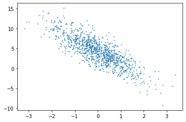
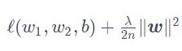

<!-- TOC -->

- [第一章](#第一章)
  - [1、数据操作](#1数据操作)
    - [1、创建tensor：](#1创建tensor)
    - [2、运算](#2运算)
    - [3、广播机制](#3广播机制)
    - [4、索引](#4索引)
    - [5、运算的内存开销](#5运算的内存开销)
    - [6、tensor及numpy转换](#6tensor及numpy转换)
  - [2、求梯度](#2求梯度)
    - [1、简单示例](#1简单示例)
    - [2、训练模型和预测模型](#2训练模型和预测模型)
    - [3、对Python控制流求梯度](#3对python控制流求梯度)
        - [Tips](#tips)
  - [3、查阅文档](#3查阅文档)
- [深度学习基础](#深度学习基础)
  - [1、线性回归](#1线性回归)
  - [2、线性回归的tf+keras实现](#2线性回归的tfkeras实现)
  - [7、模型选择、欠拟合和过拟合](#7模型选择欠拟合和过拟合)
    - [1、K折交叉验证](#1k折交叉验证)
    - [2、欠拟合和过拟合，对应的是模型的训练误差和测试数据集上的误差的关系。](#2欠拟合和过拟合对应的是模型的训练误差和测试数据集上的误差的关系)
    - [3、权重衰减](#3权重衰减)
  - [8、丢弃法和正反向传播](#8丢弃法和正反向传播)
    - [1、丢弃法 Droupout](#1丢弃法-droupout)
    - [2、正反向传播结论：](#2正反向传播结论)
- [深度学习计算](#深度学习计算)
  - [1、模型构建方法](#1模型构建方法)
  - [2、模型参数的访问、初始化和共享](#2模型参数的访问初始化和共享)
    - [1、模型参数访问](#1模型参数访问)
    - [2、初始化](#2初始化)
  - [3、自定义层](#3自定义层)
  - [4、读取和存储](#4读取和存储)
  - [获取能够计算的cpu和gpu设备](#获取能够计算的cpu和gpu设备)
- [卷积神经网络](#卷积神经网络)
  - [1、自定义VGG块（重复利用](#1自定义vgg块重复利用)
  - [2、用1*1卷积层代替全连接层](#2用11卷积层代替全连接层)
      - [用卷积层和1*1卷积层来代替卷积层和全连接层代码如下](#用卷积层和11卷积层来代替卷积层和全连接层代码如下)
          - [卷积核数据和大小要分清楚！，卷积核数目与输出通道数有关](#卷积核数据和大小要分清楚卷积核数目与输出通道数有关)
  - [3、并行连接网络](#3并行连接网络)
  - [4、批量归一化](#4批量归一化)
  - [5、残差网络](#5残差网络)
  - [稠密连接网络(DernseNet)](#稠密连接网络dernsenet)
  - [Alexnet代码（常用）](#alexnet代码常用)
  - [NiN块代码](#nin块代码)
  - [Inception](#inception)
  - [残差网络代码](#残差网络代码)
  - [稠密网络代码](#稠密网络代码)

<!-- /TOC -->

# 第一章
## 1、数据操作
### 1、创建tensor：     
    x = tf.constant(range(12))
    tf.zeros(()) tf.ones(()) tf.constant([[]]) 
    tf.random.normal(shape=[3,4], mean = 0, stddev = 1)  
    #x.shape（12，） 
    改变tensor形状： X = tf.reshape(x, (3, 4))|(-1,4)|(3,-1)
    tf.Variable(initializer,name)生成变量，tf.Variable(num)
    tf.placeholder(tf.float32)生成占位变量
    tf.constant([])生成常量
    tf.assign(A, new_number):将A的值修改为new
    assign类操作在tf2中仅支持Variable变量
### 2、运算
    X+Y，X*Y，X/Y（X，Y形状相同）
    tf.exp(X)，tf.transpose(转置)，
    tf.cast(数据类型转换)，tf.matmul(矩阵相乘)，tf.concat([],axis=0)矩阵连接，tf.equal(X,Y)判断，tf.reduce_sum(所有元素求和)，tf.norm(范数)
### 3、广播机制
        可以支持两个矩阵均为最小向量的情况
### 4、索引
        X[1,2].assign(9)
### 5、运算的内存开销
        1、X.assign_add(Y)与X+=Y相同
### 6、tensor及numpy转换
        tf.contant()
        np.array()
## 2、求梯度
    梯度求解利器：tf.GradientTape()  使用方法：
```
with tf.GradientTape() as g:
    g.watch(x)
    y = 2 * tf.matmul(tf.transpose(x),x)
dy_dx = g.gradient(y,x)
``` 
### 1、简单示例
$$对y=2x^T求关于列向量x的梯度$$
```
x = tf.reshape(tf.Variable(range(4),dtype = tf.float32),(4,1))
with tf.GradientTape()as t:
        t.watch(x)
        y = 2 * tf.matmul(tf.transpose(x), x)
dy_dx = t.gradient(y, x)
```
### 2、训练模型和预测模型
```
with tf.GradientTape(persistent=True) as g:
    g.watch(x)
    y = x * x
    z = y * y
    dz_dx = g.gradient(z, x)  # 108.0 (4*x^3 at x = 3)
    dy_dx = g.gradient(y, x)  # 6.0
```
        在一般网络中，不需要显式调用watch函数，使用默认设置，GradientTape会监控可控制变量
```
with tf.GradientTape() as tape:
    predictions = model(images)
    loss = loss_object(labels, predictions)
gradients = tape.gradient(loss, model.trainable_variables)
```
        这样即可计算出所有可训练变量的梯度，然后进行下一步的更新，并且可以在eager模式下查看具体的梯度值
### 3、对Python控制流求梯度
即使函数的计算图包含了Python的控制流，如条件和循环控制，也能对变量求梯度。考虑下面函数：
```
def f(a):
    b = a * 2
    while tf.norm(b) < 1000:
        b = b * 2
    if tf.reduce_sum(b) > 0:
        c = b
    else:
        c = 100 * b
    return c
```
使用下面函数验证控制流求梯度的结果正确性。
```
a = tf.random.normal((1,1),dtype=tf.float32)
with tf.GradientTape() as t:
    t.watch(a)
    c = f(a)
t.gradient(c,a) == c/a  # 
```
可用t.gradient求二阶导
##### Tips
1、在同一个tape中进行不同计算图切换的方法：
```
with tf.GradientTape() as t:  
    loss = loss_fn() 
    t.reset() #reset即不同计算图切换核心函数 
    loss += other_loss_fn() #后一步运算的梯度
    t.gradient(loss, ...)
```
2、stop_recording，tape将不会记录其中的运算操作（连接取消），可以选择不记录某些运算操作，从而节省内存。作用与assign效果相同，但该方法会建立新节点。
* * *assign赋值时节点之间没有建立依赖关系，计算梯度时无法传递梯度，只改变计算图中某个节点的值，这种特性可以用来设计截断的计算图。
* * *a=b|a=a+b|a=a-b方法得到的梯度为1，后两个会新增新的节点指向
* * 运算式 a = func(b,c...) ：在计算图中创建一个新节点来记录计算结果，同时建立b,c...指向的节点到新节点的依赖关系。
* * *赋值a = b：计算图不变，a、b同时指向原来b指向的节点。
* * *如果要达到运算式a = identity(b)的效果（亦即新建一个节点，使其依赖于b指向节点，并且两节点同值），可以使用a = tf.identity(b)。
截断的计算图，只求z对x的导数方法，其中：
$$
y = g(x)\\
z = f(x, y)
$$

方法1：不记录依赖路径，使用stop_recording实现
```
'''使用 tape.stop_recording()'''
x = tf.Variable(4.0)
with tf.GradientTape() as g:
    g.watch(x)
    with g.stop_recording():
        y = x * x  #assign同理
    z = x + y
grads_1 = g.gradient(z, x)
'''grads_1 = 1.0'''
```
方法2：添加隐藏节点来解除依赖关系
```
s = tf.Variable(4.0)
with tf.GradientTape() as g:
    g.watch(s)
    x = tf.identity(s)
    y = s * s#使用s新的变量来代替x，从而隐藏节点。
    z = x + y
grads_2 = g.gradient(z, x)
'''grads_2 = 1.0'''
```
## 3、查阅文档
dir(tf.dtype)
help(tf.ones)
# 深度学习基础
## 1、线性回归
应该尽可能采用矢量计算，以提升计算效率。
```python
import tensorflow as tf
print(tf.__version__)
import matplotlib.pyplot as plt
import random
import numpy as np
```
    2.1.0
```python
num_input = 2
num_examples = 1000
true_w = [2, -3 ,4]
true_b = 4.2
features = tf.random.normal((num_examples, num_input), stddev = 1)  # 模拟输入
labels = true_w[0] * features[:,0] + true_w[1] * features[:,1] + true_b
labels += tf.random.normal(labels.shape,stddev=0.01)  # 模拟输出
```


```python

```


```python
plt.scatter(features[:, 1], labels, 1)
```

    
生成信号迭代

```python
def data_iter(batch_size, features, labels):
    num_examples = len(features)
    indexx  = list(range(num_examples))
    random.shuffle(indexx) #打乱次序
    for i in range(0, num_examples, batch_size):
        j = indexx[i:min(i+batch_size, num_examples)]
        yield tf.gather(features, axis = 0, indices = j), tf.gather(labels, axis=0, indices=j)
        # yield会在循环中经过yield时作为return结束函数，next(func)会接着上一步return位置继续运行只到下次运行到yield
        # yield相对来讲更省空间
batch_size = 10  
```
```python
# 初始化模型参�?
w = tf.Variable(tf.random.normal((num_input, 1), stddev = 0.01))
b = tf.Variable((tf.zeros((1,))))
# 定义信号模型
def linreg(X, w, b):
    return tf.matmul(X, w) + b
def square_loss(y_hat, y):# y_hat为信号的预测值，最后使得两者误差最小
return (y_hat - tf.reshape(y, y_hat.shape)) ** 2 / 2
# 损失函数是用来度量模型的预测值和数据真实值之间的差距
# 优化函数一般用随机梯度方法使预测值和真实值之间更为接近，目前常用的优化函数为Adam
def sgd(params, lr, batch_size, grads):
    for i, param in enumerate(params):
        param.assign_sub(lr * grads[i] /batch_size)# sub:ref = ref-value
        
```
```python
lr = 0.03
num_epochs = 3
net = linreg
loss = square_loss
for epoch in range(num_epochs):
    for X, y in data_iter(batch_size, features, labels):
        with tf.GradientTape() as t:
            t.watch([w, b])
            l = tf.reduce_sum(loss(net(X, w, b), y))
        grads = t.gradient(l, [w, b])
            print(l)
        sgd([w, b], lr, batch_size, grads)
    train_l = loss(net(features, w, b), labels)# labels为标签，每次迭代仅改变w和b的值
    print('epoch %d, loss %f' % (epoch+1, tf.reduce_mean(train_l)))
# 二件事
# 1、l为每组用最新的w,b得到的总损失值（这个总损失值的总体现在10个样本的数目上）
# 2、每次迭代只关心的是w,b的变化，且优化函数中含有batch_size这个概念，即为批量梯度下降的优化函数
```
    epoch 1, loss 0.037374
    epoch 2, loss 0.000143
    epoch 3, loss 0.000053

```python
print(true_w, w)
print(true_b, b)
```
    [2, -3, 4] <tf.Variable 'Variable:0' shape=(2, 1) dtype=float32, numpy=
    array([[ 1.9993333],
           [-2.9994075]], dtype=float32)>
    4.2 <tf.Variable 'Variable:0' shape=(1,) dtype=float32, numpy=array([4.199557], dtype=float32)>
## 2、线性回归的tf+keras实现


## 7、模型选择、欠拟合和过拟合
### 1、K折交叉验证
当训练数据不够用时，预留大量的验证数据显得太奢侈，在K折交叉验证中，我们把原始训练数据分割成k个不重合的子数据集，然后我们做K次模型训练和验证。每一次我们使用一个子数据集验证模型，并使用其他K-1个子数据集来训练模型。在这K次训练和验证中，每次用来验证模型的子数据集都不同。最后我们对这K次训练误差和验证误差分别求平均。
### 2、欠拟合和过拟合，对应的是模型的训练误差和测试数据集上的误差的关系。
如果模型的复杂度较低，很容易出现欠拟合，如果模型的复杂度过高很容易出现过拟合；应对欠拟合和过拟合的一个办法是针对数据及选择合适复杂度的模型。
影响欠拟合和过拟合的另一个重要因素是训练数据集的大小。如果训练数据集样本数过少，过拟合更容易发生。泛化误差不会随训练数据集里样本数量增加而增大。通常希望训练数据集大一些。

经非线性多项式曲线拟合实验，得出以下结论：
*  由于无法从训练误差估计泛化误差，一味地降低训练误差并不意味着泛化误差一定会降低。机器学习模型应关注降低泛化误差。
* 可以使用验证数据集来进行模型选择。
* 欠拟合指模型无法得到较低的训练误差，过拟合指模型的训练误差远小于它在测试数据集上的误差。
* 应选择复杂度合适的模型并避免使用过少的训练样本。
### 3、权重衰减
权重衰减等价于L2范数正则化。正则化通过为模型损失函数添加惩罚项使学出的模型参数值较小，是应对过拟合的常用手段。
L2​范数正则化在模型原损失函数基础上添加L2范数惩罚项，从而得到训练所需要最小化的函数。L2范数惩罚项指的是模型权重参数每个元素的平方和与一个正的常数的乘积。
<div align = center>
    
</div>

上式中$\lambda$表示惩罚权重

&#8195;&#8195;最终结果使用权重衰减后训练误差有所提高，但测试集上误差有所下降，过拟合现象得到一定程度缓解，且得到的权重参数更接近0
```python
# tf2 实现L2正则时可以在全链接层使用kernel_regularizer=regularizers.l2(wd)实现，wd是自定义系数。其在计算loss时会直接自动加载到main loss中，好处是不需要在main loss定义时写大量代码，提高了代码的可读性
tf.keras.layers.Dense(1,kernel_regularizer=regularizers.l2(wd),bias_regularizer=None)
```
结论：
+ 1、正则化通过为模型损失函数添加惩罚项使学出的模型参数值较小，是应对过拟合的常用手段。
+ 2、权重衰减等价于L2范数正则化，通常会使学到的权重参数的元素较接近0。
+ 3、权重衰减可以通过 kernel_regularizer超参数来指定。
+ 4、可以定义多个优化器实例对不同的模型参数使用不同的迭代方法。
## 8、丢弃法和正反向传播
### 1、丢弃法 Droupout
### 2、正反向传播结论：
* 1、正向传播沿着从输入层到输出层的顺序，依次计算并存储神经网络的中间变量。
* 2、反向传播沿着从输出层到输入层的顺序，依次计算并存储神经网络中间变量和参数的梯度。
* 3、在训练深度学习模型时，正向传播和反向传播相互依赖。
* 4、深度模型有关数值稳定性的典型问题是衰减和爆炸。当神经网络的层数较多时，模型的数值稳定性容易变差。
# 深度学习计算
## 1、模型构建方法
```python
model = keras.Sequential([
    keras.layers.Flatten(input_shape = (28, 28)),
    keras.layers.Dense(256, activation = 'relu'),
    Dropout(0.2),
    keras.layers.Dense(256, activation = 'relu'),
    Dropout(0.5),
    keras.layers.Dense(19, activation = tf.nn.softmax)])
model.compile(optimizer=optimizer,
              loss='sparse_categorical_crossentropy',
              metrics=['accuracy'])
net.fit(train_images, train_labels, epochs=5, validation_split=0.1)
```
```python
class MLP(tf.keras.Model):
    def __init__(self):
        super().__init__()
        self.flatten = tf.keras.layers.Flatten() 
        self.dense1 = tf.keras.layers.Dense(units=256, activation=tf.nn.relu)
        self.dense2 = tf.keras.layers.Dense(units=10)

    def call(self, inputs):         
        x = self.flatten(inputs)   
        x = self.dense1(x)    
        output = self.dense2(x)     
        return output
```
```python
# 其中有常随机权重
class FancyMLP(tf.keras.Model):
    def __init__(self):
        super().__init__()
        self.flatten = tf.keras.layers.Flatten()
        self.rand_weight = tf.constant(
            tf.random.uniform((20,20)))
        self.dense = tf.keras.layers.Dense(units=20, activation=tf.nn.relu)

    def call(self, inputs):         
        x = self.flatten(inputs)   
        x = tf.nn.relu(tf.matmul(x, self.rand_weight) + 1)
        x = self.dense(x)    
        while tf.norm(x) > 1:
            x /= 2
        if tf.norm(x) < 0.8:
            x *= 10
        return tf.reduce_sum(x)

class NestMLP(tf.keras.Model):
    def __init__(self):
        super().__init__()
        self.net = tf.keras.Sequential()
        self.net.add(tf.keras.layers.Flatten())
        self.net.add(tf.keras.layers.Dense(64, activation=tf.nn.relu))
        self.net.add(tf.keras.layers.Dense(32, activation=tf.nn.relu))
        self.dense = tf.keras.layers.Dense(units=16, activation=tf.nn.relu)


    def call(self, inputs):         
        return self.dense(self.net(inputs))
# 嵌套。。。
net = tf.keras.Sequential()
net.add(NestMLP())
net.add(tf.keras.layers.Dense(20))
net.add(FancyMLP())
net(X)
```
## 2、模型参数的访问、初始化和共享
### 1、模型参数访问
net.weights[0] | type(net.weights[0])
net.get_weights()
for layer in net.layers:
net.get_layer(index=1).gamma伸缩参数|.beta偏移参数

### 2、初始化
默认初始化方法为权重参数元素为[-0.07,0.07]之间均匀分布的随机数，初始化权值在定义层时实现
tf.keras.layers.Dense(
            kernel_initializer=tf.random_normal_initializer(mean=0,stddev=0.01),
            bias_initializer=tf.zeros_initializer()
        )
也可以使用tf.keras.initializers自定义初始化
```python
def my_init():
    return tf.keras.initializers.Ones()

model = tf.keras.models.Sequential()
model.add(tf.keras.layers.Dense(64, kernel_initializer=my_init()))
```
## 3、自定义层
```python
class myDense(tf.keras.layers.Layer):
    def __init__(self, units):
        super().__init__()
        self.units = units

    def build(self, input_shape):     # 这里 input_shape 是第一次运行call()时参数inputs的形状
        self.w = self.add_weight(name='w',
            shape=[input_shape[-1], self.units], initializer=tf.random_normal_initializer())
        self.b = self.add_weight(name='b',
            shape=[self.units], initializer=tf.zeros_initializer())

    def call(self, inputs):
        y_pred = tf.matmul(inputs, self.w) + self.b
        return y_pred
```
build() 可自定义网络的权重的维度，可以根据输入来指定权重的维度，若权重固定(如自定义网络层的权重随机分布形式，这时把权重定义写在init即可），可避免使用build() 方法
self.built = True，该参数在build() 运行开始时为False，为了保证先调用build() 方法, 再调用call() 方法，结束时会自动赋值为True，保证build() 方法**只被调用一次**
call()函数实现前向传播的逻辑功能。返回该层输出值，不包含激活函数计算
## 4、读取和存储
tensor数据可以用numpy的save和load进行存储和读取
网络模型的参数可用net.save_weight('save_model.h5)保存
## 获取能够计算的cpu和gpu设备
```python
gpus = tf.config.experimental.list_physical_devices(device_type='GPU')
cpus = tf.config.experimental.list_physical_devices(device_type='CPU')
print("可用的GPU：",gpus,"\n可用的CPU：", cpus)
# 使用tf.device()来指定特定设备(GPU/CPU)
with tf.device('GPU:0'):
    a = tf.constant([1,2,3],dtype=tf.float32)
    b = tf.random.uniform((3,))
    print(tf.exp(a + b) * 2)

# **********************************
# 采用GPU训练并设置memory_growth
tf.config.experimental.list_physical_devices('GPU') #确认TensorFlow正在使用GPU。
for gpu in tf.config.experimental.list_physical_devices('GPU'):
    tf.config.experimental.set_memory_growth(gpu, True) #自适应
    tf.config.experimental.VirtualDeviceConfiguration(memory_limit=2048) #最大值
# 
tensor.device
```
# 卷积神经网络
卷积层，功能：填充、步幅
池化层，功能：窗口形状|大小、步幅、填充
注意多通道输入和输出问题
池化层作用：缓解卷积层对位置的过度敏感性
## 1、自定义VGG块（重复利用
```python
conv_arch = ((1, 64), (1, 128), (2, 256), (2, 512), (2, 512))
def vgg_block(num_convs, num_channels):
    blk = tf.keras.models.Sequential()
    for _ in range(num_convs):
        blk.add(tf.keras.layers.Conv2D(num_channels,kernel_size=3, padding='same',activation='relu'))
    blk.add(tf.keras.layers.MaxPool2D(pool_size=2, strides=2))
    return blk
def vgg(conv_arch):
    net = tf.keras.models.Sequential()
    for (num_convs, num_channels) in conv_arch:
        net.add(vgg_block(num_convs,num_channels))
    net.add(tf.keras.models.Sequential([tf.keras.layers.Flatten(),
             tf.keras.layers.Dense(4096,activation='relu'),
             tf.keras.layers.Dropout(0.5),
             tf.keras.layers.Dense(4096,activation='relu'),
             tf.keras.layers.Dropout(0.5),
             tf.keras.layers.Dense(10,activation='sigmoid')]))
    return net
```
**上图定义的多卷积+池化层的方法可以参考、重复使用**
```python
def train_vgg():
#     net.load_weights("5.7_vgg_weights.h5")
    epoch = 5
    num_iter = dataLoader.num_train//batch_size
    for e in range(epoch):
        for n in range(num_iter):
            x_batch, y_batch = dataLoader.get_batch_train(batch_size)
            net.fit(x_batch, y_batch)
            if n%20 == 0:
                net.save_weights("5.7_vgg_weights.h5")

optimizer = tf.keras.optimizers.SGD(learning_rate=0.05, momentum=0.0, nesterov=False)

net.compile(optimizer=optimizer,
              loss='sparse_categorical_crossentropy',
              metrics=['accuracy'])

x_batch, y_batch = dataLoader.get_batch_train(batch_size)
net.fit(x_batch, y_batch)
# train_vgg()
```
## 2、用1*1卷积层代替全连接层
全连接层后因为维度关系无法接上卷积层，，为了传递空间信息，可使用1*1卷积层达到以上两个目的，同时降低参数复杂度。
升维、降维、跨通道信息交互、增加非线性特性
注意，此时学习率应随之小幅度增加
缺点1：1*1卷积层只会考虑特征每个位置单独的信息，堆叠多少次都不会有感受野的变化
缺点2：使用该卷积改变通道，会导致内存访问量增加。尽量使输入输出通道相同以最小化内存访问量
#### 用卷积层和1*1卷积层来代替卷积层和全连接层[代码如下](#nin块)
###### 卷积核数据和大小要分清楚！，卷积核数目与输出通道数有关
## 3、并行连接网络
Inception块[代码部分](：

* 1、Inception块相当于一个有4条线路的子网络。它通过不同窗口形状的卷积层和最大池化层来并行抽取信息，并使用1×11×1卷积层减少通道数从而降低模型复杂度。
* 2、GoogLeNet将多个设计精细的Inception块和其他层串联起来。其中Inception块的通道数分配之比是在ImageNet数据集上通过大量的实验得来的。
* 3、GoogLeNet和它的后继者们一度是ImageNet上最高效的模型之一：在类似的测试精度下，它们的计算复杂度往往更低。[详情点击](https://blog.csdn.net/weixin_44211398/article/details/94298169)
## 4、批量归一化
```python
#tf.keras.layers.BatchNormalization()
net = tf.keras.models.Sequential(
    [tf.keras.layers.Conv2D(filters=6,kernel_size=5),
    BatchNormalization(),
    tf.keras.layers.Activation('sigmoid'))
```
使用批量归一化时，可以将批量大小设得大一点，从而使批量内样本的均值和方差的计算都较为准确。
测试时，因为单个样本的输出不应取决于批量归一化所需要的随机小批量中的均值和方差。一种常见的方法是通过移动平均估算整个训练数据集的样本均值和方差，并在预测时使用它们得到确定的输出。

解决方法：：
如果待预测数据量比较大，直接调用 model(test) 进行预测就行了，这样就使用训练模式，会直接从待预测数据计算其对应的均值和方差。
tf.keras.backend.set_learning_phase(True) # predict mode

如果是单个数据或数据分布差异不大，就需要保存BN 层的参数，特别是移动均值和方差，然后直接预测(model.predict)。

具体使用时一般情况下将Batch_Normalization层加一参数，is_training = FLAG_TRAIN。当遇到使用批量归一化层且测试集效果比训练集效果差太多时，点击[参考1]和[参考2]进行深入探究
## 5、残差网络
在实践中，添加过多的层后训练误差往往不降反升，即使利用批量归一化带来的数值稳定性使得训练深层模型更加容易，但该问题依然存在。
残差映射易于捕捉恒等映射的细微波动。在残差块中，输入可通过跨层的数据线路更快的向前传播。
ResNet沿用了VGG全3x3卷积层的设计。残差块首先有两个相同输出通道的3x3卷积层。每个卷积层后姐一个批量归一化层和RelU激活函数，然后将输入跳过这两个卷积运算后直接加在最后的ReLU激活函数前。这样的设计要求两个卷积层的输出与输入形状一样，从而可以相加。如果想改变通道数，就需要引入额外的1x1卷积层将输入变换成需要的醒转后再做相加运算。[代码部分](#残差网络代码)
* 将残差网络的跳层结构发挥到极致，即成为下方的DenseNet，其对于学习的新的信息更有效。而ResNet对于重用信息更有效
* 将残差网络更多并行的跳层链接，得到Dual Path Network。能够综合上述两种网络优点
* 残差网络优势[相关链接](https://www.zhihu.com/question/336310627)：
* * ① 简化了学习的过程，如果整个网络反向传播时其中一个导数很小，多次连乘后梯度越来越小，即梯度消散。但残差网络对输出的变化更敏感，有利于网络的传播。增强了梯度传播。
* * ② 打破了网络的不对称性。一方面通过跳层连接增强了梯度流动性，使得上千层网络的训练成为可能；另一方面残差网络减轻了神经网络的退化。消除输入和权重零极点，打破对称性，线性依赖性。
* * * 网络退化：如果再网络中每个层只有少量的隐藏单元对不同的输入改变它们的激活值，而大部分隐藏党员对不同的输入都是同样的反应，使得整个权重矩阵的秩不高。并且随着网络层数增加，连乘后使得整个秩变得更低，这就是网络退化问题。
* * ③ 增强了网络的泛化能力。即去除某个网络层，并不会使得网络的性能有很大的退化，而VGG网络却会造成性能崩溃。
## 稠密连接网络(DernseNet)
DenseNet中模块的输出不是与输入相加，而是在通道维上连结。DenseNet的主要构建模块是稠密块和过渡层，前者定义了输入和输出是如何连结的，后者则用来控制通道数，使之不过大。
[代码部分](#稠密网络代码)
## Alexnet代码（常用）
<details>
<summary>代码部分</summary>

```python
# -*- coding: utf-8 -*-
import tensorflow as tf
import numpy as np
# 采用GPU训练，并设置memor_growth
for gpu in tf.config.experimental.list_physical_devices('GPU'):
    tf.config.experimental.set_memory_growth(gpu, True)
net = tf.keras.models.Sequential([
    tf.keras.layers.Conv2D(filters=96, kernel_size=11, strides=4, activation='relu'),
    tf.keras.layers.MaxPool2D(pool_size=3, strides=2),
    tf.keras.layers.Conv2D(filters=256, kernel_size=5, padding='same', activation='relu'),
    tf.keras.layers.MaxPool2D(pool_size=3, strides=2),
    tf.keras.layers.Conv2D(filters=384,kernel_size=3,padding='same',activation='relu'),
    tf.keras.layers.Conv2D(filters=384,kernel_size=3,padding='same',activation='relu'),
    tf.keras.layers.Conv2D(filters=256,kernel_size=3,padding='same',activation='relu'),
    tf.keras.layers.MaxPool2D(pool_size=3, strides=2),
    tf.keras.layers.Flatten(),
    tf.keras.layers.Dense(4096,activation='relu'),
    tf.keras.layers.Dropout(0.5),
    tf.keras.layers.Dense(4096,activation='relu'),
    tf.keras.layers.Dropout(0.5),
    tf.keras.layers.Dense(10,activation='sigmoid')
    ])
X = tf.random.uniform((1,224,224,1))
for layer in net.layers:
    X = layer(X)
    print(layer.name, 'output shape\t', X.shape)
fashion_mnist = tf.keras.datasets.fashion_mnist
class DataLoader():
    def __init__(self):
        fashion_mnist = tf.keras.datasets.fashion_mnist
        (self.train_images, self.train_labels), (self.test_images, self.test_labels) = fashion_mnist.load_data()
        self.train_images = np.expand_dims(self.train_images.astype(np.float32)/255.0,axis=-1)
        self.test_images = np.expand_dims(self.test_images.astype(np.float32)/255.0,axis=-1)
        self.train_labels = self.train_labels.astype(np.int32)
        self.test_labels = self.test_labels.astype(np.int32)
        self.num_train, self.num_test = self.train_images.shape[0], self.test_images.shape[0]

    def get_batch_train(self, batch_size):
        index = np.random.randint(0, np.shape(self.train_images)[0], batch_size)
        #need to resize images to (224,224)
        resized_images = tf.image.resize_with_pad(self.train_images[index],224,224,)
        return resized_images.numpy(), self.train_labels[index]

    def get_batch_test(self, batch_size):
        index = np.random.randint(0, np.shape(self.test_images)[0], batch_size)
        #need to resize images to (224,224)
        resized_images = tf.image.resize_with_pad(self.test_images[index],224,224,)
        return resized_images.numpy(), self.test_labels[index]

batch_size = 128
dataLoader = DataLoader()
x_batch, y_batch = dataLoader.get_batch_train(batch_size)


# 训练
def train_alexnet():
    epoch = 5
    num_iter = dataLoader.num_train//batch_size
    for e in range(epoch):
        for n in range(num_iter):
            x_batch, y_batch = dataLoader.get_batch_train(batch_size)
            net.fit(x_batch, y_batch)
            if n%20 == 0:
                net.save_weights("5.6_alexnet_weights.h5")

optimizer = tf.keras.optimizers.SGD(learning_rate=0.01, momentum=0.0, nesterov=False)

net.compile(optimizer=optimizer,
              loss='sparse_categorical_crossentropy',
              metrics=['accuracy'])

x_batch, y_batch = dataLoader.get_batch_train(batch_size)
net.fit(x_batch, y_batch)
# train_alexnet()
```
</details>

## NiN块代码
<details>
<summary>代码部分</summary>

```python
net = tf.keras.models.Sequential()
net.add(nin_block(96, kernel_size=11, strides=4, padding='valid'))
net.add(tf.keras.layers.MaxPool2D(pool_size=3, strides=2))
net.add(nin_block(256, kernel_size=5, strides=1, padding='same'))
net.add(tf.keras.layers.MaxPool2D(pool_size=3, strides=2))
net.add(nin_block(384, kernel_size=3, strides=1, padding='same'))
net.add(tf.keras.layers.MaxPool2D(pool_size=3, strides=2))
net.add(tf.keras.layers.Dropout(0.5))
net.add(nin_block(10, kernel_size=3, strides=1, padding='same'))
net.add(tf.keras.layers.GlobalAveragePooling2D())
net.add(tf.keras.layers.Flatten())
X = tf.random.uniform((1,224,224,1))
for blk in net.layers:
    X = blk(X)
    print(blk.name, 'output shape:\t', X.shape)


def train_nin():
    net.load_weights("5.8_nin_weights.h5")
    epoch = 5
    num_iter = dataLoader.num_train//batch_size
    for e in range(epoch):
        for n in range(num_iter):
            x_batch, y_batch = dataLoader.get_batch_train(batch_size)
            net.fit(x_batch, y_batch)
            if n%20 == 0:
                net.save_weights("5.8_nin_weights.h5")

# optimizer = tf.keras.optimizers.SGD(learning_rate=0.06, momentum=0.3, nesterov=False)
optimizer = tf.keras.optimizers.Adam(lr=1e-7)
net.compile(optimizer=optimizer,
              loss='sparse_categorical_crossentropy',
              metrics=['accuracy'])

x_batch, y_batch = dataLoader.get_batch_train(batch_size)
net.fit(x_batch, y_batch)
# train_nin()
```
</details>

## Inception
<details>
<summary>代码部分</summary>

```python
class Inception(tf.keras.layers.Layer):
    def __init__(self,c1, c2, c3, c4):
        super().__init__()
        # 线路1，单1 x 1卷积层
        self.p1_1 = tf.keras.layers.Conv2D(c1, kernel_size=1, activation='relu', padding='same')
        # 线路2，1 x 1卷积层后接3 x 3卷积层
        self.p2_1 = tf.keras.layers.Conv2D(c2[0], kernel_size=1, padding='same', activation='relu')
        self.p2_2 = tf.keras.layers.Conv2D(c2[1], kernel_size=3, padding='same',
                              activation='relu')
        # 线路3，1 x 1卷积层后接5 x 5卷积层
        self.p3_1 = tf.keras.layers.Conv2D(c3[0], kernel_size=1, padding='same', activation='relu')
        self.p3_2 = tf.keras.layers.Conv2D(c3[1], kernel_size=5, padding='same',
                              activation='relu')
        # 线路4，3 x 3最大池化层后接1 x 1卷积层
        self.p4_1 = tf.keras.layers.MaxPool2D(pool_size=3, padding='same', strides=1)
        self.p4_2 = tf.keras.layers.Conv2D(c4, kernel_size=1, padding='same', activation='relu')

    def call(self, x):#call函数也在调用类时自动运行
        p1 = self.p1_1(x)
        p2 = self.p2_2(self.p2_1(x))
        p3 = self.p3_2(self.p3_1(x))
        p4 = self.p4_2(self.p4_1(x))
        return tf.concat([p1, p2, p3, p4], axis=-1)  # 在通道维上连结输出
b1 = tf.keras.models.Sequential()
b1.add(tf.keras.layers.Conv2D(64, kernel_size=7, strides=2, padding='same', activation='relu'))
b1.add(tf.keras.layers.MaxPool2D(pool_size=3, strides=2, padding='same'))

b2 = tf.keras.models.Sequential()
b2.add(tf.keras.layers.Conv2D(64, kernel_size=1, padding='same', activation='relu'))
b2.add(tf.keras.layers.Conv2D(192, kernel_size=3, padding='same', activation='relu'))
b2.add(tf.keras.layers.MaxPool2D(pool_size=3, strides=2, padding='same'))

b3 = tf.keras.models.Sequential()
b3.add(Inception(64, (96, 128), (16, 32), 32))
b3.add(Inception(128, (128, 192), (32, 96), 64))
b3.add(tf.keras.layers.MaxPool2D(pool_size=3, strides=2, padding='same'))

b4 = tf.keras.models.Sequential()
b4.add(Inception(192, (96, 208), (16, 48), 64))
b4.add(Inception(160, (112, 224), (24, 64), 64))
b4.add(Inception(128, (128, 256), (24, 64), 64))
b4.add(Inception(112, (144, 288), (32, 64), 64))
b4.add(Inception(256, (160, 320), (32, 128), 128))
b4.add(tf.keras.layers.MaxPool2D(pool_size=3, strides=2, padding='same'))

b5 = tf.keras.models.Sequential()
b5.add(Inception(256, (160, 320), (32, 128), 128))
b5.add(Inception(384, (192, 384), (48, 128), 128))
b5.add(tf.keras.layers.GlobalAvgPool2D())

net = tf.keras.models.Sequential([b1, b2, b3, b4, b5, tf.keras.layers.Dense(10)])
X = tf.random.uniform(shape=(1, 96, 96, 1))
for layer in net.layers:
    X = layer(X)
    print(layer.name, 'output shape:\t', X.shape)

def train_googlenet():
    net.load_weights("5.9_googlenet_weights.h5")
    epoch = 5
    num_iter = dataLoader.num_train//batch_size
    for e in range(epoch):
        for n in range(num_iter):
            x_batch, y_batch = dataLoader.get_batch_train(batch_size)
            net.fit(x_batch, y_batch)
            if n%20 == 0:
                net.save_weights("5.9_googlenet_weights.h5")

# optimizer = tf.keras.optimizers.SGD(learning_rate=0.05, momentum=0.0, nesterov=False)
optimizer = tf.keras.optimizers.Adam(lr=1e-7)

net.compile(optimizer=optimizer,
              loss='sparse_categorical_crossentropy',
              metrics=['accuracy'])

x_batch, y_batch = dataLoader.get_batch_train(batch_size)
net.fit(x_batch, y_batch)
train_googlenet()

net.load_weights("5.9_googlenet_weights.h5")

x_test, y_test = dataLoader.get_batch_test(2000)
net.evaluate(x_test, y_test, verbose=2)
```
</details>

## 残差网络代码
<details>
<summary>代码部分</summary>

```py
# -*- coding: utf-8 -*-


import tensorflow as tf
from tensorflow.keras import layers,activations
## 残差块
# *args 传入元组，**kwargs传入字典
class Residual(tf.keras.Model):
    def __init__(self, num_channels, use_1x1conv=False, strides=1, **kwargs):
        super(Residual, self).__init__(**kwargs)
        self.conv1 = layers.Conv2D(num_channels,
                                   padding='same',
                                   kernel_size=3,
                                   strides=strides
                                   )
        self.conv2 = layers.Conv2D(num_channels, kernel_size=3, padding='same')
        if use_1x1conv:
            self.conv3 = layers.Conv2D(num_channels,
                                       kernel_size=1,
                                       strides=strides)
        else:
            self.conv3 = None
        self.bn1 = layers.BatchNormalization()
        self.bn2 = layers.BatchNormalization()
    def call(self, X):
        Y = activations.relu(self.bn1(self.conv1(X)))
        Y = self.bn2(self.conv2(Y))
        if self.conv3:
            X = self.conv3(X)
        return activations.relu(Y + X)
blk = Residual(3)
#tensorflow input shpe     (n_images, x_shape, y_shape, channels).
X = tf.random.uniform((4, 6, 6, 3))
print(blk(X).shape)
blk = Residual(6, use_1x1conv=True, strides=2)
print(blk(X).shape)

## ResNet模型
class ResNetBlock(tf.keras.layers.Layer):
    def __init__(self, num_channels, num_residuals, first_block=False, **kwargs):
        super(ResNetBlock, self).__init__(**kwargs)
        self.listLayers = []
        for i in range(num_residuals):
            if i==0 and not first_block:
                self.listLayers.append(Residual(num_channels, use_1x1conv=True, strides=2))
            else:
                self.listLayers.append(Residual(num_channels))
    def call(self, X):
        for layer in self.listLayers.layers:
            X = layer(X)
        return X
# 为ResNet加入所有残差块
class ResNet(tf.keras.Model):
    def __init__(self, num_blocks, **kwargs):
        super(ResNet, self).__init__(**kwargs)
        self.conv = layers.Conv2D(64, kernel_size=7, strides=2, padding='same')
        self.bn = layers.BatchNormalization()
        self.relu = layers.Activation('relu')
        self.mp = layers.MaxPool2D(pool_size=3, strides=2, padding='same')
        self.resnet_block1 = ResNetBlock(64, num_blocks[0], first_block=True)
        self.resnet_block2 = ResNetBlock(128, num_blocks[1])
        self.resnet_block3 = ResNetBlock(256, num_blocks[2])
        self.resnet_block4 = ResNetBlock(512, num_blocks[3])
        self.gap = layers.GlobalAvgPool2D()
        self.fc = layers.Dense(units=10, activation=tf.keras.activations.softmax)
    def call(self, x):
        x = self.conv(x)
        x = self.bn(x)
        x = self.relu(x)
        x = self.mp(x)
        x = self.resnet_block1(x)
        x = self.resnet_block2(x)
        x = self.resnet_block3(x)
        x = self.resnet_block4(x)
        x = self.gap(x)
        x = self.fc(x)
        return x
    
mynet = ResNet([2, 2, 2, 2])
x = tf.random.uniform(shape=[1, 224, 224, 1])
for layer in mynet.layers:
    X = layer(X)
    print(layer.name, 'outpout shape:\t', X.shape)
(x_train, y_train), (x_test, y_test) = tf.keras.datasets.fashion_mnist.load_data()
x_train = x_train.reshape((60000, 28, 28, 1)).astype('float32') / 255
x_test = x_test.reshape((10000, 28, 28, 1)).astype('float32') / 255

mynet.compile(loss='sparse_categorical_crossentropy',
              optimizer=tf.keras.optimizers.Adam(),
              metrics=['accuracy'])

history = mynet.fit(x_train, y_train,
                    batch_size=64,
                    epochs=5,
                    validation_split=0.2)
test_scores = mynet.evaluate(x_test, y_test, verbose=2)
```
</details>

## 稠密网络代码
<details><summary>代码部分</summary>

```py
# -*- coding: utf-8 -*-
import tensorflow as tf
import numpy as np

class BottleNeck(tf.keras.layers.Layer):
    def __init__(self, growth_rate, drop_rate):
        super(BottleNeck, self).__init__()
        self.bn1 = tf.keras.layers.BatchNormalization()
        self.conv1 = tf.keras.layers.Conv2D(filters=4*growth_rate,
                                            kernel_size=(1, 1),
                                            strides=1,
                                            padding='same')
        self.bn2 = tf.keras.layers.BatchNormalization()
        self.conv2 = tf.keras.layers.Conv2D(filters=growth_rate,
                                            kernel_size=(3, 3),
                                            strides=1,
                                            padding='same')
        self.dropout = tf.keras.layers.Dropout(rate=drop_rate)
        self.listLayers = [self.bn1,
                           tf.keras.layers.Activation('relu'),
                           self.conv1,
                           self.bn2,
                           tf.keras.layers.Activation('relu'),
                           self.conv2,
                           self.dropout]
        def call(self, x):
            y = x
            for layer in self.listLayers.layers:
                y = layer(y)
            y = tf.keras.layers.concatenate([x, y], axis=-1)
            return y
# 稠密块
class DenseBlock(tf.keras.layers.Layer):
    def __init__(self, num_layers, growth_rate, drop_rate=0.5):
        super(DenseBlock, self).__init__()
        self.num_layers = num_layers
        self.growth_rate = growth_rate
        self.drop_rate = drop_rate
        self.listLayers = []
        for _ in range(num_layers):
            self.listLayers.append(BottleNeck(growth_rate=self.growth_rate, drop_rate= self.drop_rate))
        
    def call(self, x):
        for layer in self.listLayers.layers:
            x = layer(x)
        return x
blk = DenseBlock(2, 10)
X = tf.random.uniform((4, 8, 8,3))
Y = blk(X)
print(Y.shape)
# 在此例中，定义一个有2个输出通道数为10的卷积块。
# 使用通道数为3的输入时，我们会得到通道数为3+2×10=23
# 的输出。卷积块的通道数控制了输出通道数相对于输入通道数的增长，
# 因此也被称为增长率（growth rate）。
# 过渡层
class TransitionLayer(tf.keras.layers.Layer):
    def __init__(self, out_channels):
        super(TransitionLayer, self).__init__()
        self.bn = tf.keras.layers.BatchNormalization()
        self.conv = tf.keras.layers.Conv2D(filters=out_channels,
                                           kernel_size=(1, 1),
                                           strides=1,
                                           padding='same')
        self.pool = tf.keras.layers.MaxPool2D(pool_size=(2,2),
                                              strides=2,
                                              padding='same')
    def call(self, inputs):
        x = self.bn(inputs)
        x = tf.keras.activations.relu(x)
        x = self.conv(x)
        x = self.pool(x)
        return x
blk = TransitionLayer(10)
blk(Y).shape#TensorShape([4, 4, 4, 10])
class DenseNet(tf.keras.Model):
    def __init__(self, num_init_features, growth_rate, block_layers, compression_rate, drop_rate):
        super(DenseNet, self).__init__()
        self.conv = tf.keras.layers.Conv2D(filters=num_init_features,
                                           kernel_size=(7, 7),
                                           strides=2,
                                           padding="same")
        self.bn = tf.keras.layers.BatchNormalization()
        self.pool = tf.keras.layers.MaxPool2D(pool_size=(3, 3),
                                              strides=2,
                                              padding="same")
        self.num_channels = num_init_features
        self.dense_block_1 = DenseBlock(num_layers=block_layers[0], growth_rate=growth_rate, drop_rate=drop_rate)
        self.num_channels += growth_rate * block_layers[0]
        self.num_channels = compression_rate * self.num_channels
        self.transition_1 = TransitionLayer(out_channels=int(self.num_channels))
        self.dense_block_2 = DenseBlock(num_layers=block_layers[1], growth_rate=growth_rate, drop_rate=drop_rate)
        self.num_channels += growth_rate * block_layers[1]
        self.num_channels = compression_rate * self.num_channels
        self.transition_2 = TransitionLayer(out_channels=int(self.num_channels))
        self.dense_block_3 = DenseBlock(num_layers=block_layers[2], growth_rate=growth_rate, drop_rate=drop_rate)
        self.num_channels += growth_rate * block_layers[2]
        self.num_channels = compression_rate * self.num_channels
        self.transition_3 = TransitionLayer(out_channels=int(self.num_channels))
        self.dense_block_4 = DenseBlock(num_layers=block_layers[3], growth_rate=growth_rate, drop_rate=drop_rate)

        self.avgpool = tf.keras.layers.GlobalAveragePooling2D()
        self.fc = tf.keras.layers.Dense(units=10,
                                        activation=tf.keras.activations.softmax)

    def call(self, inputs):
        x = self.conv(inputs)
        x = self.bn(x)
        x = tf.keras.activations.relu(x)
        x = self.pool(x)

        x = self.dense_block_1(x)
        x = self.transition_1(x)
        x = self.dense_block_2(x)
        x = self.transition_2(x)
        x = self.dense_block_3(x)
        x = self.transition_3(x,)
        x = self.dense_block_4(x)

        x = self.avgpool(x)
        x = self.fc(x)

        return x
def densenet():
    return DenseNet(num_init_features=64, growth_rate=32, block_layers=[4,4,4,4], compression_rate=0.5, drop_rate=0.5)
mynet=densenet()
X = tf.random.uniform(shape=(1,  96, 96 , 1))
for layer in mynet.layers:
    X = layer(X)
    print(layer.name, 'output shape:\t', X.shape)
(x_train, y_train), (x_test, y_test) = tf.keras.datasets.fashion_mnist.load_data()
x_train = x_train.reshape((60000, 28, 28, 1)).astype('float32') / 255
x_test = x_test.reshape((10000, 28, 28, 1)).astype('float32') / 255

mynet.compile(loss='sparse_categorical_crossentropy',
              optimizer=tf.keras.optimizers.Adam(),
              metrics=['accuracy'])

history = mynet.fit(x_train, y_train,
                    batch_size=64,
                    epochs=5,
                    validation_split=0.2)
test_scores = mynet.evaluate(x_test, y_test, verbose=2)
```
</details>

