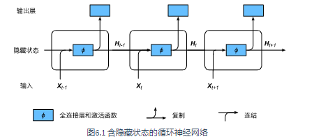
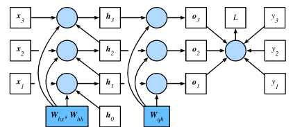
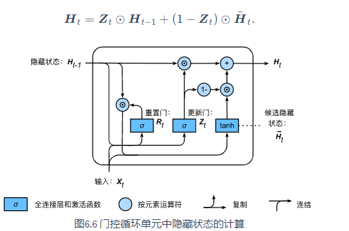

<!-- TOC -->

- [1. 循环神经网络](#1-循环神经网络)
  - [1.1. 语言模型](#11-语言模型)
    - [1.1.1. 语言模型的计算](#111-语言模型的计算)
    - [1.1.2. n元语法](#112-n元语法)
  - [1.2. 循环神经网络](#12-循环神经网络)
    - [不含隐藏状态的神经网络](#不含隐藏状态的神经网络)
    - [含隐藏状态的循环神经网络](#含隐藏状态的循环神经网络)
  - [语言模型数据集](#语言模型数据集)
    - [时序数据的采样](#时序数据的采样)
      - [随机采样](#随机采样)
      - [相邻采样](#相邻采样)
  - [循环神经网络从零开始实现](#循环神经网络从零开始实现)
    - [one-hot向量](#one-hot向量)
    - [初始化模型参数](#初始化模型参数)
    - [定义模型](#定义模型)
    - [定义预测函数](#定义预测函数)
    - [裁剪梯度](#裁剪梯度)
    - [困惑度](#困惑度)
    - [定义模型训练函数](#定义模型训练函数)
  - [通过时间反向传播](#通过时间反向传播)
  - [门控循环单元](#门控循环单元)
    - [门控循环单元](#门控循环单元-1)
      - [重置门和更新门](#重置门和更新门)
      - [候选隐藏状态](#候选隐藏状态)
      - [隐藏状态](#隐藏状态)
  - [长短期记忆（LSTM）](#长短期记忆lstm)
  - [深度循环神经网络](#深度循环神经网络)
  - [双向循环神经网络](#双向循环神经网络)
- [优化算法](#优化算法)
  - [优化与深度学习](#优化与深度学习)
  - [梯度下降和随机梯度下降](#梯度下降和随机梯度下降)
  - [小批量随机梯度下降](#小批量随机梯度下降)
  - [动量法](#动量法)
    - [梯度下降的问题](#梯度下降的问题)
    - [动量法](#动量法-1)
  - [AdaGrad算法](#adagrad算法)
  - [RMSProp算法](#rmsprop算法)
  - [AdaDelta算法](#adadelta算法)
  - [Adam算法](#adam算法)
- [计算性能（重点）](#计算性能重点)

<!-- /TOC -->

# 1. 循环神经网络
## 1.1. 语言模型
语言模型是自然语言处理的重要技术，自然语言处理中最常见的数据是文本数据，把一段自然语言文本看作一段离散的时间序列。假设一段长度为T的文本中的词依次为$w_1,w_2,...,w_T$，那么在离散时间序列中，$w_t(1<=t<=T)$可看作在时间步(time step)t的输出或标签。给定一个长度为T的词的序列$w_1,w_2,...,w_T$，语言模型将计算该序列的概率
$$P(w_1,w_2,...,w_T)$$
语言模型可用于提升语音识别和机器翻译的性能。
### 1.1.1. 语言模型的计算
假设序列$w_1,w_2,...,w_T$中的每个词是依次生成的，我们有
$$P(w_1,w_2,...,w_T)= \prod_{t=1}^{T}P(w_t|w_1,w_2,...,w_{T-1})$$
为了计算语言模型，需要计算词的概率，以及一个词在给定前几个词的情况下的条件概率，即语言模型参数。例如$P(w_2|w_1)$可计算w1，w2两词相邻的频率与w1词频的比值。
### 1.1.2. n元语法
当序列长度增加时，计算和存储多个词共同出现的概率的复杂度呈指数级增加。n元语法通过马尔可夫假设（并不一定成立）简化了语言模型计算。马尔可夫假设是指一个词的出现只与前面几个词相关，即n阶马尔可夫链。如果n=1，那么有$P(w_3|w_1,w_2)=P(w_3|w_2)$，如果基于n-1阶马克可夫链，语言模型改写为
$$P(w_1,w_2,...,w_T)= \prod_{t=1}^{T}P(w_t|w_{t-(n-1)},...,w_{T-1})$$
也叫做n元语法。当n较小时，n元语法往往并不准确。例如在一元语法中，由三个词组成的句子“你走先”和“你先走”的概率是一样的。然而，当n较大时，n元语法需要计算并存储大量的词频和多词相邻概率。
## 1.2. 循环神经网络
循环神经网络并非刚性地记忆所有固定长度的序列，而是通过隐藏状态来存储之前时间步的信息。
### 不含隐藏状态的神经网络
首先考虑一个单隐藏层的多层感知机。给定样本数为n，输入个数为d的小批量数据样本X。设隐藏层的激活函数为$\phi$，那么隐藏层的输出H计算为
$$H=\phi(XW+b)$$
其中隐藏层权重参数W，隐藏层偏差参数b，h为隐藏单元个数，上式相加的两项形状不同，因此将按照广播机制相加。把隐藏变量H作为输出层的输入，且设输出个数为q（如分类问题中的类别数），输出层的输出为
$$O=HW+b$$
其中输出变量O，输出层权重参数W，输出层偏差参数b。如果是分类问题，我们可以使用softmax(O)来计算输出类别的概率分布。
### 含隐藏状态的循环神经网络
现在考虑输入数据存在时间相关性。假设X是序列中时间步的小批量输入，$H_t$是该时间步的隐藏变量。与多层感知机不同的是，这里我们保存上一时间步的隐藏变量$H_{t-1}$，并引入一个新的权重参数W，该参数用来描述在当前时间步如何使用上一时间步的隐藏变量。具体来说，时间步t的隐藏变量的计算由当前时间步的输入和上一时间步的隐藏变量共同决定：
$$H_t=\phi(X_tW_{xh}+H_{t-1}W_{hh}+b_h)$$
与多层感知机相比，我们在这里添加了$H_{t-1}W_{hh}$一项。由上式中相邻时间步的隐藏变量$H_t$和$H_{t-1}$之间的关系可知，这里的隐藏变量能够捕捉截至当前时间步的序列的历史信息，就像是神经网络当前时间步的状态或记忆一样。因此，该隐藏变量又叫做隐藏状态。由于隐藏状态在当前时间步的定义使用了上一时间步的隐藏状态，上式的计算是循环的。使用循环计算的网络即循环神经网络。
循环神经网络有很多种不同的构造方法。含上式所定义的隐藏状态的循环神经网络是极为常见的一种。在时间步t，输出层的输出和多层感知机中的计算类似：
$$O_t=H_tW_{hq}+b_q$$
循环神经网络的参数包括隐藏层的权重$W_{xh}、W_{hh}、和偏差b_h$，以及输出层的权重$W_{hq}$和偏差$b_q$。值得一提的是，即使在不同时间步，循环神经网络也hi中使用这些模型参数。因此，循环神经网络模型参数的数量不随时间步的增加而增长。

上图展示了循环神经网络在3个相邻时间步的计算逻辑。在时间步t,隐藏状态的计算可以看成是将输入$X_t$和前一时间步隐藏状态$H_{t-1}$连结后输入一个激活函数为$\phi$的全连接层。该全连接层的输出就是当前时间步的隐藏状态$H_t$，且模型参数为$W_{xh}$与$W_{hh}$的连结，偏差为$b_h$。当前时间步t的隐藏状态$H_t$将参与下一个时间步t+1的隐藏状态$H_{t+1}$的计算，并输入到当前时间步的全连接输出层。
隐藏状态$X_tW_{xh}+H_{t-1}W_{hh}$的计算等价于Xt与Ht-1连结后的矩阵乘以Wxh与Whh连接后的矩阵。
## 语言模型数据集
### 时序数据的采样
在训练中我们需要每次随机读取小批量样本和标签。时序数据的一个样本通常包含连续的字符。有随机采样和相邻采样对时序数据进行采样
#### 随机采样
每次从数据里随机采样一个小批量。其中批量大小batch_size指每个小批量的样本数，num_steps为每个样本所包含的时间步数。 在随机采样中，每个样本是原始序列上任意截取的一段序列。相邻的两个随机小批量在原始序列上的位置不一定相毗邻。因此，我们无法用一个小批量最终时间步的隐藏状态来初始化下一个小批量的隐藏状态。在训练模型时，每次随机采样前都需要重新初始化隐藏状态。
#### 相邻采样
除对原始序列做随机采样之外，我们还可以令相邻的两个随机小批量在原始序列上的位置相毗邻。这时候，我们就可以用一个小批量最终时间步的隐藏状态来初始化下一个小批量的隐藏状态，从而使下一个小批量的输出也取决于当前小批量的输入，并如此循环下去。这对实现循环神经网络造成了两方面影响：一方面， 在训练模型时，我们只需在每一个迭代周期开始时初始化隐藏状态；另一方面，当多个相邻小批量通过传递隐藏状态串联起来时，模型参数的梯度计算将依赖所有串联起来的小批量序列。同一迭代周期中，随着迭代次数的增加，梯度的计算开销会越来越大。 为了使模型参数的梯度计算只依赖一次迭代读取的小批量序列，我们可以在每次读取小批量前将隐藏状态从计算图中分离出来。
## 循环神经网络从零开始实现
### one-hot向量
### 初始化模型参数
### 定义模型
### 定义预测函数
### 裁剪梯度
循环神经网络中较容易出现梯度衰减或梯度爆炸。我们会在6.6节（通过时间反向传播）中解释原因。为了应对梯度爆炸，我们可以裁剪梯度（clip gradient）。假设我们把所有模型参数梯度的元素拼接成一个向量 g，并设裁剪的阈值是θ。裁剪后的梯度的L2范数不超过θ。
### 困惑度
我们通常使用困惑度（perplexity）来评价语言模型的好坏。回忆一下交叉熵损失函数的定义。困惑度是对交叉熵损失函数做指数运算后得到的值。特别地：
* 最佳情况下，模型总是把标签类别的概率预测为1，此时困惑度为1；
* 最坏情况下，模型总是把标签类别的概率预测为0，此时困惑度为正无穷；
* 基线情况下，模型总是预测所有类别的概率都相同，此时困惑度为类别个数。
显然，任何一个有效模型的困惑度必须小于类别个数。在本例中，困惑度必须小于词典大小vocab_size。
### 定义模型训练函数
* Keras的layers模块提供了循环神经网络层的实现。
* Keras的layers.RNN实例在前向计算后会分别返回输出和隐藏状态。该前向计算并不涉及输出层计算。
## 通过时间反向传播
我们在（正向传播、反向传播和计算图）中介绍了神经网络中梯度计算与存储的一般思路，并强调正向传播和反向传播相互依赖。正向传播在循环神经网络中比较直观，而通过时间反向传播其实是反向传播在循环神经网络中的具体应用。我们需要将循环神经网络按时间步展开，从而得到模型变量和参数之间的依赖关系，并依据链式法则应用反向传播计算并存储梯度。

上图为可视化循环神经网络中模型变量和参数在计算中的依赖关系。
## 门控循环单元
当时间步数较大或者时间步较小时，循环神经网络的梯度较容易出现衰减或爆炸。虽然裁剪梯度可以应对梯度爆炸，但无法解决梯度衰减的问题。通常由于这个原因，循环神经网络在实际中较难捕捉时间序列中时间步距离较大的依赖关系。
门控循环神经网络能更好地捕捉时间序列中时间步距离较大的依赖关系。它通过可以学习的门来控制信息的流动。其中，门控循环单元是一种常见的门控循环神经网络。
### 门控循环单元
包括重置门和更新门的概念，从而修改了循环神经网络中隐藏状态的计算方式。

#### 重置门和更新门
门控循环单元的重置门和更新门的输入均为当前时间步输入$X_t$与上一时间步隐藏状态$H_{t-1}$，输出由激活函数为sigmoid函数的全连接层计算得到。
具体来说，假设隐藏单元个数为h，给定时间步t的小批量输入Xt和上一时间步隐藏状态Ht-1。重置门Rt和更新门Zt的计算如下：
$$
R_t=\sigma \left( X_tW_{xr}+H_{t-1}W_{hr}+b_r \right) 
\\
Z_t=\sigma \left( X_tW_{xz}+H_{t-1}W_{hz}+b_z \right) 
$$
其中W是权重参数，b是偏差参数。重置门和更新门中每个元素的值域为[0,1]
#### 候选隐藏状态
接下来，门控循环单元将计算候选隐藏状态来辅助稍后的隐藏状态计算。
将当前时间步重置门的输出与上一时间步的隐藏状态做元素乘法（如果当前时间步重置门中元素值接近0，则重置对应隐藏状态元素为0，即丢弃上一时间步的隐藏状态；如果接近1，则保留上一时间步的隐藏状态）然后，将按元素乘法的结果与当前时间步的输入连结，再通过激活函数tanh的全连接层计算出候选隐藏状态，其所有元素的值域为[-1,1]。
具体来说，时间步的候选隐藏状态Ht的计算为：
$$
H_t=\tanh \left( X_tW_{xh}+\left( R_t\odot H_{t-1} \right) W_{hh}+b_h \right) 
$$
其中W为权重参数，b是偏差参数。重置门控制了上一时间步的隐藏状态如何流入当前时间步的候选隐藏状态。而上一时间步的隐藏状态可能包含了时间序列截至上一时间步的全部历史信息。因此，重置门可以用来丢弃与预测无关的历史信息。
#### 隐藏状态
最后，时间步t的隐藏状态Ht的计算使用当前时间步的更新门Zt来对上一时间步的隐藏状态Ht-1和当前时间步的候选隐藏状态Ht做组合。
值得注意的是，更新门可以控制隐藏状态应该如何被包含当前时间步信息的候选隐藏状态所更新。假设更新门在时间步t'到t之间一直近似1.那么，在时间步t'到t之间的输入信息几乎没有流入时间步t的隐藏状态Ht。实际上，这可以看作是较早时刻的隐藏状态Ht'一直通过时间保存并传递至当前时间步t。这个设计可以应对循环神经网络中的梯度衰减问题，并更好地捕捉时间序列中时间步距离较大的依赖关系。
* 重置门有助于捕捉时间序列里短期的依赖关系；
* 更新门有助于捕捉时间序列里长期的依赖关系。
## 长短期记忆（LSTM）
长短期记忆门控循环神经网络比门控循环单元的结构稍微复杂。
LSTM中引入了3个门，即输入门、遗忘门和输出们，以及与隐藏状态现状相同的记忆细胞，从而记录形状相同的记忆细胞。
## 深度循环神经网络
即含有多个隐藏层（对比多层感知机）的循环神经网络
## 双向循环神经网络
当前时间步不仅由前面较早的时间步序列决定，还可能由后面时间步决定。双向循环神经网络通过增加从后往前传递信息的隐藏层来灵活地处理这类信息。
例：隐藏状态$\overrightarrow{H}_2$由前一隐藏状态$\overrightarrow{H}_1$决定，同时$\overleftarrow{H}_2$由后一刻隐藏状态$\overleftarrow{H}_3$决定，最后将$\overrightarrow{H}_2$和$\overleftarrow{H}_2$共同组成$H_2$隐藏状态。

# 优化算法
## 优化与深度学习
鞍点： 目标函数在此点上bai的梯度（一阶导数du）值为 0， 但从改点出发的一个方向是函数的极大值点，而在另一个方向是函数的极小值点。
海森矩阵：假设一个函数的输入为k维向量，输出为标量，那么它的海森矩阵有K个特征值，且：
* * 当函数的海森矩阵在梯度为零的位置上的特征值全为正时，该函数得到局部最小值。
* * 当函数的海森矩阵在梯度为零的位置上的特征值全为负时，该函数得到局部最大值。
* * 当函数的海森矩阵在梯度为零的位置上的特征值有正有负时，该函数得到鞍点。

* 总结1：由于优化算法的目标函数通常是一个基于训练数据集的损失函数，优化的目标在于降低训练误差。

* 总结2：由于深度学习模型参数通常都是高维的，目标函数的鞍点通常比局部最小值更常见。
## 梯度下降和随机梯度下降
如果使用梯度下降，每次自变量迭代的计算开销为O(n)O(n)，它随着n线性增长。因此，当训练数据样本数很大时，梯度下降每次迭代的计算开销很高。
随机梯度下降：在梯度中添加均值为0的随机噪声来模拟随机梯度下降
## 小批量随机梯度下降
小批量随机梯度下降计算开销减少许多。
当批量较大时，每个小批量梯度里可能含有更多的冗余信息。为了得到较好的解，批量较大时比批量较小时需要计算的样本数目可能更多，例如增大迭代周期数。
## 动量法
### 梯度下降的问题
当目标函数在两个收敛方向的斜率绝对值相差较大时，此时给定学习率，梯度下降迭代自变量会使自变量在不同方向移动幅度差别很大。当学习率较小时，会造成在某一方向上朝最优解移动变慢；当学习率稍大时，自变量会在某个方向上出现发散。
### 动量法
通过给学习率加一超参，进行指数加权移动平均，达到随迭代进行学习率逐渐减小，当前时间步获得的权重较大，使得结果只因前l个时间步的输入值的加权平均有关。
## AdaGrad算法
小批量随机梯度按元素平方的累加变量st出现在学习率的分母项中。因此，如果目标函数有关自变量中某个元素的偏导数一直都较大，那么该元素的学习率将下降较快；反之，如果目标函数有关自变量中某个元素的偏导数一直都较小，那么该元素的学习率将下降较慢。然而，由于st一直在累加按元素平方的梯度，自变量中每个元素的学习率在迭代过程中一直在降低（或不变）。所以，**当学习率在迭代早期降得较快且当前解依然不佳时，AdaGrad算法在迭代后期由于学习率过小，可能较难找到一个有用的解。**
* AdaGrad算法在迭代过程中不断调整学习率，并让目标函数自变量中每个元素都分别拥有自己的学习率。
* 使用AdaGrad算法时，自变量中每个元素的学习率在迭代过程中一直在降低（或不变）。
  
## RMSProp算法
因此，当学习率在迭代早期降得较快且当前解依然不佳时，AdaGrad算法在迭代后期由于学习率过小，可能较难找到一个有用的解。为了解决这一问题，RMSProp算法对AdaGrad算法做了一点小小的修改。
不同于AdaGrad算法里状态变量st是截至时间步tt所有小批量随机梯度gt按元素平方和，RMSProp算法将这些梯度按元素平方做指数加权移动平均。
## AdaDelta算法
针对AdaGrad算法在迭代后期可能较难找到有用解的问题做了改进。AdaDelta算法也像RMSProp算法一样，使用了小批量随机梯度gt按元素平方的指数加权移动平均变量st。
## Adam算法
Adam算法在RMSProp算法基础上对小批量随机梯度也做了指数加权移动平均。
**Adam算法可以看做是RMSProp算法与动量法的结合。**
# 计算性能（重点）
