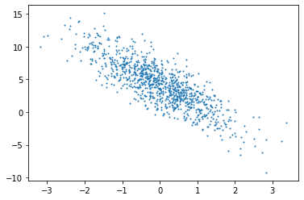

# 第一章
## 1、数据操作
### 1、创建tensor：     
    x = tf.constant(range(12))
    tf.zeros(()) tf.ones(()) tf.constant([[]]) 
    tf.random.normal(shape=[3,4], mean = 0, stddev = 1)  
    #x.shape（12，） 
    改变tensor形状： X = tf.reshape(x, (3, 4))|(-1,4)|(3,-1)
    tf.Variable(initializer,name)生成变量，tf.Variable(num)
    tf.placeholder(tf.float32)生成占位变量
    tf.constant([])生成常量
    tf.assign(A, new_number):将A的值修改为new
    assign类操作在tf2中仅支持Variable变量
### 2、运算
    X+Y，X*Y，X/Y（X，Y形状相同）
    tf.exp(X)，tf.transpose(转置)，
    tf.cast(数据类型转换)，tf.matmul(矩阵相乘)，tf.concat([],axis=0)矩阵连接，tf.equal(X,Y)判断，tf.reduce_sum(所有元素求和)，tf.norm(范数)
### 3、广播机制
        可以支持两个矩阵均为最小向量的情况
### 4、索引
        X[1,2].assign(9)
### 5、运算的内存开销
        1、X.assign_add(Y)与X+=Y相同
### 6、tensor及numpy转换
        tf.contant()
        np.array()
## 2、求梯度
    梯度求解利器：tf.GradientTape()  使用方法：
```
with tf.GradientTape() as g:
    g.watch(x)
    y = 2 * tf.matmul(tf.transpose(x),x)
dy_dx = g.gradient(y,x)
``` 
### 1、简单示例
$$对y=2x^T求关于列向量x的梯度$$
```
x = tf.reshape(tf.Variable(range(4),dtype = tf.float32),(4,1))
with tf.GradientTape()as t:
        t.watch(x)
        y = 2 * tf.matmul(tf.transpose(x), x)
dy_dx = t.gradient(y, x)
```
### 2、训练模型和预测模型
```
with tf.GradientTape(persistent=True) as g:
    g.watch(x)
    y = x * x
    z = y * y
    dz_dx = g.gradient(z, x)  # 108.0 (4*x^3 at x = 3)
    dy_dx = g.gradient(y, x)  # 6.0
```
        在一般网络中，不需要显式调用watch函数，使用默认设置，GradientTape会监控可控制变量
```
with tf.GradientTape() as tape:
    predictions = model(images)
    loss = loss_object(labels, predictions)
gradients = tape.gradient(loss, model.trainable_variables)
```
        这样即可计算出所有可训练变量的梯度，然后进行下一步的更新，并且可以在eager模式下查看具体的梯度值
### 3、对Python控制流求梯度
即使函数的计算图包含了Python的控制流，如条件和循环控制，也能对变量求梯度。考虑下面函数：
```
def f(a):
    b = a * 2
    while tf.norm(b) < 1000:
        b = b * 2
    if tf.reduce_sum(b) > 0:
        c = b
    else:
        c = 100 * b
    return c
```
使用下面函数验证控制流求梯度的结果正确性。
```
a = tf.random.normal((1,1),dtype=tf.float32)
with tf.GradientTape() as t:
    t.watch(a)
    c = f(a)
t.gradient(c,a) == c/a  # 
```
可用t.gradient求二阶导
##### Tips
1、在同一个tape中进行不同计算图切换的方法：
```
with tf.GradientTape() as t:  
    loss = loss_fn() 
    t.reset() #reset即不同计算图切换核心函数 
    loss += other_loss_fn() #后一步运算的梯度
    t.gradient(loss, ...)
```
2、stop_recording，tape将不会记录其中的运算操作（连接取消），可以选择不记录某些运算操作，从而节省内存。作用与assign效果相同，但该方法会建立新节点。
###### *assign赋值时节点之间没有建立依赖关系，计算梯度时无法传递梯度，只改变计算图中某个节点的值，这种特性可以用来设计截断的计算图。
###### *a=b|a=a+b|a=a-b方法得到的梯度为1，后两个会新增新的节点指向
###### 运算式 a = func(b,c...) ：在计算图中创建一个新节点来记录计算结果，同时建立b,c...指向的节点到新节点的依赖关系。
###### *赋值a = b：计算图不变，a、b同时指向原来b指向的节点。
###### *如果要达到运算式a = identity(b)的效果（亦即新建一个节点，使其依赖于b指向节点，并且两节点同值），可以使用a = tf.identity(b)。
截断的计算图，只求z对x的导数方法，其中：
$$
y = g(x)\\
z = f(x, y)
$$

方法1：不记录依赖路径，使用stop_recording实现
```
'''使用 tape.stop_recording()'''
x = tf.Variable(4.0)
with tf.GradientTape() as g:
    g.watch(x)
    with g.stop_recording():
        y = x * x  #assign同理
    z = x + y
grads_1 = g.gradient(z, x)
'''grads_1 = 1.0'''
```
方法2：添加隐藏节点来解除依赖关系
```
s = tf.Variable(4.0)
with tf.GradientTape() as g:
    g.watch(s)
    x = tf.identity(s)
    y = s * s#使用s新的变量来代替x，从而隐藏节点。
    z = x + y
grads_2 = g.gradient(z, x)
'''grads_2 = 1.0'''
```
## 3、查阅文档
dir(tf.dtype)
help(tf.ones)
# 深度学习基础
## 1、线性回归
应该尽可能采用矢量计算，以提升计算效率。
```python
import tensorflow as tf
print(tf.__version__)
import matplotlib.pyplot as plt
import random
import numpy as np
```
    2.1.0
```python
num_input = 2
num_examples = 1000
true_w = [2, -3 ,4]
true_b = 4.2
features = tf.random.normal((num_examples, num_input), stddev = 1)  # 模拟输入
labels = true_w[0] * features[:,0] + true_w[1] * features[:,1] + true_b
labels += tf.random.normal(labels.shape,stddev=0.01)  # 模拟输出
```


```python

```


```python
plt.scatter(features[:, 1], labels, 1)
```

    
生成信号迭代

```python
def data_iter(batch_size, features, labels):
    num_examples = len(features)
    indexx  = list(range(num_examples))
    random.shuffle(indexx) #打乱次序
    for i in range(0, num_examples, batch_size):
        j = indexx[i:min(i+batch_size, num_examples)]
        yield tf.gather(features, axis = 0, indices = j), tf.gather(labels, axis=0, indices=j)
        # yield会在循环中经过yield时作为return结束函数，next(func)会接着上一步return位置继续运行只到下次运行到yield
        # yield相对来讲更省空间
batch_size = 10  
```
```python
# 初始化模型参�?
w = tf.Variable(tf.random.normal((num_input, 1), stddev = 0.01))
b = tf.Variable((tf.zeros((1,))))
# 定义信号模型
def linreg(X, w, b):
    return tf.matmul(X, w) + b
def square_loss(y_hat, y):# y_hat为信号的预测值，最后使得两者误差最小
return (y_hat - tf.reshape(y, y_hat.shape)) ** 2 / 2
# 损失函数是用来度量模型的预测值和数据真实值之间的差距
# 优化函数一般用随机梯度方法使预测值和真实值之间更为接近，目前常用的优化函数为Adam
def sgd(params, lr, batch_size, grads):
    for i, param in enumerate(params):
        param.assign_sub(lr * grads[i] /batch_size)# sub:ref = ref-value
        
```
```python
lr = 0.03
num_epochs = 3
net = linreg
loss = square_loss
for epoch in range(num_epochs):
    for X, y in data_iter(batch_size, features, labels):
        with tf.GradientTape() as t:
            t.watch([w, b])
            l = tf.reduce_sum(loss(net(X, w, b), y))
        grads = t.gradient(l, [w, b])
            print(l)
        sgd([w, b], lr, batch_size, grads)
    train_l = loss(net(features, w, b), labels)# labels为标签，每次迭代仅改变w和b的值
    print('epoch %d, loss %f' % (epoch+1, tf.reduce_mean(train_l)))
# 二件事
# 1、l为每组用最新的w,b得到的总损失值（这个总损失值的总体现在10个样本的数目上）
# 2、每次迭代只关心的是w,b的变化，且优化函数中含有batch_size这个概念，即为批量梯度下降的优化函数
```
    epoch 1, loss 0.037374
    epoch 2, loss 0.000143
    epoch 3, loss 0.000053

```python
print(true_w, w)
print(true_b, b)
```
    [2, -3, 4] <tf.Variable 'Variable:0' shape=(2, 1) dtype=float32, numpy=
    array([[ 1.9993333],
           [-2.9994075]], dtype=float32)>
    4.2 <tf.Variable 'Variable:0' shape=(1,) dtype=float32, numpy=array([4.199557], dtype=float32)>
## 2、线性回归的tf+keras实现


## 7、模型选择、欠拟合和过拟合
### 1、K折交叉验证
当训练数据不够用时，预留大量的验证数据显得太奢侈，在K折交叉验证中，我们把原始训练数据分割成k个不重合的子数据集，然后我们做K次模型训练和验证。每一次我们使用一个子数据集验证模型，并使用其他K-1个子数据集来训练模型。在这K次训练和验证中，每次用来验证模型的子数据集都不同。最后我们对这K次训练误差和验证误差分别求平均。
### 2、欠拟合和过拟合，对应的是模型的训练误差和测试数据集上的误差的关系。
如果模型的复杂度较低，很容易出现欠拟合，如果模型的复杂度过高很容易出现过拟合；应对欠拟合和过拟合的一个办法是针对数据及选择合适复杂度的模型。
影响欠拟合和过拟合的另一个重要因素是训练数据集的大小。如果训练数据集样本数过少，过拟合更容易发生。泛化误差不会随训练数据集里样本数量增加而增大。通常希望训练数据集大一些。

经非线性多项式曲线拟合实验，得出以下结论：
###### 由于无法从训练误差估计泛化误差，一味地降低训练误差并不意味着泛化误差一定会降低。机器学习模型应关注降低泛化误差。
###### 可以使用验证数据集来进行模型选择。
###### 欠拟合指模型无法得到较低的训练误差，过拟合指模型的训练误差远小于它在测试数据集上的误差。
###### 应选择复杂度合适的模型并避免使用过少的训练样本。
### 3、权重衰减
权重衰减等价于L2范数正则化。正则化通过为模型损失函数添加惩罚项使学出的模型参数值较小，是应对过拟合的常用手段。
L2​范数正则化在模型原损失函数基础上添加L2范数惩罚项，从而得到训练所需要最小化的函数。L2范数惩罚项指的是模型权重参数每个元素的平方和与一个正的常数的乘积。
<div align = center>
    
</div>

上式中$\lambda$表示惩罚权重

&#8195;&#8195;最终结果使用权重衰减后训练误差有所提高，但测试集上误差有所下降，过拟合现象得到一定程度缓解，且得到的权重参数更接近0
```python
# tf2 实现L2正则时可以在全链接层使用kernel_regularizer=regularizers.l2(wd)实现，wd是自定义系数。其在计算loss时会直接自动加载到main loss中，好处是不需要在main loss定义时写大量代码，提高了代码的可读性
tf.keras.layers.Dense(1,kernel_regularizer=regularizers.l2(wd),bias_regularizer=None)
```
结论：
###### 1、正则化通过为模型损失函数添加惩罚项使学出的模型参数值较小，是应对过拟合的常用手段。
###### 2、权重衰减等价于L2范数正则化，通常会使学到的权重参数的元素较接近0。
###### 3、权重衰减可以通过 kernel_regularizer超参数来指定。
###### 4、可以定义多个优化器实例对不同的模型参数使用不同的迭代方法。
## 8、丢弃法和正反向传播
### 1、丢弃法 Droupout
### 2、正反向传播结论：
##### 1、正向传播沿着从输入层到输出层的顺序，依次计算并存储神经网络的中间变量。
##### 2、反向传播沿着从输出层到输入层的顺序，依次计算并存储神经网络中间变量和参数的梯度。
###### 3、在训练深度学习模型时，正向传播和反向传播相互依赖。
###### 4、深度模型有关数值稳定性的典型问题是衰减和爆炸。当神经网络的层数较多时，模型的数值稳定性容易变差。
# 深度学习计算
## 1、模型构建方法
```python
model = keras.Sequential([
    keras.layers.Flatten(input_shape = (28, 28)),
    keras.layers.Dense(256, activation = 'relu'),
    Dropout(0.2),
    keras.layers.Dense(256, activation = 'relu'),
    Dropout(0.5),
    keras.layers.Dense(19, activation = tf.nn.softmax)])
model.compile(optimizer=optimizer,
              loss='sparse_categorical_crossentropy',
              metrics=['accuracy'])
net.fit(train_images, train_labels, epochs=5, validation_split=0.1)
```
```python
class MLP(tf.keras.Model):
    def __init__(self):
        super().__init__()
        self.flatten = tf.keras.layers.Flatten() 
        self.dense1 = tf.keras.layers.Dense(units=256, activation=tf.nn.relu)
        self.dense2 = tf.keras.layers.Dense(units=10)

    def call(self, inputs):         
        x = self.flatten(inputs)   
        x = self.dense1(x)    
        output = self.dense2(x)     
        return output
```
```python
# 其中有常随机权重
class FancyMLP(tf.keras.Model):
    def __init__(self):
        super().__init__()
        self.flatten = tf.keras.layers.Flatten()
        self.rand_weight = tf.constant(
            tf.random.uniform((20,20)))
        self.dense = tf.keras.layers.Dense(units=20, activation=tf.nn.relu)

    def call(self, inputs):         
        x = self.flatten(inputs)   
        x = tf.nn.relu(tf.matmul(x, self.rand_weight) + 1)
        x = self.dense(x)    
        while tf.norm(x) > 1:
            x /= 2
        if tf.norm(x) < 0.8:
            x *= 10
        return tf.reduce_sum(x)

class NestMLP(tf.keras.Model):
    def __init__(self):
        super().__init__()
        self.net = tf.keras.Sequential()
        self.net.add(tf.keras.layers.Flatten())
        self.net.add(tf.keras.layers.Dense(64, activation=tf.nn.relu))
        self.net.add(tf.keras.layers.Dense(32, activation=tf.nn.relu))
        self.dense = tf.keras.layers.Dense(units=16, activation=tf.nn.relu)


    def call(self, inputs):         
        return self.dense(self.net(inputs))
# 嵌套。。。
net = tf.keras.Sequential()
net.add(NestMLP())
net.add(tf.keras.layers.Dense(20))
net.add(FancyMLP())
net(X)
```
## 2、模型参数的访问、初始化和共享
### 1、模型参数访问
net.weights[0] | type(net.weights[0])
net.get_weights()
for layer in net.layers:
net.get_layer(index=1).gamma伸缩参数|.beta偏移参数

### 2、初始化
默认初始化方法为权重参数元素为[-0.07,0.07]之间均匀分布的随机数，初始化权值在定义层时实现
tf.keras.layers.Dense(
            kernel_initializer=tf.random_normal_initializer(mean=0,stddev=0.01),
            bias_initializer=tf.zeros_initializer()
        )
也可以使用tf.keras.initializers自定义初始化
```python
def my_init():
    return tf.keras.initializers.Ones()

model = tf.keras.models.Sequential()
model.add(tf.keras.layers.Dense(64, kernel_initializer=my_init()))
```
## 3、自定义层
```python
class myDense(tf.keras.layers.Layer):
    def __init__(self, units):
        super().__init__()
        self.units = units

    def build(self, input_shape):     # 这里 input_shape 是第一次运行call()时参数inputs的形状
        self.w = self.add_weight(name='w',
            shape=[input_shape[-1], self.units], initializer=tf.random_normal_initializer())
        self.b = self.add_weight(name='b',
            shape=[self.units], initializer=tf.zeros_initializer())

    def call(self, inputs):
        y_pred = tf.matmul(inputs, self.w) + self.b
        return y_pred
```
build() 可自定义网络的权重的维度，可以根据输入来指定权重的维度，若权重固定(如自定义网络层的权重随机分布形式，这时把权重定义写在init即可），可避免使用build() 方法
self.built = True，该参数在build() 运行开始时为False，为了保证先调用build() 方法, 再调用call() 方法，结束时会自动赋值为True，保证build() 方法**只被调用一次**
call()函数实现前向传播的逻辑功能。返回该层输出值，不包含激活函数计算
## 4、读取和存储
tensor数据可以用numpy的save和load进行存储和读取
网络模型的参数可用net.save_weight('save_model.h5)保存
## 获取能够计算的cpu和gpu设备
```python
gpus = tf.config.experimental.list_physical_devices(device_type='GPU')
cpus = tf.config.experimental.list_physical_devices(device_type='CPU')
print("可用的GPU：",gpus,"\n可用的CPU：", cpus)
# 使用tf.device()来指定特定设备(GPU/CPU)
with tf.device('GPU:0'):
    a = tf.constant([1,2,3],dtype=tf.float32)
    b = tf.random.uniform((3,))
    print(tf.exp(a + b) * 2)

# **********************************
# 采用GPU训练并设置memory_growth
tf.config.experimental.list_physical_devices('GPU') #确认TensorFlow正在使用GPU。
for gpu in tf.config.experimental.list_physical_devices('GPU'):
    tf.config.experimental.set_memory_growth(gpu, True) #自适应
    tf.config.experimental.VirtualDeviceConfiguration(memory_limit=2048) #最大值
# 
tensor.device
```
# 卷积神经网络
卷积层，功能：填充、步幅
池化层，功能：窗口形状|大小、步幅、填充
注意多通道输入和输出
## 1、自定义VGG块（重复利用
```python
conv_arch = ((1, 64), (1, 128), (2, 256), (2, 512), (2, 512))
def vgg_block(num_convs, num_channels):
    blk = tf.keras.models.Sequential()
    for _ in range(num_convs):
        blk.add(tf.keras.layers.Conv2D(num_channels,kernel_size=3, padding='same',activation='relu'))
    blk.add(tf.keras.layers.MaxPool2D(pool_size=2, strides=2))
    return blk
def vgg(conv_arch):
    net = tf.keras.models.Sequential()
    for (num_convs, num_channels) in conv_arch:
        net.add(vgg_block(num_convs,num_channels))
    net.add(tf.keras.models.Sequential([tf.keras.layers.Flatten(),
             tf.keras.layers.Dense(4096,activation='relu'),
             tf.keras.layers.Dropout(0.5),
             tf.keras.layers.Dense(4096,activation='relu'),
             tf.keras.layers.Dropout(0.5),
             tf.keras.layers.Dense(10,activation='sigmoid')]))
    return net
```
**上图定义的多卷积+池化层的方法可以参考、重复使用**
```python
def train_vgg():
#     net.load_weights("5.7_vgg_weights.h5")
    epoch = 5
    num_iter = dataLoader.num_train//batch_size
    for e in range(epoch):
        for n in range(num_iter):
            x_batch, y_batch = dataLoader.get_batch_train(batch_size)
            net.fit(x_batch, y_batch)
            if n%20 == 0:
                net.save_weights("5.7_vgg_weights.h5")

optimizer = tf.keras.optimizers.SGD(learning_rate=0.05, momentum=0.0, nesterov=False)

net.compile(optimizer=optimizer,
              loss='sparse_categorical_crossentropy',
              metrics=['accuracy'])

x_batch, y_batch = dataLoader.get_batch_train(batch_size)
net.fit(x_batch, y_batch)
# train_vgg()
```
## 2、用1*1卷积层代替全连接层
全连接层后因为维度关系无法接上卷积层，，为了传递空间信息，可使用1*1卷积层达到以上两个目的，同时降低参数复杂度。
注意，此时学习率应随之小幅度增加
###### 卷积核数据和大小要分清楚！，卷积核数目与输出通道数有关
## 3、并行连接网络
Inception块：

##### 1、Inception块相当于一个有4条线路的子网络。它通过不同窗口形状的卷积层和最大池化层来并行抽取信息，并使用1×11×1卷积层减少通道数从而降低模型复杂度。
##### 2、GoogLeNet将多个设计精细的Inception块和其他层串联起来。其中Inception块的通道数分配之比是在ImageNet数据集上通过大量的实验得来的。
##### 3、GoogLeNet和它的后继者们一度是ImageNet上最高效的模型之一：在类似的测试精度下，它们的计算复杂度往往更低。[详情点击](https://blog.csdn.net/weixin_44211398/article/details/94298169)
## 4、批量归一化
```python
#tf.keras.layers.BatchNormalization()
net = tf.keras.models.Sequential(
    [tf.keras.layers.Conv2D(filters=6,kernel_size=5),
    BatchNormalization(),
    tf.keras.layers.Activation('sigmoid'))
```
使用批量归一化时，可以将批量大小设得大一点，从而使批量内样本的均值和方差的计算都较为准确。
测试时，因为单个样本的输出不应取决于批量归一化所需要的随机小批量中的均值和方差。一种常见的方法是通过移动平均估算整个训练数据集的样本均值和方差，并在预测时使用它们得到确定的输出。

解决方法：：
如果待预测数据量比较大，直接调用 model(test) 进行预测就行了，这样就使用训练模式，会直接从待预测数据计算其对应的均值和方差。
tf.keras.backend.set_learning_phase(True) # predict mode

如果是单个数据或数据分布差异不大，就需要保存BN 层的参数，特别是移动均值和方差，然后直接预测(model.predict)。

具体使用时一般情况下将Batch_Normalization层加一参数，is_training = FLAG_TRAIN。当遇到使用批量归一化层且测试集效果比训练集效果差太多时，点击[参考1]和[参考2]进行深入探究
